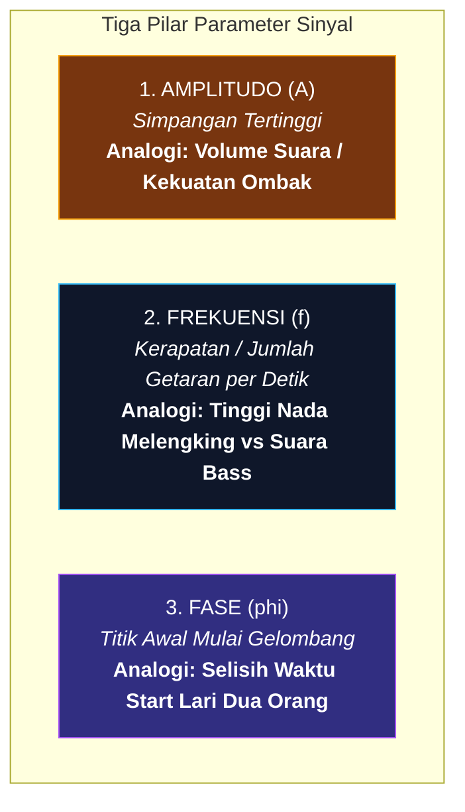

# 📘 BUKU AJAR & MODUL LENGKAP PENGOLAHAN SINYAL DIGITAL (PSD)
*Panduan Komprehensif: Dari Konsep Dasar, Sinyal Multi-Dimensi, Multikanal, Sistem, hingga Proses Digitalisasi (ADC)*

---

## 📑 DAFTAR ISI
1. [BAB 1: Memahami Fondasi Sinyal, Sistem, dan Paradigma Pemrosesan](#bab-1-memahami-fondasi-sinyal-sistem-dan-paradigma-pemrosesan)
   - [1.1 Apa Sebenarnya Sinyal Itu? (Konsep Awam & Filosofi)](#11-apa-sebenarnya-sinyal-itu-konsep-awam--filosofi)
   - [1.2 Sinyal Multi-Dimensi (M-Dimensi): 1D, 2D, 3D, hingga 4D](#12-sinyal-multi-dimensi-m-dimensi-1d-2d-3d-hingga-4d)
   - [1.3 Sinyal Kanal Tunggal vs Sinyal Multikanal (Multi-Channel Signals)](#13-sinyal-kanal-tunggal-vs-sinyal-multikanal-multi-channel-signals)
   - [1.4 Tiga Pilar Anatomi Gelombang: Amplitudo, Frekuensi, dan Fase](#14-tiga-pilar-anatomi-gelombang-amplitudo-frekuensi-dan-fase)
   - [1.5 Anatomi Visual Grafik Sinyal](#15-anatomi-visual-grafik-sinyal)
   - [1.6 Komparasi Visual Parameter Sinyal](#16-komparasi-visual-parameter-sinyal)
   - [1.7 Studi Kasus Nyata: Mengapa Suara Manusia Adalah Sinyal?](#17-studi-kasus-nyata-mengapa-suara-manusia-adalah-sinyal)
   - [1.8 Apa Itu Sistem? (Analogi Mesin Pemroses)](#18-apa-itu-sistem-analogi-mesin-pemroses)
   - [1.9 Tiga Wujud Realisasi Sistem Pengolah Sinyal](#19-tiga-wujud-realisasi-sistem-pengolah-sinyal)
   - [1.10 Klasifikasi Sifat & Karakteristik Operasi Sistem](#110-klasifikasi-sifat--karakteristik-operasi-sistem)
   - [1.11 Dua Paradigma Besar: Pemrosesan Analog (ASP) vs Pemrosesan Digital (DSP)](#111-dua-paradigma-besar-pemrosesan-analog-asp-vs-pemrosesan-digital-dsp)
   - [1.12 Mengapa Dunia Beralih ke DSP? (Kelebihan & Batasan)](#112-mengapa-dunia-beralih-ke-dsp-kelebihan--batasan)
2. [BAB 2: Proses Digitalisasi Sinyal (Analog-to-Digital Converter / ADC)](#bab-2-proses-digitalisasi-sinyal-analog-to-digital-converter--adc)
   - [2.1 Mengapa Sinyal Analog Harus Diubah ke Digital?](#21-mengapa-sinyal-analog-harus-diubah-ke-digital)
   - [2.2 Rantai 4 Tahap Lengkap Konversi ADC](#22-rantai-4-tahap-lengkap-konversi-adc)
   - [2.3 Tahap 1: Pencuplikan (Sampling) & Peran Detak Clock](#23-tahap-1-pencuplikan-sampling--peran-detak-clock)
   - [2.4 Teorema Nyquist-Shannon & Bahaya Fenomena Aliasing](#24-teorema-nyquist-shannon--bahaya-fenomena-aliasing)
   - [2.5 Mengapa Wajib Ada Filter Anti-Aliasing Sebelum Sampling?](#25-mengapa-wajib-ada-filter-anti-aliasing-sebelum-sampling)
   - [2.6 Tahap 2: Kuantisasi (Quantization) — Seni Membulatkan Nilai](#26-tahap-2-kuantisasi-quantization--seni-membulatkan-nilai)
   - [2.7 Tahap 3: Pengkodean (Encoding) ke Deretan Bit Biner Digital](#27-tahap-3-pengkodean-encoding-ke-deretan-bit-biner-digital)
   - [2.8 Studi Kasus End-to-End: Konversi Sinyal Sinus Utuh x(t) ke Aliran Biner](#28-studi-kasus-end-to-end-konversi-sinyal-sinus-utuh-xt-ke-aliran-biner)

---

# BAB 1: Memahami Fondasi Sinyal, Sistem, dan Paradigma Pemrosesan

## 1.1 Apa Sebenarnya Sinyal Itu? (Konsep Awam & Filosofi)

Bayangkan Anda sedang berbicara dengan teman di seberang ruangan. Pita suara Anda bergetar, menggetarkan partikel udara di sekitarnya, merambat sebagai gelombang tekanan udara, dan akhirnya menggetarkan gendang telinga teman Anda. 

Secara ilmiah, getaran tekanan udara yang merambat dari mulut ke telinga itulah yang disebut **Sinyal**.

> **📌 Definisi Formal Sinyal:**  
> **Sinyal** adalah besaran fisik yang nilainya berubah (*bervariasi*) terhadap satu atau lebih variabel bebas (seperti waktu, ruang/posisi, suhu, atau kedalaman). Sinyal bertindak sebagai **kendaraan pembawa pesan (*carrier of information*)** mengenai perilaku suatu fenomena alam.

---

## 1.2 Sinyal Multi-Dimensi (M-Dimensi): 1D, 2D, 3D, hingga 4D

Berapa banyak variabel yang menentukan nilai suatu sinyal? Inilah konsep dari **Dimensi Sinyal ($M$-Dimensi)**.

> **📌 Definisi Sinyal $M$-Dimensi:**  
> Suatu sinyal disebut **$M$-Dimensi ($M$-D)** apabila nilai amplitudonya merupakan fungsi matematis dari **$M$ buah variabel bebas (*independent variables*)**:
> $$s = f(v_1, v_2, v_3, \dots, v_M)$$

---

### A. Hierarki & Klasifikasi Dimensi Sinyal:

#### 1. Sinyal Satu Dimensi (1D) — $s = f(t)$
* **Variabel Bebas:** $1$ variabel, yaitu **Waktu ($t$)**.
* **Cara Kerja:** Nilai tegangan listrik atau tekanan udara hanya berubah seiring berjalannya detik waktu.
* **Contoh Nyata:** Sinyal suara manusia melalui mikrofon mono, rekaman detak jantung ECG, sinyal seismometer pendeteksi gempa bumi, sinyal fluktuasi harga saham harian.

#### 2. Sinyal Dua Dimensi (2D) — Citra Intensitas $I = f(x, y)$
* **Variabel Bebas:** $2$ variabel, yaitu **Koordinat Spasial Bidang Datar $(x, y)$** (sumbu kolom $x$ dan sumbu baris $y$).
* **Cara Kerja:** Pada sebuah foto atau citra diam, nilai fungsi $f(x, y)$ merepresentasikan **tingkat intensitas kecerahan (*brightness/luminance*)** atau derajat keabuan (*grayscale*) pada titik piksel koordinat $(x, y)$. Nilainya berkisar dari $0$ (hitam pekat) hingga $255$ (putih terang pada citra 8-bit).
* **Contoh Nyata:** Foto digital JPEG hitam-putih, citra rontgen medis X-Ray, foto satelit permukaan bumi.

#### 3. Sinyal Tiga Dimensi (3D) — $V = f(x, y, t)$ atau $f(x, y, z)$
* **Bentuk A (Video / Citra Televisi Hitam-Putih):** $f(x, y, t)$
  * **Variabel Bebas:** $2$ variabel spasial $(x, y)$ dan $1$ variabel temporal waktu $(t)$.
  * **Cara Kerja:** Citra televisi hitam-putih adalah rangkaian frame foto 2D $f(x, y)$ yang diputar dan diperbarui terus-menerus setiap detik $t$ (misal 30 atau 60 frame per detik).
* **Bentuk B (Citra Medis Volume 3D):** $f(x, y, z)$
  * **Variabel Bebas:** $3$ koordinat ruang tiga dimensi $(x, y, z)$ yaitu panjang, lebar, dan kedalaman.
  * **Cara Kerja:** Pemindaian organ tubuh menghasilkan kumpulan titik volume bernama ***Voxel* (*Volumetric Pixel*)**.
  * **Contoh Nyata:** Pemindaian otak 3D menggunakan MRI (*Magnetic Resonance Imaging*) atau CT-Scan.

#### 4. Sinyal Empat Dimensi (4D) & Multi-Spektral — $C = f(x, y, t, \lambda)$
* **Variabel Bebas:** Ruang $(x, y)$, Waktu $(t)$, dan Panjang Gelombang Spektral / Saluran Warna ($\lambda$ atau kanal $R, G, B$).
* **Contoh Nyata:** Video digital berwarna (setiap piksel $(x, y)$ pada waktu $t$ memiliki 3 nilai intensitas warna Red, Green, Blue), atau rekaman animasi 3D organ jantung yang sedang berdetak terhadap waktu $f(x, y, z, t)$.

---

### B. Perbedaan Kunci: Sinyal Multi-Dimensi vs Sinyal Multi-Kanal

Banyak pemula yang bingung membedakan kedua istilah ini. Mari kita luruskan:

| Parameter Pembeda | Sinyal Multi-Dimensi ($M$-D) | Sinyal Multi-Kanal (*Multi-Channel*) |
| :--- | :--- | :--- |
| **Fokus Utama** | **Jumlah Variabel Bebas Masukan ($M$)**. Sinyal dipengaruhi oleh berapa banyak sumbu (waktu, ruang $x, y, z$, dsb.). | **Jumlah Sensor / Jalur Keluaran ($M$)**. Sinyal direkam oleh berapa banyak sensor fisik secara serentak. |
| **Bentuk Matematis** | Fungsi skalar dari banyak variabel: $s = f(x, y, t)$. | Vektor dari banyak fungsi: $\mathbf{x}(t) = [x_1(t), x_2(t), \dots, x_M(t)]^T$. |
| **Contoh Kasus** | Foto Citra 2D $f(x, y)$ atau Video 3D $f(x, y, t)$. | Rekaman ECG 12-Lead (12 sensor merekam waktu $t$) atau Audio Surround 7.1. |

---

## 1.3 Sinyal Kanal Tunggal vs Sinyal Multikanal (Multi-Channel Signals)

Dalam dunia nyata, kita sering kali tidak hanya menggunakan 1 buah sensor, melainkan **sekumpulan sensor sekaligus** yang bekerja bersamaan:

1. **Representasi Vektor Kolom pada Setiap Saat $t$:**
   $$\mathbf{x}(t) = \begin{bmatrix} x_1(t) \\ x_2(t) \\ x_3(t) \\ \vdots \\ x_M(t) \end{bmatrix} \in \mathbb{R}^{M \times 1}$$

2. **Representasi Matriks Spasio-Temporal ($N$ Sampel):**
   $$\mathbf{X} = \begin{bmatrix} 
   x_1[0] & x_1[1] & \dots & x_1[N-1] \\ 
   x_2[0] & x_2[1] & \dots & x_2[N-1] \\ 
   x_3[0] & x_3[1] & \dots & x_3[N-1] \\ 
   \vdots & \vdots & \ddots & \vdots \\ 
   x_M[0] & x_M[1] & \dots & x_M[N-1] 
   \end{bmatrix}_{M \times N}$$

3. **Keunggulan Analisis:** Membuka pintu penerapan operasi **Aljabar Linier**, seperti *Spatial Filtering & Beamforming* (fokus pendengaran mikrofon), *Independent Component Analysis* (ICA untuk memisahkan suara bertumpuk), dan *Principal Component Analysis* (PCA).

---

## 1.4 Tiga Pilar Anatomi Gelombang: Amplitudo, Frekuensi, dan Fase

Persamaan matematis gelombang sinus dinyatakan sebagai:

$$x(t) = A \cdot \sin(2\pi f t + \phi) = A \cdot \sin(\omega t + \phi)$$

---

## 1.5 Anatomi Visual Grafik Sinyal

---

## 1.6 Komparasi Visual Parameter Sinyal

---

## 1.7 Studi Kasus Nyata: Mengapa Suara Manusia Adalah Sinyal?

---

## 1.8 Apa Itu Sistem? (Analogi Mesin Pemroses)

> **📌 Definisi Sistem:**  
> **Sistem** adalah perangkat fisik (elektronika) atau algoritma perangkat lunak yang menerima sinyal masukan $x[n]$, melakukan operasi matematis terhadapnya, lalu mengeluarkan sinyal baru $y[n]$ yang telah dimodifikasi:
> $$y[n] = \mathcal{T}\{x[n]\}$$

---

## 1.9 Tiga Wujud Realisasi Sistem Pengolah Sinyal

1. **Hardware Murni (Analog):** Rangkaian RLC, Op-Amp, Transistor.
2. **Software Murni (Digital):** Algoritma Python, C++, MATLAB di PC/Server.
3. **Hybrid / Embedded Firmware:** Chip DSP (TMS320), FPGA, Mikrokontroler (STM32, ESP32).

---

## 1.10 Klasifikasi Sifat & Karakteristik Operasi Sistem

* **Linear:** Mematuhi prinsip superposisi $\mathcal{T}\{a x_1 + b x_2\} = a \mathcal{T}\{x_1\} + b \mathcal{T}\{x_2\}$.
* **Time-Invariant (TI):** Sifat sistem tidak berubah seiring waktu ($x[n - n_0] \implies y[n - n_0]$).
* **Kausal:** Output saat ini hanya bergantung pada input saat ini dan masa lalu.
* **Stabilitas BIBO:** Input terbatas menjamin output selalu terbatas.

---

## 1.11 Dua Paradigma Besar: Pemrosesan Analog (ASP) vs Pemrosesan Digital (DSP)

---

## 1.12 Mengapa Dunia Beralih ke DSP? (Kelebihan & Batasan)

| Aspek | Pemrosesan Analog (ASP) | Pemrosesan Digital (DSP) |
| :--- | :--- | :--- |
| **Fleksibilitas** | ❌ Kaku. Ubah fitur harus ganti komponen solder fisik. | ✅ **Sangat Fleksibel**. Cukup update baris kode program (*software update*). |
| **Kekebalan Derau (*Noise*)** | ❌ Rentan. Gangguan kabel langsung merusak sinyal. | ✅ **Sangat Kebal**. Data berupa biner (0 & 1). |
| **Akurasi & Presisi** | ❌ Rendah. Bergantung toleransi fisik pabrik dan suhu. | ✅ **Eksak & 100% Konsisten** (32-bit / 64-bit). |
| **Penyimpanan Data** | ❌ Sulit. Pita kaset aus setiap diputar. | ✅ **Abadi Tanpa Rusak (*Lossless*)**. |
| **Kompleksitas Algoritma** | ❌ Hanya operasi sederhana. | ✅ **Bisa Sangat Rumit** (ANC, Kompresi MP4, AI Speech Recognition). |

---

# BAB 2: Proses Digitalisasi Sinyal (Analog-to-Digital Converter / ADC)

## 2.1 Mengapa Sinyal Analog Harus Diubah ke Digital?

Komputer hanya mengerti bilangan biner ($0$ dan $1$). Oleh karena itu, kita memerlukan jembatan penerjemah yang disebut **Analog-to-Digital Converter (ADC)**.

---

## 2.2 Rantai 4 Tahap Lengkap Konversi ADC

```mermaid
flowchart LR
    Analog["Sinyal Analog x(t)<br><i>Kontinu Waktu & Nilai</i>"] --> LPF["0. Anti-Aliasing Filter<br>(Low-Pass Analog)"]
    LPF --> Sampler["1. Sampling (Clock Ts)<br>x[n] = x(nTs)<br><i>Diskrit Waktu</i>"]
    Sampler --> Quantizer["2. Kuantisasi (2^B Step)<br>xq[n]<br><i>Diskrit Nilai</i>"]
    Quantizer --> Encoder["3. Encoding (Biner)<br>Stream Bit 0 & 1"]
    Encoder --> DSPCore["Digital Signal Processor<br>(CPU / FPGA / DSP)"]

    style Analog fill:#1e293b,stroke:#64748b,color:#fff
    style LPF fill:#78350f,stroke:#f59e0b,color:#fff
    style Sampler fill:#312e81,stroke:#6366f1,color:#fff
    style Quantizer fill:#581c87,stroke:#a855f7,color:#fff
    style Encoder fill:#064e3b,stroke:#10b981,color:#fff
    style DSPCore fill:#0f172a,stroke:#38bdf8,color:#fff
```

---

## 2.3 Tahap 1: Pencuplikan (Sampling) & Peran Detak Clock

* Generator clock osilator membangkitkan trigger periodik tiap $T_s = \frac{1}{F_s}$. Rangkaian *Sample-and-Hold* menangkap nilai tegangan sesaat $x[n] = x(n \cdot T_s)$.
* **Status:** Diskrit dalam waktu, namun amplitudo masih berupa bilangan riil kontinu.

---

## 2.4 Teorema Nyquist-Shannon & Bahaya Fenomena Aliasing

> **🛡️ Teorema Sampling Nyquist:**  
> $$F_s \geq 2 \cdot f_{\text{maks}}$$
* Jika $F_s < 2 f_{\text{maks}}$, terjadi fenomena **Aliasing** (frekuensi tinggi menyamar menjadi frekuensi rendah palsu).

---

## 2.5 Mengapa Wajib Ada Filter Anti-Aliasing Sebelum Sampling?

Filter analog Low-Pass Filter (LPF) dipasang tepat sebelum ADC untuk memangkas frekuensi liar $f > F_s/2$ agar tidak merusak data.

---

## 2.6 Tahap 2: Kuantisasi (Quantization) — Seni Membulatkan Nilai

* **Jumlah Step ($L$):** $L = 2^B$.
* **Lebar Rentang Per Step (*Step Size* $\Delta$):**
  $$\Delta = \frac{V_{\text{maks}} - V_{\text{min}}}{2^B}$$
* **Quantization Error ($e$):** $e = x_q[n] - x[n]$, di mana $|e| \leq \frac{\Delta}{2}$.

---

## 2.7 Tahap 3: Pengkodean (Encoding) ke Deretan Bit Biner Digital

### Tabel Pemetaan Step Kuantisasi vs Biner 3-Bit ($0\text{V} - 10\text{V}$):
$$\Delta = \frac{10\text{ V} - 0\text{ V}}{8} = 1.25\text{ Volt / step}$$

| Step Kuantisasi | Rentang Tegangan Analog Input ($V_{\text{in}}$) | Kode Biner Encoding ($3$-bit) | Nilai Tengah Representasi ($V_q$) |
| :---: | :---: | :---: | :---: |
| **Step 1** | $0.00\text{ V} \leq V_{\text{in}} < 1.25\text{ V}$ | **`000`** | $0.625\text{ V}$ |
| **Step 2** | $1.25\text{ V} \leq V_{\text{in}} < 2.50\text{ V}$ | **`001`** | $1.875\text{ V}$ |
| **Step 3** | $2.50\text{ V} \leq V_{\text{in}} < 3.75\text{ V}$ | **`010`** | $3.125\text{ V}$ |
| **Step 4** | $3.75\text{ V} \leq V_{\text{in}} < 5.00\text{ V}$ | **`011`** | $4.375\text{ V}$ |
| **Step 5** | $5.00\text{ V} \leq V_{\text{in}} < 6.25\text{ V}$ | **`100`** | $5.625\text{ V}$ |
| **Step 6** | $6.25\text{ V} \leq V_{\text{in}} < 7.50\text{ V}$ | **`101`** | $6.875\text{ V}$ |
| **Step 7** | $7.50\text{ V} \leq V_{\text{in}} < 8.75\text{ V}$ | **`110`** | $8.125\text{ V}$ |
| **Step 8** | $8.75\text{ V} \leq V_{\text{in}} \leq 10.00\text{ V}$| **`111`** | $9.375\text{ V}$ |

---

## 2.8 Studi Kasus End-to-End: Konversi Sinyal Sinus Utuh x(t) ke Aliran Biner

* **Sinyal Masukan:** $x(t) = 5 + 4 \cdot \sin(2\pi \cdot 1 \cdot t)\text{ Volt}$
* **Spesifikasi ADC:** $3\text{-bit}$, rentang $0-10\text{ V}$, Clock $F_s = 8\text{ Hz}$ ($T_s = 0.125\text{ detik}$, $8$ titik sampel $n = 0 \dots 7$).

### Tabel Rekapitulasi Lengkap 8 Titik Sampel:

| Sampel ($n$) | Waktu ($t$) | Tegangan Analog $V_{\text{in}}$ | Step Kuantisasi | Nilai Level $V_q$ | Output Biner | Quantization Error ($e$) |
| :---: | :---: | :---: | :---: | :---: | :---: | :---: |
| **$n = 0$** | $0.000\text{ s}$ | $5.00\text{ V}$ | **Step 5** | $5.625\text{ V}$ | **`100`** | $+0.625\text{ V}$ |
| **$n = 1$** | $0.125\text{ s}$ | $7.83\text{ V}$ | **Step 7** | $8.125\text{ V}$ | **`110`** | $+0.295\text{ V}$ |
| **$n = 2$** | $0.250\text{ s}$ | $9.00\text{ V}$ (Peak) | **Step 8** | $9.375\text{ V}$ | **`111`** | $+0.375\text{ V}$ |
| **$n = 3$** | $0.375\text{ s}$ | $7.83\text{ V}$ | **Step 7** | $8.125\text{ V}$ | **`110`** | $+0.295\text{ V}$ |
| **$n = 4$** | $0.500\text{ s}$ | $5.00\text{ V}$ | **Step 5** | $5.625\text{ V}$ | **`100`** | $+0.625\text{ V}$ |
| **$n = 5$** | $0.625\text{ s}$ | $2.17\text{ V}$ | **Step 2** | $1.875\text{ V}$ | **`001`** | $-0.295\text{ V}$ |
| **$n = 6$** | $0.750\text{ s}$ | $1.00\text{ V}$ (Trough) | **Step 1** | $0.625\text{ V}$ | **`000`** | $-0.375\text{ V}$ |
| **$n = 7$** | $0.875\text{ s}$ | $2.17\text{ V}$ | **Step 2** | $1.875\text{ V}$ | **`001`** | $-0.295\text{ V}$ |

### Aliran Bit Digital Akhir (*Bitstream*):

$$\mathbf{\text{Aliran Bit (Bitstream)}} = \underbrace{\mathbf{100}}_{n=0} \ \underbrace{\mathbf{110}}_{n=1} \ \underbrace{\mathbf{111}}_{n=2} \ \underbrace{\mathbf{110}}_{n=3} \ \underbrace{\mathbf{100}}_{n=4} \ \underbrace{\mathbf{001}}_{n=5} \ \underbrace{\mathbf{000}}_{n=6} \ \underbrace{\mathbf{001}}_{n=7}$$
