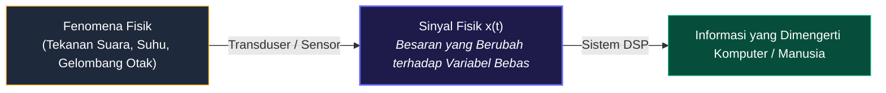
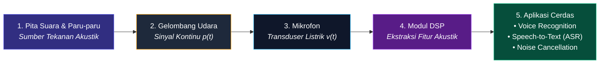
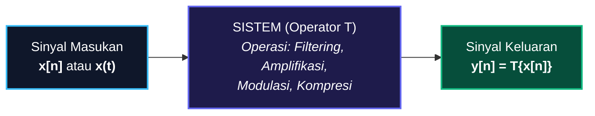

# 📘 MODUL PEMBELAJARAN PENGOLAHAN SINYAL DIGITAL (PSD)
**Materi Terkompilasi — Konsep Dasar Sinyal dan Sistem**

---

## 📑 DAFTAR ISI
1. [BAB 1: Fondasi & Parameter Sinyal](#bab-1-fondasi--parameter-sinyal)
   - [1.1 Definisi Fundamental Sinyal](#11-definisi-fundamental-sinyal)
   - [1.2 Representasi Matematis](#12-representasi-matematis)
   - [1.3 Tiga Parameter Utama (Amplitudo, Frekuensi, Fase)](#13-tiga-parameter-utama)
   - [1.4 Anatomi Visual Grafik Sinyal](#14-anatomi-visual-grafik-sinyal)
   - [1.5 Komparasi Visual Parameter Sinyal](#15-komparasi-visual-parameter-sinyal)
   - [1.6 Studi Kasus: Sinyal Ucapan (Speech Signal)](#16-studi-kasus-sinyal-ucapan)
2. [BAB 2: Konsep Dasar & Klasifikasi Sistem](#bab-2-konsep-dasar--klasifikasi-sistem)
   - [2.1 Definisi Sistem](#21-definisi-sistem)
   - [2.2 Tiga Bentuk Realisasi Sistem](#22-tiga-bentuk-realisasi-sistem)
   - [2.3 Klasifikasi & Karakteristik Operasi Sistem](#23-klasifikasi--karakteristik-operasi-sistem)

---

# BAB 1: Fondasi & Parameter Sinyal

### 1.1 Definisi Fundamental Sinyal
> **📌 Definisi:**  
> **Sinyal** adalah suatu besaran fisik yang nilainya berubah terhadap waktu, ruang, atau satu maupun lebih variabel bebas lainnya. Sinyal bertindak sebagai media pembawa informasi fisik dari suatu fenomena alam ke sistem pengolah data.

### 1.2 Representasi Matematis
Sinyal direpresentasikan secara formal sebagai fungsi dari variabel-variabel bebas:
* **Sinyal 1-Dimensi (1D) — $x = f(t)$:** Contoh: sinyal suara $s(t)$, tegangan listrik $v(t)$, sinyal detak jantung ECG $x(t)$.
* **Sinyal 2-Dimensi (2D) — $I = f(x, y)$:** Contoh: citra digital/foto (intensitas kecerahan pada koordinat baris $x$ dan kolom $y$).
* **Sinyal Multi-Dimensi (3D/4D) — $V = f(x, y, t)$:** Contoh: video digital (rangkaian frame 2D terhadap waktu) atau citra medis MRI 3D.

### 1.3 Tiga Parameter Utama
Setiap gelombang sinusoida dapat dinyatakan secara eksplisit:
$$x(t) = A \cdot \sin(2\pi f t + \phi) = A \cdot \sin(\omega t + \phi)$$

| Parameter | Simbol & Satuan | Makna Matematis | Makna Fisik (Contoh Audio) |
| :--- | :--- | :--- | :--- |
| **Amplitudo** | $A$ (Volt, Pascal, dsb.) | Simpangan puncak maksimum gelombang dari titik nol. | **Kekuatan / Volume Suara (*Loudness*)**. Gelombang tinggi = suara keras. |
| **Frekuensi** | $f = \frac{1}{T}$ (Hz) atau $\omega = 2\pi f$ (rad/s) | Jumlah siklus gelombang penuh per 1 detik. | **Tinggi-Rendah Nada (*Pitch*)**. Gelombang rapat = nada tinggi melengking. |
| **Fase** | $\phi$ (Radian / Derajat) | Posisi awal gelombang pada saat $t = 0$. | **Pergeseran Waktu / Arah Kedatangan Gelombang**. |

---

### 1.4 Anatomi Visual Grafik Sinyal

Berikut adalah grafik visual asli yang menunjukkan letak **Amplitudo ($A$)**, **Periode ($T$)**, **Frekuensi ($f$)**, **Puncak (*Peak*)**, dan **Lembah (*Trough*)**:

---

### 1.5 Komparasi Visual Parameter Sinyal

Berikut adalah perbandingan visual langsung bagaimana perubahan nilai Frekuensi, Amplitudo, dan Fase mengubah bentuk fisik gelombang:

---

### 1.6 Studi Kasus: Sinyal Ucapan (*Speech Signal*)

* **Informasi Fonem/Tekstual:** Resonansi rongga vokal (*Formant* $F_1, F_2, F_3$).
* **Informasi Pembicara:** Frekuensi dasar pita suara ($F_0$) dan timbre suara.
* **Informasi Emosi:** Dinamika modulasi amplitudo dan kontur intonasi frekuensi.

---

# BAB 2: Konsep Dasar & Klasifikasi Sistem

### 2.1 Definisi Sistem
> **📌 Definisi:**  
> **Sistem** adalah perangkat fisik atau realisasi perangkat lunak yang melakukan suatu operasi matematis atau transformasi pada sinyal masukan $x[n]$ untuk menghasilkan sinyal keluaran $y[n]$ yang diinginkan:
> $$y[n] = \mathcal{T}\{x[n]\}$$

---

### 2.2 Tiga Bentuk Realisasi Sistem

---

### 2.3 Klasifikasi & Karakteristik Operasi Sistem

1. **Linear vs Non-Linear:**
   * **Linear:** Memenuhi prinsip superposisi:
     $$\mathcal{T}\{a \cdot x_1[n] + b \cdot x_2[n]\} = a \cdot \mathcal{T}\{x_1[n]\} + b \cdot \mathcal{T}\{x_2[n]\}$$
   * **Non-Linear:** Tidak memenuhi superposisi *(Contoh: $y[n] = x^2[n]$, distorsi audio).*

2. **Time-Invariant (TI) vs Time-Variant:**
   * Pergeseran waktu pada masukan menghasilkan pergeseran waktu yang sama pada keluaran tanpa mengubah bentuk respon:
     $$x[n - n_0] \implies y[n - n_0]$$

3. **Kausal (Causal) vs Non-Kausal:**
   * **Kausal:** Output saat ini hanya bergantung pada input saat ini dan masa lalu ($x[n], x[n-1], \dots$). Wajib untuk sistem *real-time*.
   * **Non-Kausal:** Bergantung pada nilai masa depan ($x[n+1]$), hanya bisa dilakukan pada data rekaman/offline.

4. **Stabilitas BIBO (Bounded-Input Bounded-Output):**
   * Input terbatas menjamin output selalu terbatas (sistem stabil, tidak meledak/berosilasi liar).
