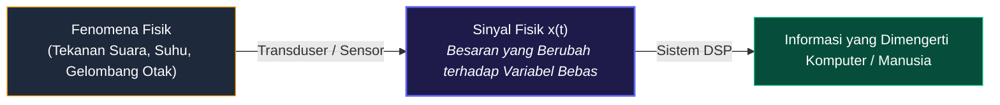
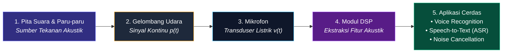

# 📘 MODUL PEMBELAJARAN PENGOLAHAN SINYAL DIGITAL (PSD)
**Materi Terkompilasi — Bagian 1: Konsep Dasar & Karakteristik Sinyal**

---

## 📑 DAFTAR ISI
1. [1. Definisi Fundamental Sinyal](#1-definisi-fundamental-sinyal)
2. [2. Representasi Matematis Sinyal](#2-representasi-matematis-sinyal)
3. [3. Tiga Parameter Analisis Sinyal (Amplitudo, Frekuensi, Fase)](#3-tiga-parameter-analisis-sinyal)
4. [4. Anatomi Visual Grafik Sinyal (Posisi Parameter)](#4-anatomi-visual-grafik-sinyal)
5. [5. Studi Kasus Riil: Sinyal Ucapan (Speech Signal)](#5-studi-kasus-riil-sinyal-ucapan-speech-signal)

---

## 1. Definisi Fundamental Sinyal

> **📌 Definisi:**  
> **Sinyal** adalah suatu besaran fisik yang nilainya berubah terhadap waktu, ruang, atau satu maupun lebih variabel bebas lainnya.

Sinyal berfungsi sebagai media pembawa informasi fisik dari suatu fenomena alam atau sistem elektronik ke sistem pengolah data.



---

## 2. Representasi Matematis Sinyal

Sinyal direpresentasikan secara formal sebagai **fungsi dari satu atau lebih variabel bebas**:

* **Sinyal 1-Dimensi (1D) — Fungsi Waktu $t$:**
  $$x = f(t)$$
  *Contoh:* Sinyal suara $s(t)$, tegangan sensor getaran $v(t)$, sinyal detak jantung ECG $x(t)$.

* **Sinyal 2-Dimensi (2D) — Fungsi Spasial $(x, y)$:**
  $$I = f(x, y)$$
  *Contoh:* Citra digital/foto, di mana nilai fungsi merepresentasikan intensitas kecerahan (*brightness*) pada koordinat baris $x$ dan kolom $y$.

* **Sinyal Multi-Dimensi (3D/4D) — Spatio-Temporal:**
  $$V = f(x, y, t)$$
  *Contoh:* Video digital (citra 2D yang terus berganti seiring waktu $t$) atau citra medis CT-Scan/MRI 3D.

---

## 3. Tiga Parameter Analisis Sinyal

Setiap sinyal periodik atau sinusoida dapat dinyatakan secara eksplisit melalui persamaan matematis:

$$x(t) = A \cdot \sin(2\pi f t + \phi) = A \cdot \sin(\omega t + \phi)$$

Seluruh sinyal pada dasarnya dapat dianalisis dan dibedah melalui **3 pilar parameter utama**:

| Parameter | Simbol & Satuan | Makna Matematis | Makna Fisik (Contoh Audio) |
| :--- | :--- | :--- | :--- |
| **Amplitudo** | $A$ (Volt, Pascal, dsb.) | Nilai puncak simpangan maksimum gelombang dari titik kesetimbangan (0). | **Kekuatan / Volume Suara (*Loudness*)**. Gelombang tinggi = suara keras. |
| **Frekuensi** | $f = \frac{1}{T}$ (Hertz / Hz) atau $\omega = 2\pi f$ (rad/s) | Banyaknya siklus gelombang penuh yang terjadi dalam satuan 1 detik. | **Tinggi-Rendah Nada (*Pitch*)**. Gelombang rapat = nada tinggi melengking. |
| **Fase** | $\phi$ (Radian / Derajat) | Posisi awal gelombang pada saat $t = 0$. Menentukan pergeseran horizontal gelombang. | **Waktu Kedatangan / Pergeseran Gelombang**. Membantu lokalisasi arah suara. |

---

## 4. Anatomi Visual Grafik Sinyal

Berikut adalah letak pasti dari **Amplitudo ($A$)**, **Periode ($T$)**, dan **Frekuensi ($f$)** pada grafik gelombang waktu:

```
   Amplitudo (Sumbu Y)
         ▲
         │
     +A ─┼─ ─ ─ ─ ─ ─╭───────╮ ─ ─ ─ ─ ─ ─ ─ ─ ─ ─ ─ ─ ─ ─ ─ ─ ─ ─ ─ ─ ─ ─ ─ Puncak (Peak)
         │          /         \
         │         /           \                    │◄─── AMPLITUDO (A) ────────►│
         │        /  ▲          \                   │  Jarak vertikal dari       │
         │       /   │           \                  │  garis 0 ke puncak atas    │
         │      /    │ Amplitudo  \                 │                            │
       0 ┼─────/─────┼─(A)─────────\─────────────────\───────────────► Waktu (t)
         │    /      │              \               / \                (Sumbu X)
         │   /       ▼               \             /   \
         │  /                         \           /     \
     -A ─┼─ ─ ─ ─ ─ ─ ─ ─ ─ ─ ─ ─ ─ ─ ─╰───────╯ ─ ─ ─ ─ ─ ─ ─ ─ ─ ─ ─ ─ ─ ─ Lembah (Trough)
         │
         │   │◄────────────── 1 SIKLUS PENUH (T) ─────────────►│
         │   │          (1 Periode = 1 Bukit + 1 Lembah)       │
         │   │                                                 │
         └───┴─────────────────────────────────────────────────┴─────────────►
             0 detik                                         T detik
```

### 🔍 Komparasi Visual Sifat Sinyal

```
A. Frekuensi Rendah vs Tinggi (Kerapatan dalam 1 Detik)
   f = 2 Hz (Renggang / Bass) : ──/─\__/─\__── (2 siklus per detik)
   f = 6 Hz (Rapat / Treble)  : ─/\/\/\/\/\/\─ (6 siklus per detik)

B. Amplitudo Kecil vs Besar (Tinggi Puncak)
   Amplitudo Kecil (Pelan)    : ──.-.───.-.─── (Puncak rendah)
   Amplitudo Besar (Keras)    : ─╭───╮─╭───╮── (Puncak tinggi menjulang)
```

---

## 5. Studi Kasus Riil: Sinyal Ucapan (*Speech Signal*)

Sinyal suara ucapan manusia (*speech signal*) merupakan contoh nyata **sinyal pembawa informasi**:



### Informasi Apa Saja yang Terkandung di Dalam Sinyal Ucapan?
1. **Informasi Tekstual (Fonem & Kata):**  
   Dibentuk oleh frekuensi resonansi rongga mulut (*Formants* $F_1, F_2, F_3$). Contoh: perbedaan bunyi vokal "A", "I", "U", "E", "O".
2. **Informasi Identitas & Karakteristik Pembicara:**  
   Ditentukan oleh frekuensi dasar pita suara (*Fundamental Frequency / $F_0$*) serta warna suara unik (*Timbre*).
3. **Informasi Emosional & Intonasi:**  
   Terkandung dalam variasi amplitudo (keras-lembut) dan kontur frekuensi (naik-turunnya nada saat bertanya, marah, atau senang).
