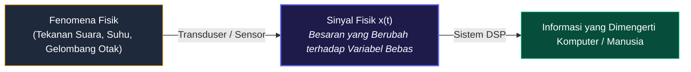

# 📘 MODUL PEMBELAJARAN PENGOLAHAN SINYAL DIGITAL (PSD)
**Materi Terkompilasi — Sinyal, Sistem, dan Proses Digitalisasi (ADC)**

---

## 📑 DAFTAR ISI MODUL
* [BAB 1: Pengantar Sinyal, Sistem, dan Paradigma Pemrosesan](#bab-1-pengantar-sinyal-sistem-dan-paradigma-pemrosesan)
  * [1.1 Definisi Fundamental Sinyal](#11-definisi-fundamental-sinyal)
  * [1.2 Representasi Matematis Sinyal](#12-representasi-matematis-sinyal)
  * [1.3 Tiga Parameter Utama Sinyal](#13-tiga-parameter-utama-sinyal)
  * [1.4 Anatomi Visual Grafik Sinyal](#14-anatomi-visual-grafik-sinyal)
  * [1.5 Komparasi Visual Parameter Sinyal](#15-komparasi-visual-parameter-sinyal)
  * [1.6 Studi Kasus: Sinyal Ucapan (Speech Signal)](#16-studi-kasus-sinyal-ucapan)
  * [1.7 Konsep Dasar Sistem](#17-konsep-dasar-sistem)
  * [1.8 Tiga Bentuk Realisasi Sistem](#18-tiga-bentuk-realisasi-sistem)
  * [1.9 Klasifikasi Karakteristik Operasi Sistem](#19-klasifikasi-karakteristik-operasi-sistem)
  * [1.10 Paradigma Pemrosesan Sinyal: ASP vs DSP](#110-paradigma-pemrosesan-sinyal-asp-vs-dsp)
  * [1.11 Keunggulan Paradigma DSP](#111-keunggulan-paradigma-dsp)
* [BAB 2: Digitalisasi Sinyal (ADC & Proses Sampling)](#bab-2-digitalisasi-sinyal-adc--proses-sampling)
  * [2.1 Rantai Lengkap Konversi Analog ke Digital (ADC)](#21-rantai-lengkap-konversi-analog-ke-digital-adc)
  * [2.2 Tahap 1: Pencuplikan (Sampling) & Pulsa Clock](#22-tahap-1-pencuplikan-sampling--pulsa-clock)
  * [2.3 Tahap 2: Kuantisasi (Quantization) & Level Pembulatan](#23-tahap-2-kuantisasi-quantization--level-pembulatan)
  * [2.4 Studi Kasus & Contoh Perhitungan ADC 3-Bit (Tegangan 0V - 10V)](#24-studi-kasus--contoh-perhitungan-adc-3-bit-tegangan-0v---10v)
  * [2.5 Tahap 3: Pengkodean (Encoding) ke Bit Biner](#25-tahap-3-pengkodean-encoding-ke-bit-biner)
  * [2.6 Teorema Sampling Nyquist-Shannon & Aliasing](#26-teorema-sampling-nyquist-shannon--aliasing)

---

# BAB 1: Pengantar Sinyal, Sistem, dan Paradigma Pemrosesan

## 1.1 Definisi Fundamental Sinyal
> **📌 Definisi Sinyal:**  
> **Sinyal** adalah suatu besaran fisik yang nilainya berubah terhadap waktu, ruang, atau satu maupun lebih variabel bebas lainnya. Sinyal berfungsi sebagai media pembawa informasi fisik dari suatu fenomena alam atau sensor ke sistem pengolah data.

---

## 1.2 Representasi Matematis Sinyal
* **Sinyal 1-Dimensi (1D) — $x = f(t)$:** Contoh: sinyal suara ucapan $s(t)$, tegangan listrik sensor $v(t)$, sinyal detak jantung ECG $x(t)$.
* **Sinyal 2-Dimensi (2D) — $I = f(x, y)$:** Contoh: citra digital/foto (intensitas kecerahan pada baris $x$ dan kolom $y$).
* **Sinyal Multi-Dimensi (3D/4D) — $V = f(x, y, t)$:** Contoh: video digital atau citra medis CT-Scan/MRI 3D.

---

## 1.3 Tiga Parameter Utama Sinyal
$$x(t) = A \cdot \sin(2\pi f t + \phi) = A \cdot \sin(\omega t + \phi)$$

| Parameter | Simbol & Satuan | Makna Matematis | Makna Fisik (Contoh Audio) |
| :--- | :--- | :--- | :--- |
| **Amplitudo** | $A$ (Volt, Pascal, dsb.) | Simpangan puncak maksimum gelombang dari titik nol. | **Kekuatan / Volume Suara (*Loudness*)**. |
| **Frekuensi** | $f = \frac{1}{T}$ (Hz) atau $\omega = 2\pi f$ (rad/s) | Jumlah siklus gelombang penuh per 1 detik. | **Tinggi-Rendah Nada (*Pitch*)**. |
| **Fase** | $\phi$ (Radian / Derajat) | Posisi awal gelombang pada saat $t = 0$. | **Pergeseran Waktu / Arah Kedatangan**. |

---

## 1.4 Anatomi Visual Grafik Sinyal

---

## 1.5 Komparasi Visual Parameter Sinyal

---

## 1.6 Studi Kasus: Sinyal Ucapan (*Speech Signal*)
* **Informasi Fonem/Tekstual:** Resonansi rongga vokal (*Formant* $F_1, F_2, F_3$).
* **Informasi Pembicara:** Frekuensi dasar pita suara ($F_0$) dan timbre suara.
* **Informasi Emosi & Intonasi:** Modulasi amplitudo dan kontur naik-turunnya frekuensi.

---

## 1.7 Konsep Dasar Sistem
> **📌 Definisi Sistem:**  
> **Sistem** adalah perangkat fisik atau realisasi perangkat lunak yang melakukan suatu operasi matematis atau transformasi pada sinyal masukan $x[n]$ untuk menghasilkan sinyal keluaran $y[n]$ yang diinginkan:
> $$y[n] = \mathcal{T}\{x[n]\}$$

---

## 1.8 Tiga Bentuk Realisasi Sistem
1. **Hardware Murni (Analog):** Rangkaian RLC, Op-Amp, Transistor.
2. **Software Murni (Digital):** Algoritma Python, C++, MATLAB pada CPU/Server.
3. **Hybrid / Embedded Firmware:** Chip DSP (TMS320), FPGA, Mikrokontroler (STM32, ESP32).

---

## 1.9 Klasifikasi Karakteristik Operasi Sistem
* **Linear vs Non-Linear:** Memenuhi prinsip superposisi $\mathcal{T}\{a x_1 + b x_2\} = a \mathcal{T}\{x_1\} + b \mathcal{T}\{x_2\}$.
* **Time-Invariant (TI) vs Time-Variant:** $x[n - n_0] \implies y[n - n_0]$.
* **Kausal vs Non-Kausal:** Output saat ini hanya bergantung pada input saat ini dan masa lalu.
* **Stabilitas BIBO:** Input terbatas menjamin output selalu terbatas.

---

## 1.10 Paradigma Pemrosesan Sinyal: ASP vs DSP

---

## 1.11 Keunggulan Paradigma DSP
* **Fleksibilitas:** Ubah fungsi sistem cukup via update baris kode software tanpa solder ulang PCB.
* **Kekebalan Derau:** Representasi biner (0 dan 1) kebal terhadap penurunan tegangan kecil.
* **Presisi Tinggi:** Reprodusibilitas 100% konsisten (32-bit / 64-bit floating point).
* **Penyimpanan Lossless:** Disimpan di flashdisk/cloud selamanya tanpa penurunan kualitas.

---

# BAB 2: Digitalisasi Sinyal (ADC & Proses Sampling)

Untuk dapat diproses oleh komputer digital, sinyal analog dari alam nyata harus melalui proses konversi **Analog-to-Digital (ADC)**.

---

## 2.1 Rantai Lengkap Konversi Analog ke Digital (ADC)

---

## 2.2 Tahap 1: Pencuplikan (Sampling) & Pulsa Clock
* **Proses:** Mengubah waktu kontinu $t \to n \cdot T_s$.
* **Pulsa Clock:** Osilator membangkitkan trigger periodik tiap $T_s = \frac{1}{F_s}$. Rangkaian *Sample-and-Hold* menangkap nilai sesaat $x[n] = x(n \cdot T_s)$.
* **Status:** Diskrit dalam waktu, namun amplitudo masih kontinu.

---

## 2.3 Tahap 2: Kuantisasi (Quantization) & Level Pembulatan
* **Proses:** Memetakan dan membulatkan amplitudo kontinu ke level diskrit terdekat $x_q[n]$.
* **Jumlah Level ($L = 2^B$):** Untuk ADC beresolusi $B$-bit, terdapat $2^B$ level diskrit.
* **Lebar Langkah (*Step Size* $\Delta$):**
  $$\Delta = \frac{V_{\text{maks}} - V_{\text{min}}}{2^B}$$

---

## 2.4 Studi Kasus & Contoh Perhitungan ADC 3-Bit (Tegangan 0V - 10V)

Misalkan sebuah sensor menghasilkan **tegangan input analog $V_{\text{in}}$ dengan rentang $0\text{ V}$ sampai $10\text{ V}$**, dan dikonversi oleh **ADC 3-Bit ($B = 3$)**:

### 1. Perhitungan Parameter ADC:
* **Jumlah Level Diskrit ($L$):**
  $$L = 2^B = 2^3 = 8\text{ buah level}$$
* **Rentang Resolusi Per Step ($\Delta$):**
  $$\Delta = \frac{V_{\text{maks}} - V_{\text{min}}}{8} = \frac{10\text{ V} - 0\text{ V}}{8} = 1.25\text{ Volt / step}$$

---

### 2. Tabel Pemetaan 8 Level Kuantisasi & Kode Biner 3-Bit:

| Level | Kode Biner ($3$-bit) | Rentang Tegangan Analog Input ($V_{\text{in}}$) | Nilai Representasi Ideal ($V_q$) |
| :---: | :---: | :---: | :---: |
| **Level 0** | `000` | $0.00\text{ V} \leq V_{\text{in}} < 1.25\text{ V}$ | $0.00\text{ V}$ (atau tengah $0.625\text{ V}$) |
| **Level 1** | `001` | $1.25\text{ V} \leq V_{\text{in}} < 2.50\text{ V}$ | $1.25\text{ V}$ (atau tengah $1.875\text{ V}$) |
| **Level 2** | `010` | $2.50\text{ V} \leq V_{\text{in}} < 3.75\text{ V}$ | $2.50\text{ V}$ (atau tengah $3.125\text{ V}$) |
| **Level 3** | `011` | $3.75\text{ V} \leq V_{\text{in}} < 5.00\text{ V}$ | $3.75\text{ V}$ (atau tengah $4.375\text{ V}$) |
| **Level 4** | `100` | $5.00\text{ V} \leq V_{\text{in}} < 6.25\text{ V}$ | $5.00\text{ V}$ (atau tengah $5.625\text{ V}$) |
| **Level 5** | `101` | $6.25\text{ V} \leq V_{\text{in}} < 7.50\text{ V}$ | $6.25\text{ V}$ (atau tengah $6.875\text{ V}$) |
| **Level 6** | `110` | $7.50\text{ V} \leq V_{\text{in}} < 8.75\text{ V}$ | $7.50\text{ V}$ (atau tengah $8.125\text{ V}$) |
| **Level 7** | `111` | $8.75\text{ V} \leq V_{\text{in}} \leq 10.00\text{ V}$| $8.75\text{ V}$ (atau tengah $9.375\text{ V}$) |

---

### 3. Grafik Visual Karakteristik Tangga Kuantisasi:

---

### 4. Contoh Kasus Nyata Konversi Tegangan:

#### 📌 Contoh Kasus 1:
* **Tegangan Masuk:** Sensor membaca $V_{\text{in}} = 3.20\text{ Volt}$.
* **Pencarian Level:**
  $$\text{Indeks Level} = \left\lfloor \frac{3.20 - 0}{1.25} \right\rfloor = \lfloor 2.56 \rfloor = 2$$
* Karena $3.20\text{ V}$ berada dalam rentang $2.50\text{ V} \leq V_{\text{in}} < 3.75\text{ V}$, maka ia dipetakan ke **Level 2**.
* **Output Biner Digital:** **`010`**
* **Derau Kuantisasi (*Quantization Error*):**
  $$e = |3.20\text{ V} - 3.125\text{ V}| = 0.075\text{ Volt}$$

#### 📌 Contoh Kasus 2:
* **Tegangan Masuk:** Sensor membaca $V_{\text{in}} = 6.80\text{ Volt}$.
* **Pencarian Level:**
  $$\text{Indeks Level} = \left\lfloor \frac{6.80 - 0}{1.25} \right\rfloor = \lfloor 5.44 \rfloor = 5$$
* Karena $6.80\text{ V}$ berada dalam rentang $6.25\text{ V} \leq V_{\text{in}} < 7.50\text{ V}$, maka ia dipetakan ke **Level 5**.
* **Output Biner Digital:** **`101`**

---

## 2.5 Tahap 3: Pengkodean (Encoding) ke Bit Biner
Setiap level diskrit dikonversi menjadi kombinasi bit digital ($B$-bit). Aliran bit (*bitstream*) yang dihasilkan ditransmisikan ke bus data prosesor untuk pemrosesan lebih lanjut.

---

## 2.6 Teorema Sampling Nyquist-Shannon & Aliasing
$$F_s \geq 2 \cdot f_{\text{max}}$$
* **Frekuensi Nyquist:** $f_N = \frac{F_s}{2}$.
* Jika $F_s < 2 f_{\text{max}}$, terjadi fenomena **Aliasing** (frekuensi tinggi menyamar menjadi frekuensi rendah palsu).
* Filter analog **Anti-Aliasing LPF** wajib dipasang sebelum ADC.
