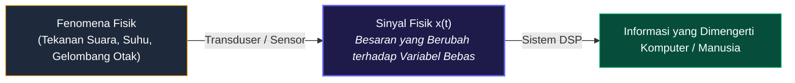
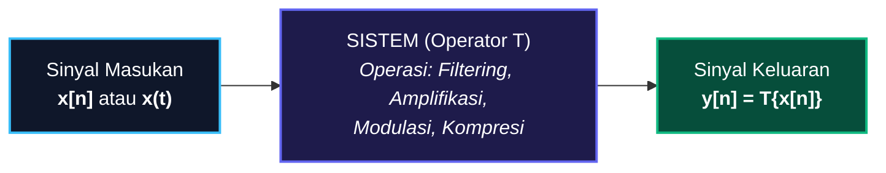
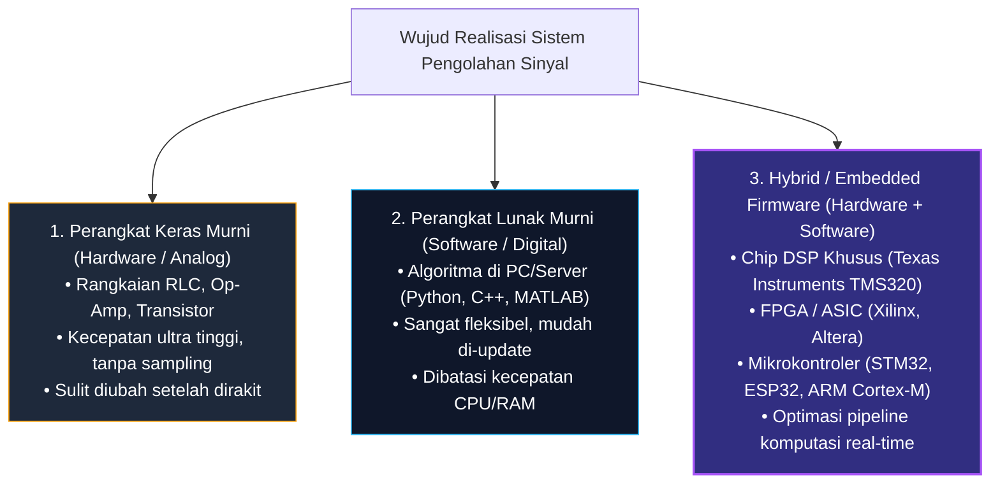
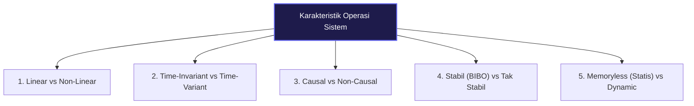

# 📘 MODUL PEMBELAJARAN PENGOLAHAN SINYAL DIGITAL (PSD)
**Materi Terkompilasi — Konsep Dasar Sinyal dan Sistem**

---

## 📑 DAFTAR ISI
1. [BAB 1: Fondasi & Parameter Sinyal](#bab-1-fondasi--parameter-sinyal)
   - [1.1 Definisi Fundamental Sinyal](#11-definisi-fundamental-sinyal)
   - [1.2 Representasi Matematis](#12-representasi-matematis)
   - [1.3 Tiga Parameter Utama (Amplitudo, Frekuensi, Fase)](#13-tiga-parameter-utama)
   - [1.4 Anatomi Visual Grafik Sinyal](#14-anatomi-visual-grafik-sinyal)
   - [1.5 Studi Kasus: Sinyal Ucapan (Speech Signal)](#15-studi-kasus-sinyal-ucapan)
2. [BAB 2: Konsep Dasar & Klasifikasi Sistem](#bab-2-konsep-dasar--klasifikasi-sistem)
   - [2.1 Definisi Sistem](#21-definisi-sistem)
   - [2.2 Tiga Bentuk Realisasi Sistem](#22-tiga-bentuk-realisasi-sistem)
   - [2.3 Klasifikasi & Karakteristik Operasi Sistem](#23-klasifikasi--karakteristik-operasi-sistem)

---

# BAB 1: Fondasi & Parameter Sinyal

### 1.1 Definisi Fundamental Sinyal
> **📌 Definisi:**  
> **Sinyal** adalah suatu besaran fisik yang nilainya berubah terhadap waktu, ruang, atau satu maupun lebih variabel bebas lainnya. Sinyal bertindak sebagai media pembawa informasi fisik dari suatu fenomena alam ke sistem pengolah data.



### 1.2 Representasi Matematis
Sinyal direpresentasikan secara formal sebagai fungsi dari variabel-variabel bebas:
* **Sinyal 1-Dimensi (1D) — $x = f(t)$:** Contoh: sinyal suara $s(t)$, tegangan listrik $v(t)$, sinyal detak jantung ECG $x(t)$.
* **Sinyal 2-Dimensi (2D) — $I = f(x, y)$:** Contoh: citra digital/gambar (intensitas kecerahan pada koordinat baris $x$ dan kolom $y$).
* **Sinyal Multi-Dimensi (3D/4D) — $V = f(x, y, t)$:** Contoh: video digital (rangkaian frame 2D terhadap waktu) atau citra medis MRI 3D.

### 1.3 Tiga Parameter Utama
Setiap gelombang sinusoida dapat dinyatakan secara eksplisit:
$$x(t) = A \cdot \sin(2\pi f t + \phi) = A \cdot \sin(\omega t + \phi)$$

| Parameter | Simbol & Satuan | Makna Matematis | Makna Fisik (Contoh Audio) |
| :--- | :--- | :--- | :--- |
| **Amplitudo** | $A$ (Volt, Pascal, dsb.) | Simpangan puncak maksimum gelombang dari titik nol. | **Kekuatan / Volume Suara (*Loudness*)**. |
| **Frekuensi** | $f = \frac{1}{T}$ (Hz) atau $\omega = 2\pi f$ (rad/s) | Jumlah siklus gelombang penuh per 1 detik. | **Tinggi-Rendah Nada (*Pitch*)**. |
| **Fase** | $\phi$ (Radian / Derajat) | Posisi awal gelombang pada saat $t = 0$. | **Pergeseran Waktu / Arah Kedatangan Gelombang**. |

### 1.4 Anatomi Visual Grafik Sinyal
```
   Amplitudo (Sumbu Y)
         ▲
         │
     +A ─┼─ ─ ─ ─ ─ ─╭───────╮ ─ ─ ─ ─ ─ ─ ─ ─ ─ ─ ─ ─ ─ ─ ─ ─ ─ ─ ─ ─ ─ ─ ─ Puncak (Peak)
         │          /         \
         │         /           \                    │◄─── AMPLITUDO (A) ────────►│
         │        /  ▲          \                   │  Jarak vertikal dari       │
         │      /    │ Amplitudo  \                 │  garis 0 ke puncak atas    │
       0 ┼─────/─────┼─(A)─────────\─────────────────\───────────────► Waktu (t)
         │    /      │              \               / \                (Sumbu X)
         │   /       ▼               \             /   \
     -A ─┼─ ─ ─ ─ ─ ─ ─ ─ ─ ─ ─ ─ ─ ─ ─╰───────╯ ─ ─ ─ ─ ─ ─ ─ ─ ─ ─ ─ ─ ─ ─ Lembah (Trough)
         │
         │   │◄────────────── 1 SIKLUS PENUH (T) ─────────────►│
         │   │          (1 Periode = 1 Bukit + 1 Lembah)       │
         └───┴─────────────────────────────────────────────────┴─────────────►
             0 detik                                         T detik
```

### 1.5 Studi Kasus: Sinyal Ucapan
* **Informasi Fonem/Tekstual:** Resonansi rongga vokal (*Formant* $F_1, F_2, F_3$).
* **Informasi Pembicara:** Frekuensi dasar pita suara ($F_0$) dan timbre suara.
* **Informasi Emosi:** Dinamika modulasi amplitudo dan kontur intonasi frekuensi.

---

# BAB 2: Konsep Dasar & Klasifikasi Sistem

### 2.1 Definisi Sistem
> **📌 Definisi:**  
> **Sistem** adalah suatu perangkat fisik atau realisasi perangkat lunak yang melakukan suatu operasi matematis atau manipulasi tertentu pada sinyal masukan (*input*) $x[n]$ untuk menghasilkan sinyal keluaran (*output*) $y[n]$ yang diinginkan.

Secara formal, sistem dinyatakan sebagai operator transformasi $\mathcal{T}\{\cdot\}$:
$$y[n] = \mathcal{T}\{x[n]\}$$



---

### 2.2 Tiga Bentuk Realisasi Sistem

Sistem pengolahan sinyal dapat diimplementasikan dalam 3 wujud:



---

### 2.3 Klasifikasi & Karakteristik Operasi Sistem

Operasi yang dilakukan oleh sistem akan menentukan sifat dan perilakunya:



#### 1. Linear vs Non-Linear
Sistem dikatakan **Linear** jika memenuhi **Prinsip Superposisi** (Gabungan sifat *Aditivitas* dan *Homogenitas/Penskalaan*):
$$\mathcal{T}\{a \cdot x_1[n] + b \cdot x_2[n]\} = a \cdot \mathcal{T}\{x_1[n]\} + b \cdot \mathcal{T}\{x_2[n]\}$$
* *Contoh Linear:* $y[n] = 3 x[n] + 2 x[n-1]$ (Penguat / Filter FIR).
* *Contoh Non-Linear:* $y[n] = x^2[n]$ atau $y[n] = \log(x[n])$ (Distorsi, Kompresor audio non-linear).

#### 2. Time-Invariant vs Time-Variant (Invariansi Waktu)
Sistem bersifat **Time-Invariant (TI)** jika pergeseran waktu pada sinyal masukan menghasilkan pergeseran waktu yang persis sama pada sinyal keluaran tanpa mengubah bentuk responnya:
$$\text{Jika } x[n] \to y[n], \quad \text{maka } x[n - n_0] \to y[n - n_0]$$
* *Contoh TI:* Karakteristik filter equalizer audio yang parameternya tetap konstan sepanjang waktu.
* *Contoh Time-Variant:* Sistem radar dengan antena yang berputar atau saluran komunikasi nirkabel yang berubah-ubah karena pergerakan kendaraan.

#### 3. Kausal (Causal) vs Non-Kausal
* **Sistem Kausal:** Nilai keluaran saat ini $y[n]$ **hanya bergantung** pada nilai masukan saat ini $x[n]$ dan masukan masa lalu $x[n-1], x[n-2], \dots$. *Wajib untuk semua sistem pemrosesan real-time fisik.*
* **Sistem Non-Kausal:** Bergantung pada masukan masa depan $x[n+1]$. Hanya dimungkinkan pada pemrosesan offline (misalnya pengeditan foto/rekaman video yang sudah tersimpan di memori).

#### 4. Stabilitas BIBO (Bounded-Input Bounded-Output)
Sistem dikatakan **Stabil** jika setiap masukan yang nilainya berhingga (terbatas $|x[n]| \leq M_x < \infty$) selalu menghasilkan keluaran yang nilainya juga berhingga ($|y[n]| \leq M_y < \infty$). Sistem tidak akan meledak (*blow up*) atau berosilasi liar.
