# 📘 BUKU AJAR VISUAL PENGOLAHAN SINYAL DIGITAL (PSD)
*Panduan Komprehensif Berbasis Visual: Dari Paradigma ASP vs DSP, Konversi Digitalisasi ADC, Sinyal Multikanal & Multi-Dimensi, hingga Analisis Mendalam Sinusoidal Kontinu vs Diskrit*

---

# BAB 1: Fondasi Pemrosesan Sinyal & Analisis Gelombang

## 📑 DAFTAR ISI BAB 1

- [1.1 Paradigma Pemrosesan Sinyal — Dari Dunia Fisik Analog (ASP) ke Era Digital (DSP)](#11-paradigma-pemrosesan-sinyal--dari-dunia-fisik-analog-asp-ke-era-digital-dsp)
  - [1.1.1 Dari Fenomena Fisik Menjadi Sinyal Listrik (Peran Sensor & Transduser)](#111-dari-fenomena-fisik-menjadi-sinyal-listrik-peran-sensor--transduser)
  - [1.1.2 Paradigma Pemrosesan: Rantai ASP (Analog) vs Rantai DSP (Digital)](#112-paradigma-pemrosesan-rantai-asp-analog-vs-rantai-dsp-digital)
  - [1.1.3 Tiga Pilar Anatomi Gelombang: Amplitudo, Frekuensi, dan Fase](#113-tiga-pilar-anatomi-gelombang-amplitudo-frekuensi-dan-fase)
  - [1.1.4 Sistem Pengolah Sinyal & 4 Klasifikasi Karakteristik Operasinya](#114-sistem-pengolah-sinyal--4-klasifikasi-karakteristik-operasinya)
- [1.2 Proses Digitalisasi Sinyal (Analog-to-Digital Converter / ADC)](#12-proses-digitalisasi-sinyal-analog-to-digital-converter--adc)
  - [1.2.1 Rantai 4 Tahap Lengkap Digitalisasi ADC](#121-rantai-4-tahap-lengkap-digitalisasi-adc)
  - [1.2.2 Pencuplikan (Sampling Clock), Teorema Nyquist, dan Bencana Aliasing](#122-pencuplikan-sampling-clock-teorema-nyquist-dan-bencana-aliasing)
  - [1.2.3 Kuantisasi & Pengkodean Biner 3-Bit (Rentang 0 s.d. 10 Volt)](#123-kuantisasi--pengkodean-biner-3-bit-rentang-0-sd-10-volt)
  - [1.2.4 Studi Kasus End-to-End: Konversi Sinyal Sinus Utuh x(t) ke Aliran Bit Biner](#124-studi-kasus-end-to-end-konversi-sinyal-sinus-utuh-xt-ke-aliran-bit-biner)
- [1.3 Klasifikasi Lanjutan Sinyal Modern](#13-klasifikasi-lanjutan-sinyal-modern)
  - [1.3.1 Sinyal Multikanal (Multi-Channel Signals) & Representasi Vektor-Matriks](#131-sinyal-multikanal-multi-channel-signals--representasi-vektor-matriks)
  - [1.3.2 Sinyal Multi-Dimensi (Multi-Dimensional Signals / M-D): 1D, 2D, 3D, hingga 4D](#132-sinyal-multi-dimensi-multi-dimensional-signals--m-d-1d-2d-3d-hingga-4d)
  - [1.3.3 Sinyal Waktu Diskrit (Discrete-Time Signals / DTS) & Sinyal Elementer](#133-sinyal-waktu-diskrit-discrete-time-signals--dts--sinyal-elementer)
- [1.4 Klasifikasi Ruang Nilai & Kepastian Sinyal](#14-klasifikasi-ruang-nilai--kepastian-sinyal)
  - [1.4.1 Definisi Hakiki Sinyal Digital: Diskrit Waktu & Diskrit Amplitudo (4 Ruang Sinyal)](#141-definisi-hakiki-sinyal-digital-diskrit-waktu--diskrit-amplitudo-4-ruang-sinyal)
  - [1.4.2 Sinyal Deterministik vs Sinyal Acak (Random / Stokastik)](#142-sinyal-deterministik-vs-sinyal-acak-random--stokastik)
- [1.5 Analisis Frekuensi & Gelombang Sinusoidal (Kontinu vs Diskrit)](#15-analisis-frekuensi--gelombang-sinusoidal-kontinu-vs-diskrit)
  - [1.5.1 Perbandingan Domain Frekuensi: Sinyal Waktu Kontinu vs Sinyal Waktu Diskrit](#151-perbandingan-domain-frekuensi-sinyal-waktu-kontinu-vs-sinyal-waktu-diskrit)
  - [1.5.2 Sinyal Sinusoidal Waktu-Kontinu (1/2): Sifat Keunikan Frekuensi Fisik & Laju Tak Terbatas](#152-sinyal-sinusoidal-waktu-kontinu-12-sifat-keunikan-frekuensi-fisik--laju-tak-terbatas)
  - [1.5.3 Sinyal Sinusoidal Waktu-Kontinu (2/2): Periodisitas Universal untuk Setiap Frekuensi F](#153-sinyal-sinusoidal-waktu-kontinu-22-periodisitas-universal-untuk-setiap-frekuensi-f)
  - [1.5.4 Sinyal Sinusoidal Waktu-Diskrit (1/3): Syarat Wajib Periodisitas Bilangan Rasional f = k/N](#154-sinyal-sinusoidal-waktu-diskrit-13-syarat-wajib-periodisitas-bilangan-rasional-f--kn)
  - [1.5.5 Sinyal Sinusoidal Waktu-Diskrit (2/3): Fenomena Frekuensi Identik Kelipatan 2π](#155-sinyal-sinusoidal-waktu-diskrit-23-fenomena-frekuensi-identik-kelipatan-2π)
  - [1.5.6 Sinyal Sinusoidal Waktu-Diskrit (3/3): Laju Osilasi Tertinggi pada ω = π (f = 1/2)](#156-sinyal-sinusoidal-waktu-diskrit-33-laju-osilasi-tertinggi-pada-ω--π-f--12)

---

## 1.1 Paradigma Pemrosesan Sinyal — Dari Dunia Fisik Analog (ASP) ke Era Digital (DSP)

### 1.1.1 Dari Fenomena Fisik Menjadi Sinyal Listrik (Peran Sensor & Transduser)

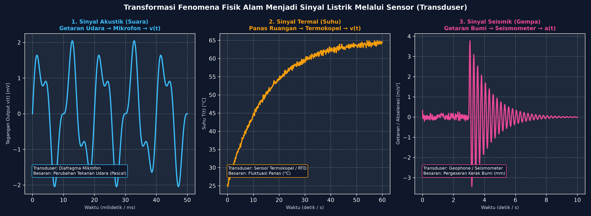

#### 🔍 Bedah Contoh Berdasarkan Visualisasi di Atas:

* **Panel 1 (Sinyal Akustik / Suara — Biru Muda):**  
  Ketika pita suara manusia bergetar di udara (tekanan Pascal), diafragma mikrofon menangkap gelombang mekanik tersebut dan mengubahnya menjadi fluktuasi **tegangan listrik $v(t)$ dalam skala milivolt (mV)**. Grafik menunjukkan getaran suara berosilasi bolak-balik dalam rentang $50\text{ ms}$.

* **Panel 2 (Sinyal Termal / Suhu — Oranye):**  
  Sensor termokopel mendeteksi kenaikan suhu panas ruangan dari $25^\circ\text{C}$ menuju $65^\circ\text{C}$ selama durasi $60\text{ detik}$. Terlihat riak gerigi halus (*thermal noise*) yang menyertai kenaikan kurva eksponensial tersebut.

* **Panel 3 (Sinyal Seismik / Gempa Bumi — Pink Magenta):**  
  Kerak bumi yang tenang tiba-tiba bergeser pada detik ke-$3$. Sensor seismometer langsung merekam lonjakan akselerasi tanah hingga $+3.8\text{ m/s}^2$ yang kemudian mereda perlahan.

---

### 1.1.2 Paradigma Pemrosesan: Rantai ASP (Analog) vs Rantai DSP (Digital)

#### 🔍 Bedah Alur Pemrosesan Berdasarkan Diagram di Atas:

* **Rantai Atas — Analog Signal Processing (ASP):**
  $$\text{Sinyal Analog } x(t) \longrightarrow \mathbf{\text{Sistem ASP (Resistor, Kapasitor, Op-Amp)}} \longrightarrow \text{Sinyal Output } y(t)$$
  * *Contoh:* Equalizer audio analog jadul. Kelemahannya: rentan derau solderan, interferensi magnet, dan perubahan suhu komponen.

* **Rantai Bawah — Digital Signal Processing (DSP):**
  $$\text{Sinyal Analog } x(t) \longrightarrow \mathbf{A/D} \longrightarrow \mathbf{\text{DSP Processor (CPU/Algoritma)}} \longrightarrow \mathbf{D/A} \longrightarrow \text{Sinyal Output } y(t)$$
  * *Contoh:* Active Noise Cancellation (ANC) di headphone modern. Keunggulannya: kebal derau suhu 100%, sangat presisi, dan algoritma dapat di-update melalui firmware software tanpa mengganti sirkuit fisik.

---

### 1.1.3 Tiga Pilar Anatomi Gelombang: Amplitudo, Frekuensi, dan Fase

Persamaan matematis gelombang sinus murni:
$$x(t) = A \cdot \sin(2\pi f t + \phi)$$

#### 🔍 Bedah Parameter Berdasarkan Gambar Visual:

1. **Amplitudo ($A = 3.0\text{ Volt}$):**  
   * *Lihat Gambar Anatomi:* Ketinggian puncak dari titik seimbang $y=0$ menuju puncak (*Peak* di $+3\text{V}$) atau lembah (*Trough* di $-3\text{V}$).  
   * *Lihat Gambar Komparasi Panel 2:* Memperbesar $A$ dari $1\text{V}$ ke $3\text{V}$ (kurva ungu) membuat getaran gelombang semakin besar (pada audio: suara semakin keras).

2. **Frekuensi ($f = 2\text{ Hz}$) & Periode ($T = 0.5\text{ detik}$):**  
   * *Lihat Gambar Anatomi:* Periode $T$ adalah waktu 1 siklus penuh ($0.5\text{ s}$). Frekuensinya $f = \frac{1}{0.5} = 2\text{ Hz}$.  
   * *Lihat Gambar Komparasi Panel 1:* Gelombang oranye ($3\text{ Hz}$) bergetar 3 kali lebih rapat dibanding gelombang biru ($1\text{ Hz}$), menghasilkan nada suara yang lebih melengking tinggi.

3. **Fase ($\phi = 90^\circ$ atau $\pi/2\text{ rad}$):**  
   * *Lihat Gambar Komparasi Panel 3:* Gelombang merah memiliki pergeseran fase $90^\circ$. Saat $t=0$, gelombang merah sudah berada di puncak tertinggi (start mendahului gelombang biru).

---

### 1.1.4 Sistem Pengolah Sinyal & 4 Klasifikasi Karakteristik Operasinya

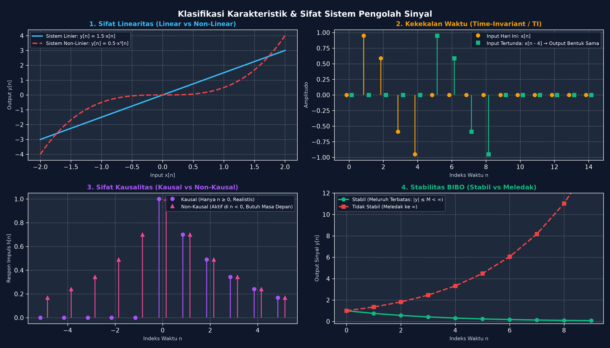

#### 🔍 Bedah Karakteristik Sistem Berdasarkan 4 Panel di Atas:

1. **Panel 1 — Linearitas (Linear vs Non-Linear):**  
   * Garis biru: Sistem linier $y[n] = 1.5 x[n]$ (lurus proporsional, mematuhi prinsip superposisi).  
   * Garis merah putus-putus: Sistem non-linier $y[n] = 0.5 x^3[n]$ (melengkung ekstrem, memicu distorsi harmonisa).

2. **Panel 2 — Kekekalan Waktu (Time-Invariant / TI):**  
   * Sinyal oranye dimasukkan pada $n=0$. Sinyal hijau dimasukkan 4 detik kemudian ($n-4$).  
   * Karena sistem bersifat *Time-Invariant*, bentuk keluaran keduanya **identik sama persis**, hanya bergeser waktu.

3. **Panel 3 — Kausalitas (Kausal vs Non-Kausal):**  
   * Respon impuls ungu hanya bernilai pada $n \geq 0$ (Kausal, realistis dapat dibuat di perangkat nyata).  
   * Respon impuls pink sudah aktif sebelum input masuk ($n < 0$) (Non-Kausal, mustahil di real-time karena butuh masa depan).

4. **Panel 4 — Stabilitas BIBO (Bounded-Input Bounded-Output):**  
   * Kurva hijau stabil ($y[n] = 0.75^n$): Nilai output meluruh mengecil menuju $0$.  
   * Kurva merah tidak stabil ($y[n] = 1.35^n$): Nilai output melonjak liar menuju tak hingga ($\infty$) dan merusak sirkuit.

---

## 1.2 Proses Digitalisasi Sinyal (Analog-to-Digital Converter / ADC)

### 1.2.1 Rantai 4 Tahap Lengkap Digitalisasi ADC

#### 🔍 Bedah Alur Kerja ADC Berdasarkan 4 Panel di Atas:

1. **Panel 1 (Sinyal Analog Asli):** Gelombang mulus kontinu terhadap waktu ($t$) dan nilai tegangan ($V$).
2. **Panel 2 (Pencuplikan / Sampling Clock):** Sakelar clock memotret tegangan pada interval periodik $T_s$. Sinyal menjadi **Diskrit Waktu**, tapi amplitudonya masih bilangan pecahan riil tak terbatas.
3. **Panel 3 (Kuantisasi Tegangan):** Nilai pecahan dibulatkan ke garis anak tangga horizontal terdekat ($x_q[n]$). Sinyal menjadi **Diskrit Nilai**.
4. **Panel 4 (Pengkodean Biner):** Setiap nomor anak tangga diubah menjadi deretan bit `0` dan `1` yang siap diproses komputer.

---

### 1.2.2 Pencuplikan (Sampling Clock), Teorema Nyquist, dan Bencana Aliasing

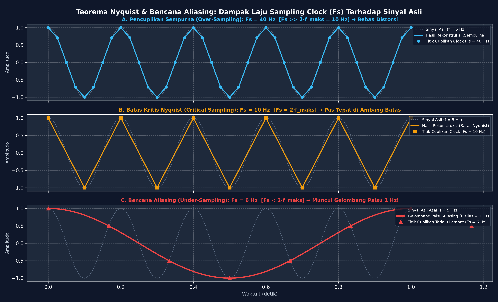

#### 🔍 Bedah Kasus Berdasarkan 3 Grafik di Atas:
*Sinyal uji: Frekuensi asli $f = 5\text{ Hz}$ (garis titik abu-abu).*

* **Grafik A — Over-Sampling ($F_s = 40\text{ Hz} \gg 2 \times 5\text{ Hz}$):**  
  Clock mengambil $40$ titik per detik (titik lingkaran biru). Rekonstruksi gelombang biru sempurna 100% tanpa cacat.

* **Grafik B — Batas Kritis Nyquist ($F_s = 10\text{ Hz} = 2 \times 5\text{ Hz}$):**  
  Clock mengambil tepat $2$ titik per siklus gelombang (kotak oranye). Batas minimal agar frekuensi asli tidak hilang.

* **Grafik C — Bencana Aliasing ($F_s = 6\text{ Hz} < 2 \times 5\text{ Hz}$):**  
  Clock terlalu lambat (segitiga merah). Rekonstruksi komputer salah membaca pola dan membentuk **Gelombang Hantu Merah berfrekuensi lambat $1\text{ Hz}$ ($|5 - 6| = 1\text{ Hz}$)**. Inilah fenomena **Aliasing**.

> **🛡️ Teorema Nyquist-Shannon:** Syarat mutlak bebas aliasing adalah:
> $$F_s \geq 2 \cdot f_{\text{maks}}$$

---

### 1.2.3 Kuantisasi & Pengkodean Biner 3-Bit (Rentang 0 s.d. 10 Volt)

#### 🔍 Bedah Tangga Kuantisasi Berdasarkan Grafik di Atas:

* **Resolusi ADC:** $3\text{-bit} \implies 2^3 = 8\text{ Tingkat Level}$.
* **Lebar Rentang Per Step (*Step Size* $\Delta$):**  
  $$\Delta = \frac{V_{\text{maks}} - V_{\text{min}}}{2^B} = \frac{10.0\text{ V} - 0.0\text{ V}}{8} = 1.25\text{ Volt / step}$$

#### Tabel Pemetaan Step 1 s.d. Step 8:

| Step Kuantisasi | Rentang Tegangan Input ($V_{\text{in}}$) | Kode Biner Encoding | Nilai Tengah Level ($V_q$) |
| :---: | :---: | :---: | :---: |
| **Step 1** | $0.00\text{ V} \leq V_{\text{in}} < 1.25\text{ V}$ | **`000`** | $0.625\text{ V}$ |
| **Step 2** | $1.25\text{ V} \leq V_{\text{in}} < 2.50\text{ V}$ | **`001`** | $1.875\text{ V}$ |
| **Step 3** | $2.50\text{ V} \leq V_{\text{in}} < 3.75\text{ V}$ | **`010`** | $3.125\text{ V}$ |
| **Step 4** | $3.75\text{ V} \leq V_{\text{in}} < 5.00\text{ V}$ | **`011`** | $4.375\text{ V}$ |
| **Step 5** | $5.00\text{ V} \leq V_{\text{in}} < 6.25\text{ V}$ | **`100`** | $5.625\text{ V}$ |
| **Step 6** | $6.25\text{ V} \leq V_{\text{in}} < 7.50\text{ V}$ | **`101`** | $6.875\text{ V}$ |
| **Step 7** | $7.50\text{ V} \leq V_{\text{in}} < 8.75\text{ V}$ | **`110`** | $8.125\text{ V}$ |
| **Step 8** | $8.75\text{ V} \leq V_{\text{in}} \leq 10.00\text{ V}$| **`111`** | $9.375\text{ V}$ |

---

### 1.2.4 Studi Kasus End-to-End: Konversi Sinyal Sinus Utuh x(t) ke Aliran Bit Biner

* Sinyal Input: $x(t) = 5 + 4 \cdot \sin(2\pi \cdot 1 \cdot t)\text{ Volt}$, dengan laju cuplikan $F_s = 8\text{ Hz}$ ($T_s = 0.125\text{ s}$).

#### 🔍 Pelacakan 8 Titik Cuplikan Berdasarkan Grafik di Atas:

1. **Titik $n = 0$ ($t = 0.000\text{ s}$):** $V = 5.00\text{V} \implies$ Masuk **Step 5** $\implies$ Level $5.625\text{V} \implies$ **Biner `100`**
2. **Titik $n = 1$ ($t = 0.125\text{ s}$):** $V = 7.83\text{V} \implies$ Masuk **Step 7** $\implies$ Level $8.125\text{V} \implies$ **Biner `110`**
3. **Titik $n = 2$ ($t = 0.250\text{ s}$):** $V = 9.00\text{V} \implies$ Masuk **Step 8** $\implies$ Level $9.375\text{V} \implies$ **Biner `111`**
4. **Titik $n = 3$ ($t = 0.375\text{ s}$):** $V = 7.83\text{V} \implies$ Masuk **Step 7** $\implies$ Level $8.125\text{V} \implies$ **Biner `110`**
5. **Titik $n = 4$ ($t = 0.500\text{ s}$):** $V = 5.00\text{V} \implies$ Masuk **Step 5** $\implies$ Level $5.625\text{V} \implies$ **Biner `100`**
6. **Titik $n = 5$ ($t = 0.625\text{ s}$):** $V = 2.17\text{V} \implies$ Masuk **Step 2** $\implies$ Level $1.875\text{V} \implies$ **Biner `001`**
7. **Titik $n = 6$ ($t = 0.750\text{ s}$):** $V = 1.00\text{V} \implies$ Masuk **Step 1** $\implies$ Level $0.625\text{V} \implies$ **Biner `000`**
8. **Titik $n = 7$ ($t = 0.875\text{ s}$):** $V = 2.17\text{V} \implies$ Masuk **Step 2** $\implies$ Level $1.875\text{V} \implies$ **Biner `001`**

$$\mathbf{\text{Aliran Bit Output (Bitstream)}} = \mathbf{100 \ 110 \ 111 \ 110 \ 100 \ 001 \ 000 \ 001}$$

---

## 1.3 Klasifikasi Lanjutan Sinyal Modern

### 1.3.1 Sinyal Multikanal (Multi-Channel Signals) & Representasi Vektor-Matriks

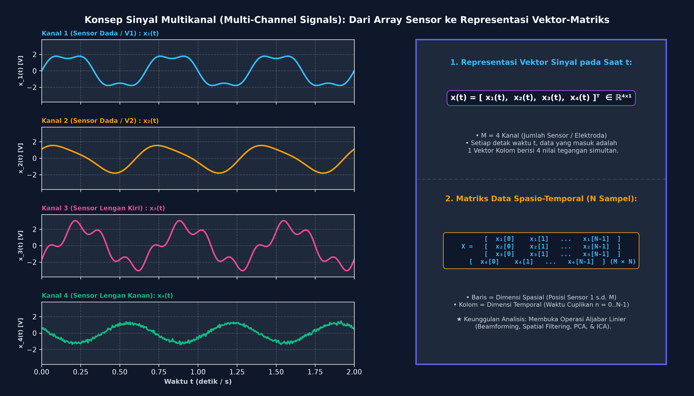

#### 🔍 Bedah Konsep Berdasarkan Visualisasi di Atas:

* **Panel Kiri (4 Kanal Sensor Simultan):**  
  Menampilkan 4 sensor/elektroda yang merekam secara serentak:
  * **Kanal 1 (Biru):** Sensor Dada $V_1 \implies x_1(t)$
  * **Kanal 2 (Oranye):** Sensor Dada $V_2 \implies x_2(t)$
  * **Kanal 3 (Pink):** Sensor Lengan Kiri $\implies x_3(t)$
  * **Kanal 4 (Hijau):** Sensor Lengan Kanan $\implies x_4(t)$

* **Panel Kanan (Representasi Vektor & Matriks):**
  1. **Vektor Kolom pada Saat $t$:** Pada setiap detak waktu, data yang masuk adalah 1 vektor kolom $\mathbf{x}(t) = [x_1(t), x_2(t), x_3(t), x_4(t)]^T \in \mathbb{R}^{4 \times 1}$.
  2. **Matriks Spasio-Temporal $\mathbf{X}_{M \times N}$:** Jika direkam selama $N$ sampel, seluruh data membentuk matriks di mana **Baris adalah Dimensi Spasial (Sensor 1..4)** dan **Kolom adalah Dimensi Waktu ($n = 0 \dots N-1$)**.

---

### 1.3.2 Sinyal Multi-Dimensi (Multi-Dimensional Signals / M-D): 1D, 2D, 3D, hingga 4D

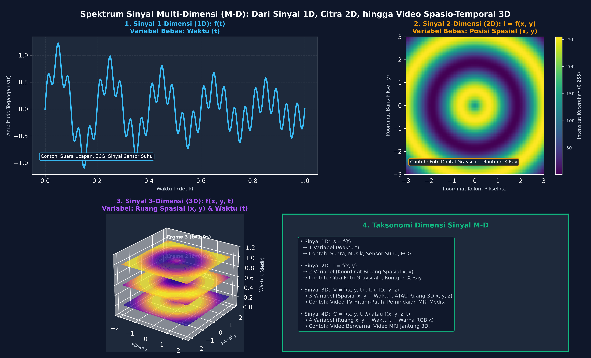

#### 🔍 Bedah Hierarki Dimensi Berdasarkan 4 Panel di Atas:

1. **Panel 1 — Sinyal 1D ($s = f(t)$):** Hanya 1 variabel bebas (Waktu $t$). Contoh: Audio ucapan manusia.
2. **Panel 2 — Sinyal 2D ($I = f(x, y)$):** Memiliki 2 variabel koordinat ruang $(x, y)$. Nilai fungsi adalah intensitas terang-gelap piksel citra digital.
3. **Panel 3 — Sinyal 3D Spasio-Temporal ($V = f(x, y, t)$):** Tumpukan frame citra 2D yang berjalan seiring sumbu waktu $t$. Contoh: Video rekaman TV hitam-putih dan volume 3D MRI.
4. **Panel 4 — Sinyal 4D ($C = f(x, y, t, \lambda)$):** Ruang $(x, y)$, Waktu $(t)$, dan Spektrum Warna $(\lambda)$ pada video berwarna bioskop.

---

### 1.3.3 Sinyal Waktu Diskrit (Discrete-Time Signals / DTS) & Sinyal Elementer

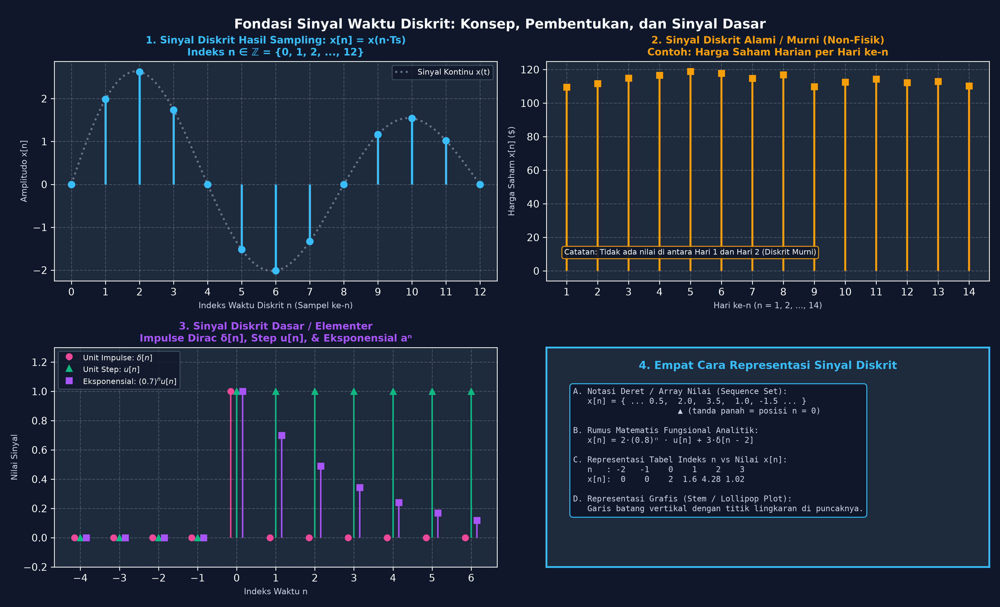

#### 🔍 Bedah Sinyal Diskrit Berdasarkan 4 Panel di Atas:

1. **Panel 1 (Stem Plot Sampling):** Sinyal kontinu dipotret menjadi batang vertikal $x[n] = x(n T_s)$ dengan indeks integer bulat $n \in \mathbb{Z}$.
2. **Panel 2 (Sinyal Diskrit Alami):** Fluktuasi harga saham harian per hari ke-$n$ yang memang lahir langsung dalam angka diskrit.
3. **Panel 3 (Tiga Sinyal Elementer):**  
   * **Unit Impulse $\delta[n]$ (Pink):** Bernilai $1$ hanya di $n=0$. Merupakan blok pembangun respon impuls sistem ($h[n]$).  
   * **Unit Step $u[n]$ (Hijau):** Bernilai $1$ untuk semua $n \geq 0$.  
   * **Eksponensial $a^n u[n]$ (Ungu):** Nilai meluruh $0.7^n$ mendekati nol.

---

## 1.4 Klasifikasi Ruang Nilai & Kepastian Sinyal

### 1.4.1 Definisi Hakiki Sinyal Digital: Diskrit Waktu & Diskrit Amplitudo (4 Ruang Sinyal)

> **🎯 Definisi Baku:** **Sinyal Digital** adalah sinyal yang berada dalam domain **waktu-diskrit ($n \in \mathbb{Z}$)** dan sekaligus memiliki himpunan **nilai amplitudo diskrit ($x_q[n] \in \{V_1, V_2, \dots, V_L\}$)** yang terkuantisasi ke dalam kode biner berhingga.

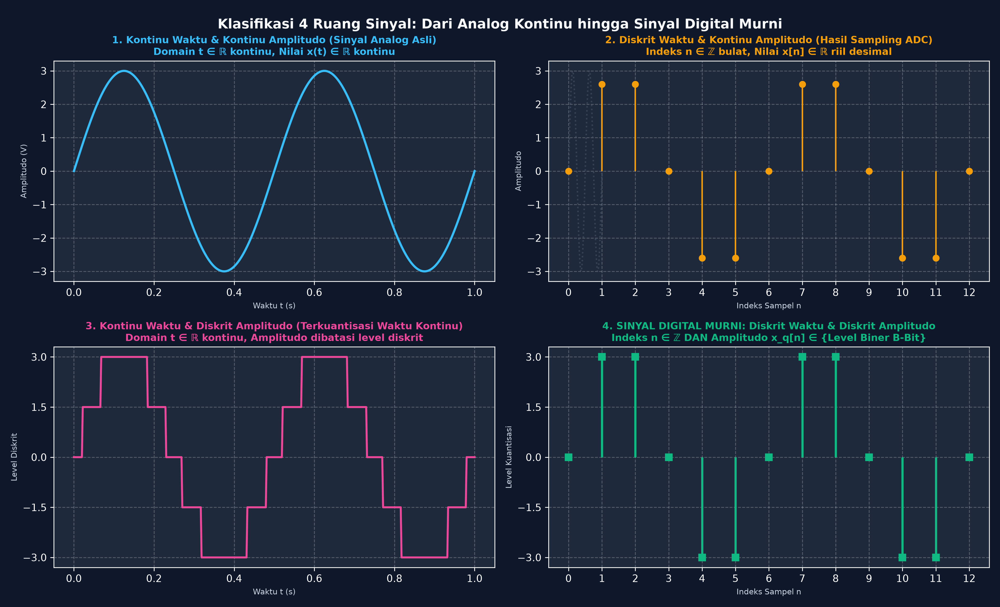

#### 🔍 Bedah 4 Ruang Sinyal Berdasarkan Gambar di Atas:

1. **Kuadran 1 (Kiri Atas — Sinyal Analog Asli):**  
   * *Domain Waktu:* Kontinu ($t \in \mathbb{R}$).  
   * *Domain Amplitudo:* Kontinu ($x(t) \in \mathbb{R}$).  
   * *Visual:* Garis kurva biru mulus tak terputus.

2. **Kuadran 2 (Kanan Atas — Sinyal Sampled-Data):**  
   * *Domain Waktu:* Diskrit ($n \in \mathbb{Z}$, hasil cuplikan clock ADC).  
   * *Domain Amplitudo:* Kontinu ($x[n] \in \mathbb{R}$, nilai tinggi batang masih desimal tak berhingga).  
   * *Visual:* Batang-batang jarum oranye yang tingginya persis mengikuti kurva analog.

3. **Kuadran 3 (Kiri Bawah — Sinyal Terkuantisasi Waktu Kontinu):**  
   * *Domain Waktu:* Kontinu ($t \in \mathbb{R}$).  
   * *Domain Amplitudo:* Diskrit (dibulatkan paksa ke 5 level tetap: $-3, -1.5, 0, 1.5, 3$).  
   * *Visual:* Garis pink berbentuk balok-balok patah kontinu.

4. **Kuadran 4 (Kanan Bawah — SINYAL DIGITAL MURNI):**  
   * *Domain Waktu:* Diskrit ($n \in \mathbb{Z}$).  
   * *Domain Amplitudo:* Diskrit ($x_q[n] \in \text{Level Biner}$).  
   * *Visual:* Batang jarum hijau dengan ujung kotak yang tingginya **hanya boleh berhenti tepat di garis level kuantisasi**. Inilah satu-satunya format yang dapat disimpan di memori RAM dan diolah oleh ALU prosesor komputer!

---

### 1.4.2 Sinyal Deterministik vs Sinyal Acak (Random / Stokastik)

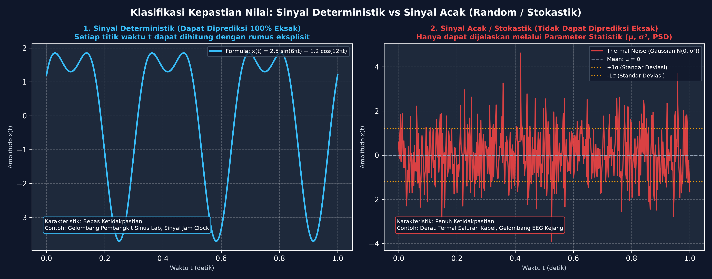

#### 🔍 Bedah Contoh & Perbedaan Berdasarkan Visualisasi di Atas:

* **Panel 1 (Sinyal Deterministik — Biru Muda):**
  * **Definisi:** Sinyal yang setiap nilai masa lalu, saat ini, dan masa depannya dapat ditentukan **secara pasti 100%** menggunakan formula matematika eksplisit tanpa ada unsur ketidakpastian.
  * **Contoh pada Grafik:** Sinyal kombinasi harmonisa:
    $$x(t) = 2.5 \sin(6\pi t) + 1.2 \cos(12\pi t)$$
    Jika ditanya nilai $x(0.5\text{ s})$, kita dapat langsung menghitungnya secara eksak presisi tanpa tebak-tebakan.
  * **Aplikasi:** Pembangkit fungsi laboratorium (*Function Generator*), sinyal detak osilator jam kristal mikroprosesor.

* **Panel 2 (Sinyal Acak / Stokastik — Merah):**
  * **Definisi:** Sinyal yang **tidak dapat dijelaskan oleh hubungan matematis eksplisit** atau memiliki tingkat kerumitan yang terlalu tinggi sehingga nilainya di masa depan tidak dapat diprediksi secara pasti.
  * **Cara Analisis:** Hanya dapat didekati menggunakan **Parameter Statistik & Teori Probabilitas**:
    1. *Mean / Rata-rata ($\mu$):* Nilai pusat sinyal (garis abu-abu $\mu = 0$).
    2. *Variansi & Standar Deviasi ($\sigma, \sigma^2$):* Batas sebaran daya energi derau (garis titik-titik oranye $\pm 1\sigma$).
    3. *Fungsi Kerapatan Probabilitas (PDF):* Distribusi Normal Gaussian.
    4. *Power Spectral Density (PSD):* Kerapatan daya pada setiap spektrum frekuensi.
  * **Contoh Nyata:** Derau termal kabel konduktor (*Johnson-Nyquist noise*), derau atmosfer penerima radio antariksa, dan fluktuasi sinyal gelombang otak EEG pasien saat serangan kejang epilepsi.

---

## 1.5 Analisis Frekuensi & Gelombang Sinusoidal (Kontinu vs Diskrit)

### 1.5.1 Perbandingan Domain Frekuensi: Sinyal Waktu Kontinu vs Sinyal Waktu Diskrit

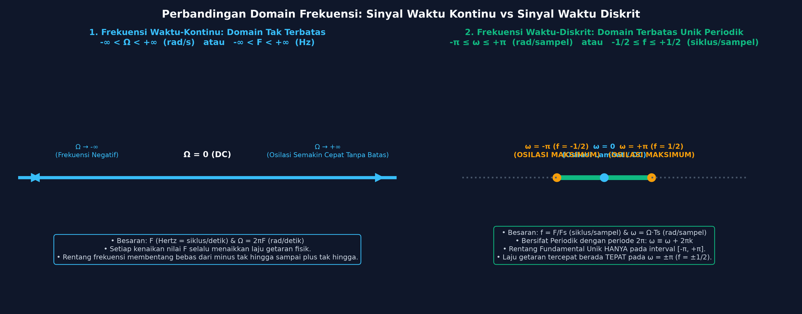

#### 🔍 Komparasi Visual Dua Domain Frekuensi:

| Parameter | Domain Waktu-Kontinu (Analog) | Domain Waktu-Diskrit (Digital) |
| :--- | :--- | :--- |
| **Simbol Frekuensi Siklik** | $F$ (Satuan: $\text{Hertz} = \text{siklus/detik}$) | $f = \frac{F}{F_s}$ (Satuan: $\text{siklus/sampel}$) |
| **Simbol Frekuensi Sudut** | $\Omega = 2\pi F$ (Satuan: $\text{rad/detik}$) | $\omega = \Omega T_s = 2\pi f$ (Satuan: $\text{rad/sampel}$) |
| **Rentang Frekuensi Unik** | $-\infty < \Omega < +\infty$ (Tak terbatas) | **$-\pi \leq \omega \leq +\pi$** atau **$-\frac{1}{2} \leq f \leq +\frac{1}{2}$** |
| **Sifat Periodisitas Spektrum** | Aperiodik | **Periodik dengan periode $2\pi$** ($\omega \equiv \omega + 2\pi k$) |
| **Laju Osilasi Tertinggi** | $\Omega \to \infty$ (Semakin besar tanpa batas) | **Tepat di $\omega = \pm \pi$ ($f = \pm 1/2$)** |

---

### 1.5.2 Sinyal Sinusoidal Waktu-Kontinu (1/2): Sifat Keunikan Frekuensi Fisik & Laju Tak Terbatas

Persamaan gelombang sinusoidal kontinu:
$$x_a(t) = A \cos(\Omega t + \theta) = A \cos(2\pi F t + \theta)$$

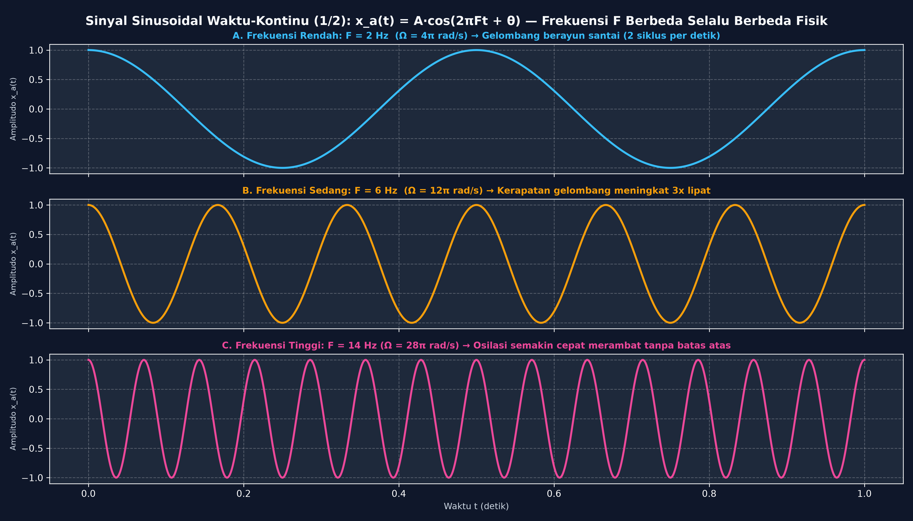

#### 🔍 Bedah Karakteristik 1 Berdasarkan Gambar di Atas:

* **Sifat 1 — Setiap Frekuensi $F$ Berbeda Adalah Gelombang yang Berbeda Unik:**  
  * *Grafik A ($F = 2\text{ Hz}$):* Berayun santai dengan 2 puncak per detik.  
  * *Grafik B ($F = 6\text{ Hz}$):* Kerapatan gelombang melonjak 3 kali lipat.  
  * *Grafik C ($F = 14\text{ Hz}$):* Gelombang semakin rapat dan bergetar cepat.  
  Tidak ada satupun nilai $F_1 \neq F_2$ yang menghasilkan bentuk fisik gelombang yang sama di dunia kontinu!

* **Sifat 2 — Laju Osilasi Bertambah Tanpa Batas:**  
  Semakin besar kita menaikkan frekuensi $F \to \infty$, laju getaran fisik partikel akan terus bertambah cepat tanpa batas atas.

---

### 1.5.3 Sinyal Sinusoidal Waktu-Kontinu (2/2): Periodisitas Universal untuk Setiap Frekuensi F

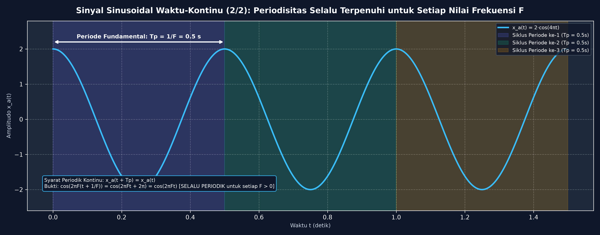

#### 🔍 Bedah Karakteristik 2 Berdasarkan Gambar di Atas:

* **Sifat Mutlak:** Sinyal sinusoidal waktu-kontinu **SELALU PERIODIK** untuk setiap nilai frekuensi $F > 0$!
* **Periode Fundamental ($T_p$):**
  $$T_p = \frac{1}{F} = \frac{2\pi}{\Omega}$$
* **Pembuktian Matematis:**
  $$x_a(t + T_p) = A \cos\left(2\pi F \left(t + \frac{1}{F}\right)\right) = A \cos(2\pi F t + 2\pi) = A \cos(2\pi F t) = x_a(t)$$

* **Contoh Visual pada Grafik:**  
  Untuk $x_a(t) = 2\cos(4\pi t)$ dengan $F = 2\text{ Hz}$, periode fundamentalnya adalah $T_p = \frac{1}{2} = 0.5\text{ detik}$.  
  Terlihat jelas:
  * Siklus ke-1: Rentang $0.0\text{ s} \le t < 0.5\text{ s}$ (kotak ungu)
  * Siklus ke-2: Rentang $0.5\text{ s} \le t < 1.0\text{ s}$ (kotak hijau)
  * Siklus ke-3: Rentang $1.0\text{ s} \le t \le 1.5\text{ s}$ (kotak oranye)  
  Bentuk ketiga siklus tersebut **100% simetris berulang selamanya**.

---

### 1.5.4 Sinyal Sinusoidal Waktu-Diskrit (1/3): Syarat Wajib Periodisitas Bilangan Rasional f = k/N

Persamaan gelombang sinusoidal diskrit:
$$x[n] = A \cos(\omega n + \theta) = A \cos(2\pi f n + \theta)$$

> **⚠️ FAKTA KRUSIAL:** Berbeda dengan sinyal kontinu yang selalu periodik, **Sinyal Sinusoidal Waktu-Diskrit TIDAK SELALU PERIODIK!**

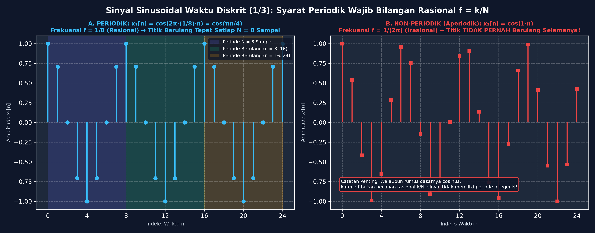

#### 🔍 Bedah Syarat Periodisitas Berdasarkan Visualisasi di Atas:

Agar sinyal diskrit periodik dengan periode bulat $N$ ($x[n + N] = x[n]$), maka harus berlaku:
$$\cos(2\pi f (n + N)) = \cos(2\pi f n + 2\pi k) \implies 2\pi f N = 2\pi k \implies \mathbf{f = \frac{k}{N} \in \mathbb{Q} \quad (\text{Bilangan Rasional})}$$

* **Panel A (Periodik — Biru Muda):**  
  $$x_1[n] = \cos\left(\frac{\pi}{4} n\right) = \cos\left(2\pi \cdot \frac{1}{8} \cdot n\right)$$
  Karena frekuensi $f = \frac{1}{8}$ adalah pecahan rasional ($k=1, N=8$), maka sinyal **Periodik dengan Periode Fundamental $N = 8$ sampel**. Perhatikan pada grafik, titik-titik sampel berulang persis sama pada siklus $n=0..8$, $n=8..16$, dan $n=16..24$.

* **Panel B (Non-Periodik / Aperiodik — Merah):**  
  $$x_2[n] = \cos(1 \cdot n) = \cos\left(2\pi \cdot \frac{1}{2\pi} \cdot n\right)$$
  Karena frekuensinya $f = \frac{1}{2\pi}$ adalah bilangan **Irasional** (mengandung $\pi$), tidak ada bilangan bulat $N$ yang memenuhi. Akibatnya, titik-titik sampel merah **tidak akan pernah berulang persis sama di sepanjang waktu sampai kapan pun!**

---

### 1.5.5 Sinyal Sinusoidal Waktu-Diskrit (2/3): Fenomena Frekuensi Identik Kelipatan 2π

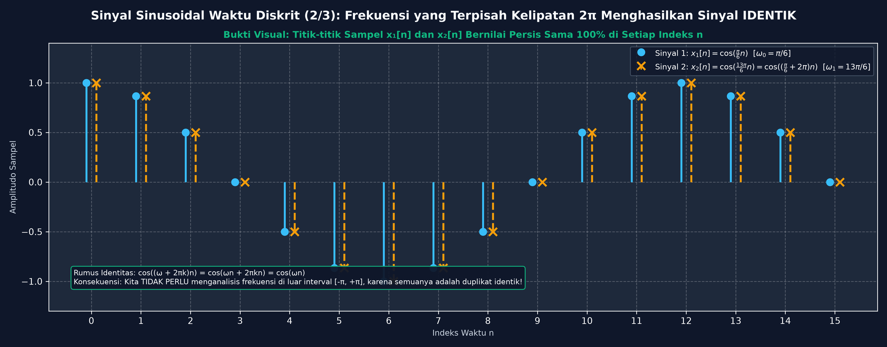

#### 🔍 Bedah Fenomena Frekuensi Identik Berdasarkan Grafik di Atas:

* **Teorema Kesamaan Frekuensi:** Sinyal sinusoidal diskrit dengan frekuensi sudut yang terpisah sejauh kelipatan bilangan bulat $2\pi$ adalah **IDENTIK SATU SAMA LAIN**:
  $$\cos((\omega + 2\pi k)n) = \cos(\omega n + 2\pi k n) = \cos(\omega n)$$

* **Contoh Nyata pada Gambar:**
  * Sinyal 1 (Titik Bulat Biru): $x_1[n] = \cos\left(\frac{\pi}{6} n\right)$ dengan $\omega_0 = \frac{\pi}{6} = 30^\circ$.
  * Sinyal 2 (Tanda Silang Oranye): $x_2[n] = \cos\left(\frac{13\pi}{6} n\right) = \cos\left(\left(\frac{\pi}{6} + 2\pi\right) n\right)$ dengan $\omega_1 = \frac{13\pi}{6} = 390^\circ$.

* **Bukti Visual:**  
  Lihat posisi tanda silang oranye dan lingkaran biru pada setiap indeks $n = 0, 1, 2, \dots, 15$. Keduanya **menempel tepat di titik koordinat yang sama 100%**.
  
> **💡 Kesimpulan Praktis:** Dalam sistem DSP, kita **hanya perlu menganalisis frekuensi pada interval fundamental $-\pi \leq \omega \leq \pi$** (atau $0 \leq \omega \leq 2\pi$), karena frekuensi di luar rentang tersebut hanyalah duplikasi alias identik.

---

### 1.5.6 Sinyal Sinusoidal Waktu-Diskrit (3/3): Laju Osilasi Tertinggi pada ω = π (f = 1/2)

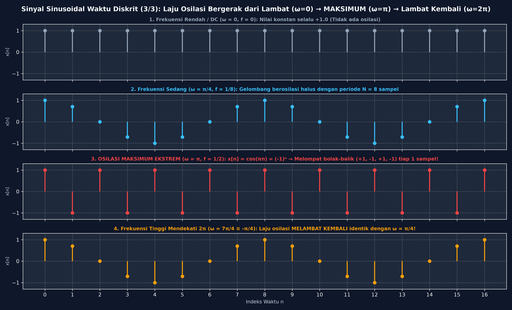

#### 🔍 Bedah Pola Laju Osilasi Berdasarkan 4 Grafik di Atas:

1. **Grafik 1 (Frekuensi Rendah / DC — $\omega = 0, f = 0$):**  
   $$x[n] = \cos(0 \cdot n) = +1.0$$  
   Semua titik sampel bernilai konstan datar $+1.0$. Tidak ada osilasi getaran sama sekali.

2. **Grafik 2 (Frekuensi Sedang — $\omega = \frac{\pi}{4}, f = \frac{1}{8}$):**  
   Gelombang berosilasi mulus dengan periode $N = 8$ sampel per siklus.

3. **Grafik 3 (OSILASI TERTINGGI MAKSIMUM — $\omega = \pi, f = \frac{1}{2}$):**  
   $$x[n] = \cos(\pi n) = (-1)^n = \{+1, -1, +1, -1, +1, -1, \dots\}$$  
   Perhatikan titik-titik merah: Sinyal melompat ekstrem bolak-balik antara puncak $+1$ dan lembah $-1$ **di setiap 1 pergantian sampel ($n \to n+1$)**. Ini adalah laju perubahan nilai tercepat yang mungkin terjadi di dunia digital!

4. **Grafik 4 (Frekuensi Tinggi Mendekati $2\pi$ — $\omega = \frac{7\pi}{4} \equiv -\frac{\pi}{4}$):**  
   Ketika $\omega$ dinaikkan melampaui $\pi$ menuju $2\pi$, laju osilasi **JUSTRU MELAMBAT KEMBALI** dan bentuk gelombangnya persis identik dengan $\omega = \frac{\pi}{4}$!

---
*Dokumen ini disusun sebagai Modul Pembelajaran Visual Pengolahan Sinyal Digital (PSD) berstandar industri dan akademis.*
