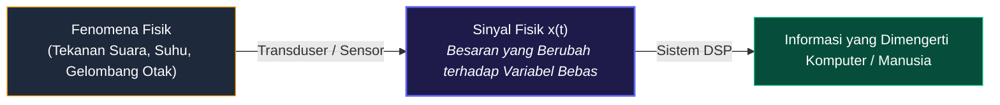
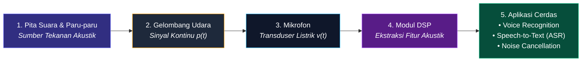
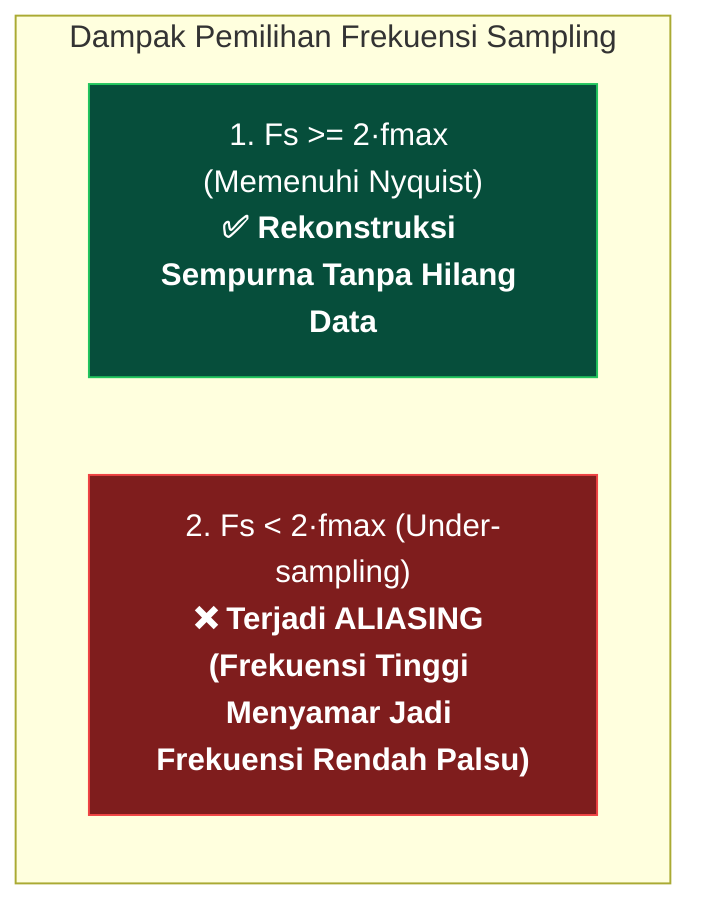

# 📘 MODUL PEMBELAJARAN PENGOLAHAN SINYAL DIGITAL (PSD)
**Materi Terkompilasi — Sinyal, Sistem, dan Proses Digitalisasi (ADC)**

---

## 📑 DAFTAR ISI MODUL
* [BAB 1: Pengantar Sinyal, Sistem, dan Paradigma Pemrosesan](#bab-1-pengantar-sinyal-sistem-dan-paradigma-pemrosesan)
  * [1.1 Definisi Fundamental Sinyal](#11-definisi-fundamental-sinyal)
  * [1.2 Representasi Matematis Sinyal](#12-representasi-matematis-sinyal)
  * [1.3 Tiga Parameter Utama Sinyal](#13-tiga-parameter-utama-sinyal)
  * [1.4 Anatomi Visual Grafik Sinyal](#14-anatomi-visual-grafik-sinyal)
  * [1.5 Komparasi Visual Parameter Sinyal](#15-komparasi-visual-parameter-sinyal)
  * [1.6 Studi Kasus: Sinyal Ucapan (Speech Signal)](#16-studi-kasus-sinyal-ucapan)
  * [1.7 Konsep Dasar Sistem](#17-konsep-dasar-sistem)
  * [1.8 Tiga Bentuk Realisasi Sistem](#18-tiga-bentuk-realisasi-sistem)
  * [1.9 Klasifikasi Karakteristik Operasi Sistem](#19-klasifikasi-karakteristik-operasi-sistem)
  * [1.10 Paradigma Pemrosesan Sinyal: ASP vs DSP](#110-paradigma-pemrosesan-sinyal-asp-vs-dsp)
  * [1.11 Keunggulan Paradigma DSP](#111-keunggulan-paradigma-dsp)
* [BAB 2: Digitalisasi Sinyal (ADC & Proses Sampling)](#bab-2-digitalisasi-sinyal-adc--proses-sampling)
  * [2.1 Rantai Lengkap Konversi Analog ke Digital (ADC)](#21-rantai-lengkap-konversi-analog-ke-digital-adc)
  * [2.2 Tahap 1: Pencuplikan (Sampling) & Pulsa Clock](#22-tahap-1-pencuplikan-sampling--pulsa-clock)
  * [2.3 Tahap 2: Kuantisasi (Quantization) & Level Pembulatan](#23-tahap-2-kuantisasi-quantization--level-pembulatan)
  * [2.4 Tahap 3: Pengkodean (Encoding) ke Bit Biner](#24-tahap-3-pengkodean-encoding-ke-bit-biner)
  * [2.5 Teorema Sampling Nyquist-Shannon & Aliasing](#25-teorema-sampling-nyquist-shannon--aliasing)

---

# BAB 1: Pengantar Sinyal, Sistem, dan Paradigma Pemrosesan

## 1.1 Definisi Fundamental Sinyal

> **📌 Definisi Sinyal:**  
> **Sinyal** adalah suatu besaran fisik yang nilainya berubah terhadap waktu, ruang, atau satu maupun lebih variabel bebas lainnya. Sinyal berfungsi sebagai media pembawa informasi fisik dari suatu fenomena alam atau sensor ke sistem pengolah data.

---

## 1.2 Representasi Matematis Sinyal

Sinyal direpresentasikan secara formal sebagai fungsi dari variabel-variabel bebas:

* **Sinyal 1-Dimensi (1D) — Fungsi Waktu $t$:**
  $$x = f(t)$$
  *Contoh:* Sinyal suara ucapan $s(t)$, tegangan listrik sensor $v(t)$, sinyal detak jantung ECG $x(t)$.

* **Sinyal 2-Dimensi (2D) — Fungsi Spasial $(x, y)$:**
  $$I = f(x, y)$$
  *Contoh:* Citra digital/foto (intensitas kecerahan pada koordinat baris $x$ dan kolom $y$).

* **Sinyal Multi-Dimensi (3D/4D) — Spatio-Temporal:**
  $$V = f(x, y, t)$$
  *Contoh:* Video digital (rangkaian frame citra 2D yang berubah seiring waktu $t$) atau citra medis CT-Scan/MRI 3D.

---

## 1.3 Tiga Parameter Utama Sinyal

Sebagian besar sinyal periodik atau harmonik dapat dinyatakan secara eksplisit melalui persamaan gelombang sinusoida:

$$x(t) = A \cdot \sin(2\pi f t + \phi) = A \cdot \sin(\omega t + \phi)$$

| Parameter | Simbol & Satuan | Makna Matematis | Makna Fisik (Contoh Audio) |
| :--- | :--- | :--- | :--- |
| **Amplitudo** | $A$ (Volt, Pascal, dsb.) | Simpangan puncak maksimum gelombang dari titik nol. | **Kekuatan / Volume Suara (*Loudness*)**. Gelombang tinggi = suara keras. |
| **Frekuensi** | $f = \frac{1}{T}$ (Hz) atau $\omega = 2\pi f$ (rad/s) | Jumlah siklus gelombang penuh per 1 detik. | **Tinggi-Rendah Nada (*Pitch*)**. Gelombang rapat = nada tinggi melengking. |
| **Fase** | $\phi$ (Radian / Derajat) | Posisi awal gelombang pada saat $t = 0$. | **Pergeseran Waktu / Arah Kedatangan Gelombang**. |

---

## 1.4 Anatomi Visual Grafik Sinyal

---

## 1.5 Komparasi Visual Parameter Sinyal

---

## 1.6 Studi Kasus: Sinyal Ucapan (*Speech Signal*)

### Informasi dalam Sinyal Ucapan:
1. **Informasi Fonem/Tekstual:** Resonansi rongga vokal (*Formant* $F_1, F_2, F_3$). Contoh: membedakan vokal "A", "I", "U", "E", "O".
2. **Informasi Pembicara:** Frekuensi dasar pita suara ($F_0$) dan warna suara unik (*Timbre*).
3. **Informasi Emosi & Intonasi:** Modulasi amplitudo dan kontur naik-turunnya frekuensi.

---

## 1.7 Konsep Dasar Sistem

> **📌 Definisi Sistem:**  
> **Sistem** adalah perangkat fisik atau realisasi perangkat lunak yang melakukan suatu operasi matematis atau transformasi pada sinyal masukan $x[n]$ untuk menghasilkan sinyal keluaran $y[n]$ yang diinginkan:
> $$y[n] = \mathcal{T}\{x[n]\}$$

---

## 1.8 Tiga Bentuk Realisasi Sistem

---

## 1.9 Klasifikasi Karakteristik Operasi Sistem

1. **Linear vs Non-Linear:** Memenuhi prinsip superposisi $\mathcal{T}\{a x_1 + b x_2\} = a \mathcal{T}\{x_1\} + b \mathcal{T}\{x_2\}$.
2. **Time-Invariant (TI) vs Time-Variant:** $x[n - n_0] \implies y[n - n_0]$.
3. **Kausal (Causal) vs Non-Kausal:** Output saat ini hanya bergantung pada input saat ini dan masa lalu.
4. **Stabilitas BIBO:** Input terbatas selalu menghasilkan output terbatas.

---

## 1.10 Paradigma Pemrosesan Sinyal: ASP vs DSP

---

## 1.11 Keunggulan Paradigma DSP

| Parameter | Sistem Analog (ASP) | Sistem Digital (DSP) |
| :--- | :--- | :--- |
| **Fleksibilitas Desain** | ❌ Kaku. Ubah fungsi harus ganti rangkaian fisik/solder baru. | ✅ **Ultra Fleksibel**. Cukup update baris kode program (*software/firmware*). |
| **Kekebalan Derau (*Noise Immunity*)** | ❌ Sangat rentan terhadap gangguan kabel dan derau lingkungan. | ✅ **Kebal**. Data berupa biner (0 & 1), tidak terpengaruh fluktuasi tegangan kecil. |
| **Akurasi & Konsistensi** | ❌ Berubah-ubah tergantung suhu dan toleransi komponen. | ✅ **Eksak & 100% Reprodusibel**. Ditentukan oleh presisi bit komputasi (32-bit / 64-bit). |
| **Penyimpanan (*Storage*)** | ❌ Pita kaset magnetik (kualitas turun setiap diputar). | ✅ **Lossless**. Disimpan di SSD/Flashdisk selamanya tanpa penurunan kualitas. |
| **Algoritma Canggih** | ❌ Hanya operasi matematika dasar (tambah, diferensial). | ✅ **Bisa Algoritma Sangat Rumit** (Active Noise Cancellation, AI Speech-to-Text). |

---

# BAB 2: Digitalisasi Sinyal (ADC & Proses Sampling)

Untuk dapat diproses oleh komputer digital, sinyal analog dari alam nyata harus melalui proses konversi **Analog-to-Digital (ADC)**.

---

## 2.1 Rantai Lengkap Konversi Analog ke Digital (ADC)

```mermaid
flowchart LR
    Analog["Sinyal Analog x(t)<br><i>Kontinu Waktu & Nilai</i>"] --> LPF["0. Anti-Aliasing Filter<br>(Low-Pass Analog)"]
    LPF --> Sampler["1. Sampling (Clock Ts)<br>x[n] = x(nTs)<br><i>Diskrit Waktu</i>"]
    Sampler --> Quantizer["2. Kuantisasi (2^B Level)<br>xq[n]<br><i>Diskrit Nilai</i>"]
    Quantizer --> Encoder["3. Encoding (Biner)<br>Stream Bit 0 & 1"]
    Encoder --> DSPCore["Digital Signal Processor<br>(CPU / FPGA / DSP)"]

    style Analog fill:#1e293b,stroke:#64748b,color:#fff
    style LPF fill:#78350f,stroke:#f59e0b,color:#fff
    style Sampler fill:#312e81,stroke:#6366f1,color:#fff
    style Quantizer fill:#581c87,stroke:#a855f7,color:#fff
    style Encoder fill:#064e3b,stroke:#10b981,color:#fff
    style DSPCore fill:#0f172a,stroke:#38bdf8,color:#fff
```

---

## 2.2 Tahap 1: Pencuplikan (Sampling) & Pulsa Clock

* **Apa itu Sampling?**  
  Proses mengubah variabel waktu kontinu $t$ menjadi variabel waktu diskrit $n$ dengan mengambil cuplikan nilai sinyal pada interval waktu berkala yang teratur:
  $$t = n \cdot T_s = \frac{n}{F_s}$$
  $$x[n] = x(n \cdot T_s)$$
* **Peran Pulsa Clock Generator:**  
  Rangkaian osilator clock membangkitkan pulsa trigger secara periodik setiap periode sampling $T_s = \frac{1}{F_s}$. Setiap pulsa clock datang, saklar *Sample-and-Hold (S/H)* akan menangkap dan menahan nilai tegangan analog sesaat.
* **Status Sinyal:**  
  Pada tahap ini, sinyal sudah **diskrit dalam domain waktu**, namun nilai amplitudonya **masih kontinu** (dapat bernilai desimal tak hingga seperti $2.71828\dots$ Volt).

---

## 2.3 Tahap 2: Kuantisasi (Quantization) & Level Pembulatan

* **Apa itu Kuantisasi?**  
  Proses memetakan dan membulatkan nilai amplitudo kontinu dari sampel $x[n]$ ke salah satu level diskrit terdekat $x_q[n]$ yang telah ditentukan sebelumnya.
* **Kapasitas Resolusi Bit ($B$-bit ADC):**  
  Jika sebuah konverter ADC memiliki resolusi $B$ bit, maka jumlah level kuantisasi diskrit yang tersedia adalah:
  $$L = 2^B$$
  *Contoh:*
  * ADC 3-bit: $2^3 = 8$ level.
  * ADC 8-bit: $2^8 = 256$ level.
  * ADC 16-bit (Audio CD): $2^{16} = 65.536$ level!
  * ADC 24-bit (Studio Pro): $2^{24} = 16.777.216$ level!
* **Lebar Langkah Kuantisasi (*Step Size* $\Delta$):**  
  $$\Delta = \frac{V_{\text{max}} - V_{\text{min}}}{2^B - 1}$$
* **Derau Kuantisasi (*Quantization Noise / Error*):**  
  Perbedaan antara nilai asli dengan nilai yang dibulatkan:
  $$e[n] = x_q[n] - x[n], \quad -\frac{\Delta}{2} \leq e[n] \leq \frac{\Delta}{2}$$
  *Semakin banyak jumlah bit $B$, nilai $\Delta$ semakin kecil, dan derau kuantisasi semakin hilang.*

---

## 2.4 Tahap 3: Pengkodean (Encoding) ke Bit Biner

* **Apa itu Encoding?**  
  Proses menetapkan deretan kode biner ($B$-bit digital word) yang unik untuk setiap level kuantisasi yang dipilih.
  *Contoh pada ADC 3-bit:*
  * Level 0 ($V_{\text{min}}$) $\to$ `000`
  * Level 1 $\to$ `001`
  * Level 2 $\to$ `010`
  * $\dots$
  * Level 7 ($V_{\text{max}}$) $\to$ `111`
* **Hasil Akhir:**  
  Aliran data biner (*Digital Stream of Bits*) berkecepatan $R = F_s \times B \text{ bit/detik}$ yang siap dibaca, diolah, difilter, atau disimpan oleh prosesor digital (DSP, CPU, FPGA).

---

## 2.5 Teorema Sampling Nyquist-Shannon & Aliasing

Agar informasi pada sinyal analog asli $x(t)$ tidak rusak dan dapat direkonstruksi kembali secara sempurna, frekuensi sampling clock $F_s$ **wajib memenuhi syarat Teorema Nyquist**:

$$F_s \geq 2 \cdot f_{\text{max}}$$

* $f_{\text{max}}$ = Frekuensi tertinggi yang terkandung di dalam sinyal analog.
* $f_N = \frac{F_s}{2}$ = **Frekuensi Nyquist** (Batas frekuensi maksimum yang aman disampling).

> **🛡️ Peran Anti-Aliasing Filter:**  
> Filter analog Low-Pass Filter (LPF) selalu diletakkan tepat **sebelum** proses pencuplikan (sampling) untuk memastikan tidak ada komponen frekuensi liar $f > F_s/2$ yang masuk ke ADC.
