# 📘 BUKU AJAR & MODUL LENGKAP PENGOLAHAN SINYAL DIGITAL (PSD)
*Panduan Komprehensif: Dari Konsep Dasar, Sinyal, Sistem, hingga Proses Digitalisasi (ADC)*

---

## 📑 DAFTAR ISI
1. [BAB 1: Memahami Fondasi Sinyal, Sistem, dan Paradigma Pemrosesan](#bab-1-memahami-fondasi-sinyal-sistem-dan-paradigma-pemrosesan)
   - [1.1 Apa Sebenarnya Sinyal Itu? (Konsep Awam & Filosofi)](#11-apa-sebenarnya-sinyal-itu-konsep-awam--filosofi)
   - [1.2 Dimensi Sinyal dalam Kehidupan Sehari-hari (1D, 2D, 3D)](#12-dimensi-sinyal-dalam-kehidupan-sehari-hari-1d-2d-3d)
   - [1.3 Tiga Pilar Anatomi Gelombang: Amplitudo, Frekuensi, dan Fase](#13-tiga-pilar-anatomi-gelombang-amplitudo-frekuensi-dan-fase)
   - [1.4 Anatomi Visual Grafik Sinyal](#14-anatomi-visual-grafik-sinyal)
   - [1.5 Komparasi Visual Parameter Sinyal](#15-komparasi-visual-parameter-sinyal)
   - [1.6 Studi Kasus Nyata: Mengapa Suara Manusia Adalah Sinyal?](#16-studi-kasus-nyata-mengapa-suara-manusia-adalah-sinyal)
   - [1.7 Apa Itu Sistem? (Analogi Mesin Pemroses)](#17-apa-itu-sistem-analogi-mesin-pemroses)
   - [1.8 Tiga Wujud Realisasi Sistem Pengolah Sinyal](#18-tiga-wujud-realisasi-sistem-pengolah-sinyal)
   - [1.9 Klasifikasi Sifat & Karakteristik Operasi Sistem](#19-klasifikasi-sifat--karakteristik-operasi-sistem)
   - [1.10 Dua Paradigma Besar: Pemrosesan Analog (ASP) vs Pemrosesan Digital (DSP)](#110-dua-paradigma-besar-pemrosesan-analog-asp-vs-pemrosesan-digital-dsp)
   - [1.11 Mengapa Dunia Beralih ke DSP? (Kelebihan & Batasan)](#111-mengapa-dunia-beralih-ke-dsp-kelebihan--batasan)
2. [BAB 2: Proses Digitalisasi Sinyal (Analog-to-Digital Converter / ADC)](#bab-2-proses-digitalisasi-sinyal-analog-to-digital-converter--adc)
   - [2.1 Mengapa Sinyal Analog Harus Diubah ke Digital?](#21-mengapa-sinyal-analog-harus-diubah-ke-digital)
   - [2.2 Rantai 4 Tahap Lengkap Konversi ADC](#22-rantai-4-tahap-lengkap-konversi-adc)
   - [2.3 Tahap 1: Pencuplikan (Sampling) & Peran Detak Clock](#23-tahap-1-pencuplikan-sampling--peran-detak-clock)
   - [2.4 Teorema Nyquist-Shannon & Bahaya Fenomena Aliasing](#24-teorema-nyquist-shannon--bahaya-fenomena-aliasing)
   - [2.5 Mengapa Wajib Ada Filter Anti-Aliasing Sebelum Sampling?](#25-mengapa-wajib-ada-filter-anti-aliasing-sebelum-sampling)
   - [2.6 Tahap 2: Kuantisasi (Quantization) — Seni Membulatkan Nilai](#26-tahap-2-kuantisasi-quantization--seni-membulatkan-nilai)
   - [2.7 Tahap 3: Pengkodean (Encoding) ke Deretan Bit Biner Digital](#27-tahap-3-pengkodean-encoding-ke-deretan-bit-biner-digital)
   - [2.8 Studi Kasus End-to-End: Konversi Sinyal Sinus Utuh x(t) ke Aliran Biner](#28-studi-kasus-end-to-end-konversi-sinyal-sinus-utuh-xt-ke-aliran-biner)

---

# BAB 1: Memahami Fondasi Sinyal, Sistem, dan Paradigma Pemrosesan

## 1.1 Apa Sebenarnya Sinyal Itu? (Konsep Awam & Filosofi)

Bayangkan Anda sedang berbicara dengan teman di seberang ruangan. Pita suara Anda bergetar, menggetarkan partikel udara di sekitarnya, merambat sebagai gelombang tekanan udara, dan akhirnya menggetarkan gendang telinga teman Anda. 

Secara ilmiah, getaran tekanan udara yang merambat dari mulut ke telinga itulah yang disebut **Sinyal**.

> **📌 Definisi Formal Sinyal:**  
> **Sinyal** adalah besaran fisik yang nilainya berubah (*bervariasi*) terhadap satu atau lebih variabel bebas (seperti waktu, ruang/posisi, suhu, atau kedalaman). Sinyal bertindak sebagai **kendaraan pembawa pesan (*carrier of information*)** mengenai perilaku suatu fenomena alam.

### Mengapa Sinyal Harus Memiliki Variabel Bebas?
Jika suatu besaran bernilai tetap dan tidak pernah berubah (misalnya tegangan baterai mati yang selalu $0\text{ Volt}$ selamanya), besaran tersebut **tidak membawa informasi baru**. Sinyal baru memiliki makna ketika nilainya berubah seiring berjalannya variabel bebas (paling umum adalah **waktu $t$**).

---

## 1.2 Dimensi Sinyal dalam Kehidupan Sehari-hari (1D, 2D, 3D)

Sinyal dikelompokkan berdasarkan berapa banyak variabel independen yang memengaruhinya:

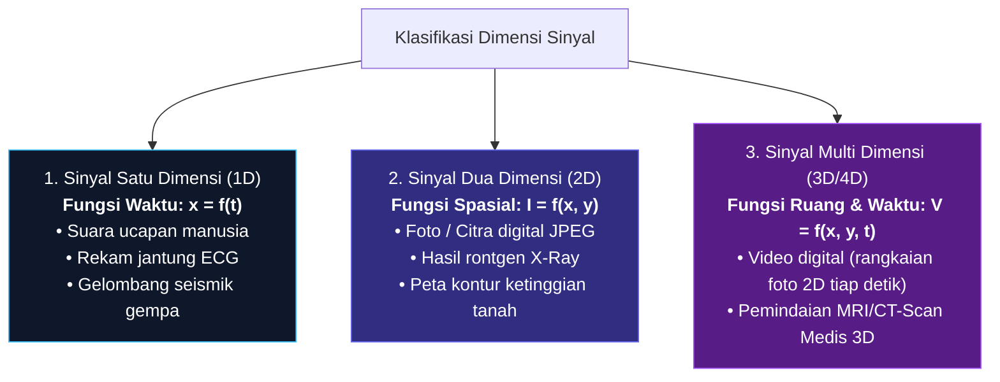

1. **Sinyal 1-Dimensi (1D) — $x = f(t)$:**
   * Hanya bergantung pada 1 variabel bebas, yaitu waktu $t$.
   * *Contoh:* Sinyal audio mikrofon. Pada detik ke-1 tegangannya $2\text{ mV}$, detik ke-2 tegangannya $-1.5\text{ mV}$.
2. **Sinyal 2-Dimensi (2D) — $I = f(x, y)$:**
   * Bergantung pada posisi ruang dua dimensi (baris horizontal $x$ dan kolom vertikal $y$).
   * *Contoh:* Foto digital di layar HP Anda. Setiap titik (*piksel*) pada koordinat $(x, y)$ memiliki intensitas warna atau kecerahan tertentu.
3. **Sinyal 3-Dimensi / Spatio-Temporal — $V = f(x, y, t)$:**
   * Bergantung pada koordinat ruang $(x, y)$ dan berubah seiring waktu $t$.
   * *Contoh:* Video streaming di YouTube. Merupakan tumpukan frame gambar 2D yang diperbarui 60 kali per detik.

---

## 1.3 Tiga Pilar Anatomi Gelombang: Amplitudo, Frekuensi, dan Fase

Semua sinyal di alam semesta—termasuk suara musik orkestra yang sangat rumit—dapat dipecah menjadi susunan gelombang sinusoida sederhana (berdasarkan Teorema Fourier). 

Persamaan matematis gelombang sinus dinyatakan sebagai:

$$x(t) = A \cdot \sin(2\pi f t + \phi) = A \cdot \sin(\omega t + \phi)$$

Mari kita bedah ketiga parameter tersebut dengan analogi kehidupan nyata:

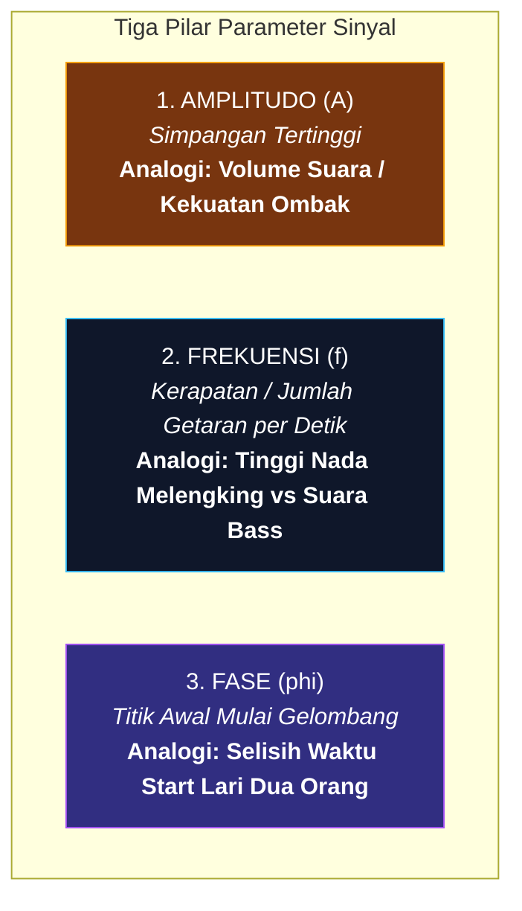

### 1. Amplitudo ($A$) — Satuan: Volt, Pascal, Meter
* **Artinya:** Jarak terjauh dari garis tengah (titik nol) ke puncak gelombang.
* **Analogi Suara:** Amplitudo adalah **Volume Suara (*Loudness*)**. Jika Anda berbisik, gelombang suara beramplitudo kecil. Jika Anda berteriak menggunakan pengeras suara, amplitudonya melonjak tinggi.

### 2. Frekuensi ($f$) — Satuan: Hertz (Hz)
* **Artinya:** Seberapa banyak satu siklus gelombang penuh berulang dalam waktu **1 detik**. Hubungannya dengan Periode ($T$) adalah $f = \frac{1}{T}$.
* **Analogi Suara:** Frekuensi adalah **Tinggi-Rendahnya Nada (*Pitch*)**. 
  * Suara petikan senar gitar bass yang berat berfrekuensi rendah ($\sim 80\text{ Hz}$, gelombang renggang).
  * Suara peluit wasit atau kicauan burung yang melengking berfrekuensi tinggi ($\sim 3000\text{ Hz}$, gelombang sangat rapat).

### 3. Fase ($\phi$) — Satuan: Derajat ($^\circ$) atau Radian ($\text{rad}$)
* **Artinya:** Posisi atau sudut awal gelombang saat waktu $t = 0$.
* **Analogi Suara:** Fase adalah **Selisih Waktu / Arah Datang Gelombang**. Jika telinga kanan Anda mendengar petir $0.001\text{ detik}$ lebih cepat daripada telinga kiri, perbedaan itu disebut perbedaan fase yang membantu otak mengetahui arah petir.

---

## 1.4 Anatomi Visual Grafik Sinyal

Berikut adalah grafik visual yang memperlihatkan dengan jelas bagian-bagian fisik gelombang:

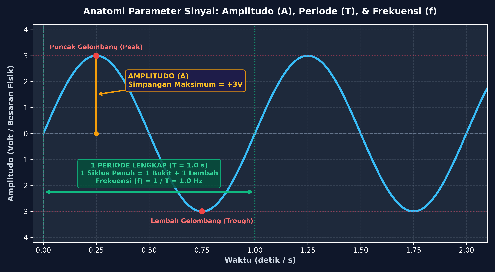

* **Puncak (*Peak*):** Titik tertinggi gelombang ($+A$).
* **Lembah (*Trough*):** Titik terendah gelombang ($-A$).
* **Periode ($T$):** Waktu yang dibutuhkan untuk menyelesaikan 1 bukit dan 1 lembah penuh.
* **Amplitudo ($A$):** Ketinggian dari sumbu 0 ke titik Puncak.

---

## 1.5 Komparasi Visual Parameter Sinyal

Bagaimana jika nilai salah satu parameter diubah? Grafik perbandingan di bawah memperlihatkan perbedaannya:

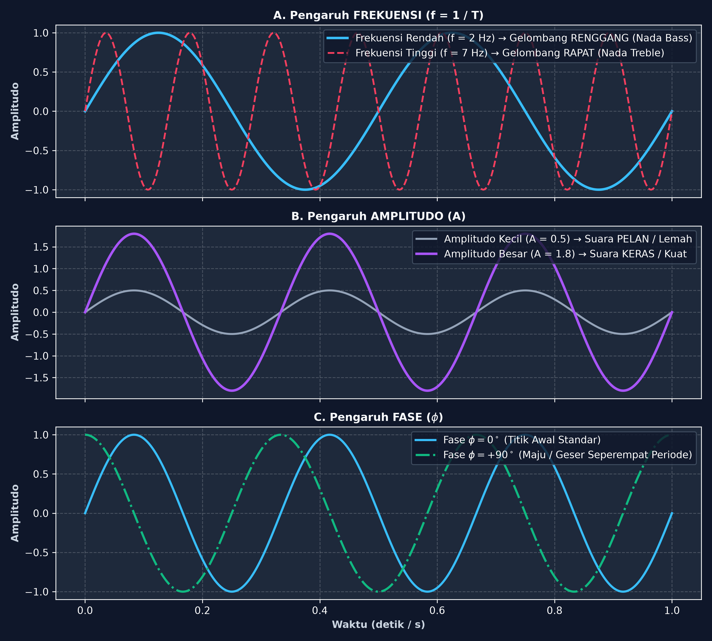

1. **Panel A (Efek Frekuensi):** Frekuensi $2\text{ Hz}$ menghasilkan gelombang renggang lambat, sedangkan $7\text{ Hz}$ menghasilkan gelombang rapat yang bergetar cepat.
2. **Panel B (Efek Amplitudo):** Amplitudo $0.5\text{ V}$ memiliki bukit yang ceper, sedangkan $1.8\text{ V}$ memiliki bukit yang menjulang tinggi.
3. **Panel C (Efek Fase):** Fase $+90^\circ$ membuat gelombang mulai meluncur lebih awal dibanding gelombang fase $0^\circ$.

---

## 1.6 Studi Kasus Nyata: Mengapa Suara Manusia Adalah Sinyal?

Ketika kita berbicara, sinyal suara membawa **3 lapis informasi sekaligus**:
1. **Informasi Tekstual / Kata yang Diucapkan:** Ditentukan oleh bentuk rongga mulut dan lidah yang membentuk frekuensi resonansi khusus bernama **Formant ($F_1, F_2, F_3$)**. Inilah cara komputer membedakan bunyi huruf "A" dan "U".
2. **Informasi Identitas Pembicara:** Ditentukan oleh ketebalan pita suara alami yang menghasilkan nada dasar (*Fundamental Frequency $F_0$*) dan warna suara unik (*Timbre*).
3. **Informasi Emosi:** Ditentukan oleh naik-turunnya volume (modulasi amplitudo) dan nada bicara saat marah, senang, atau sedih.

---

## 1.7 Apa Itu Sistem? (Analogi Mesin Pemroses)

Jika sinyal adalah **bahan mentah** (seperti gandum), maka **Sistem** adalah **pabrik pengolahnya** (mesin penggiling yang mengubah gandum menjadi tepung siap saji).

> **📌 Definisi Sistem:**  
> **Sistem** adalah perangkat fisik (elektronika) atau algoritma perangkat lunak yang menerima sinyal masukan $x[n]$, melakukan operasi atau manipulasi matematis terhadapnya, lalu mengeluarkan sinyal baru $y[n]$ yang telah dimodifikasi:
> $$y[n] = \mathcal{T}\{x[n]\}$$

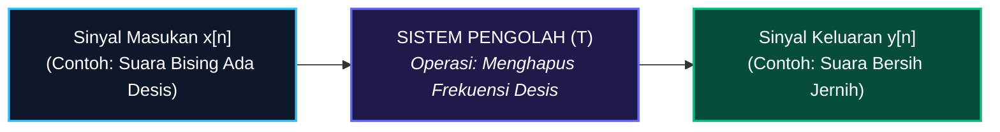

---

## 1.8 Tiga Wujud Realisasi Sistem Pengolah Sinyal

Dalam praktek teknik elektro dan informatika, sistem dapat diwujudkan dalam 3 bentuk:

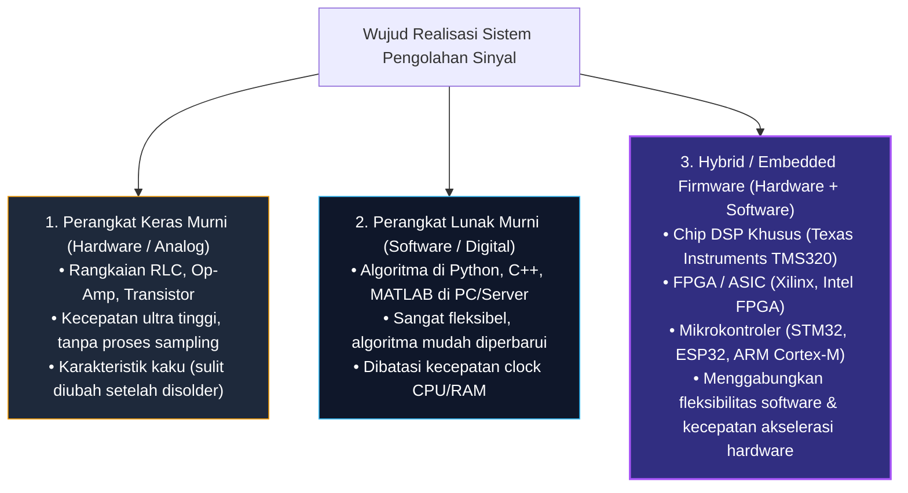

---

## 1.9 Klasifikasi Sifat & Karakteristik Operasi Sistem

Suatu sistem memiliki sifat-sifat fundamental yang menentukan cara kerjanya:

### 1. Linear vs Non-Linear
* **Sistem Linear:** Mematuhi hukum **Prinsip Superposisi**. Jika input diduplikasi dua kali lipat, maka outputnya juga naik tepat dua kali lipat secara proporsional:
  $$\mathcal{T}\{a \cdot x_1[n] + b \cdot x_2[n]\} = a \cdot \mathcal{T}\{x_1[n]\} + b \cdot \mathcal{T}\{x_2[n]\}$$
* **Sistem Non-Linear:** Respon sistem tidak proporsional (contoh: distorsi gitar rock di mana amplifier dipaksa bekerja hingga suara pecah).

### 2. Time-Invariant (Tak-Ubah Waktu) vs Time-Variant
* **Time-Invariant (TI):** Sifat sistem tidak pernah berubah kapan pun Anda menggunakannya. Jika Anda berbicara sekarang menghasilkan suara $y[n]$, berbicara 1 jam kemudian dengan kata yang sama akan menghasilkan suara $y[n]$ yang sama persis (hanya bergeser waktu):
  $$x[n - n_0] \implies y[n - n_0]$$

### 3. Kausal (Causal) vs Non-Kausal
* **Sistem Kausal:** Sistem yang hanya merespons apa yang terjadi **sekarang dan masa lalu**. Sistem ini tidak bisa meramal masa depan ($x[n+1]$). Semua sistem *real-time* di dunia nyata wajib bersifat kausal.
* **Sistem Non-Kausal:** Sistem yang bisa melihat masa depan. Hanya bisa terjadi jika kita mengolah file rekaman (misal file video yang sudah tersimpan di harddisk).

### 4. Stabilitas BIBO (*Bounded-Input Bounded-Output*)
* Jika sinyal masukan diberi batas aman yang tidak meledak ($|x[n]| < M_x < \infty$), maka sinyal keluarannya dijamin tidak akan pernah meledak menuju tak hingga ($|y[n]| < M_y < \infty$).

---

## 1.10 Dua Paradigma Besar: Pemrosesan Analog (ASP) vs Pemrosesan Digital (DSP)

Bagaimana cara para insinyur mengolah sinyal? Terdapat 2 mazhab besar:

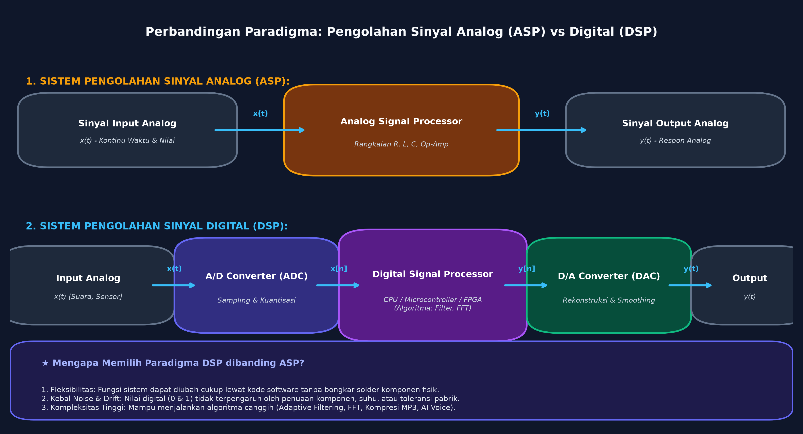

### A. Pengolahan Sinyal Analog (ASP — *Analog Signal Processing*)
$$\text{Input Analog } x(t) \longrightarrow \mathbf{\text{Sirkuit Elektronika RLC / Op-Amp}} \longrightarrow \text{Output Analog } y(t)$$
* **Prinsip:** Sinyal listrik analog dialirkan langsung melewati komponen elektronika pasif/aktif.
* **Kelemahan Fatal ASP:**
  1. **Sensitif Suhu (*Thermal Drift*):** Jika amplifier analog bekerja lama dan memanas, nilai resistansi dan kapasitansi komponen bergeser, membuat kualitas output berubah.
  2. **Kaku & Sulit Dimodifikasi:** Jika ingin mengubah filter dari frekuensi $1\text{ kHz}$ ke $2\text{ kHz}$, sirkuit PCB harus dibongkar dan disolder ulang.
  3. **Penuaan Komponen (*Aging*):** Komponen kimiawi kapasitor mengering seiring bertambahnya usia alat, membuat kinerja alat menurun.

---

### B. Pengolahan Sinyal Digital (DSP — *Digital Signal Processing*)
$$\text{Input } x(t) \xrightarrow{\text{A/D}} \text{Biner } x[n] \xrightarrow{\mathbf{\text{Prosesor Digital (Algoritma Software)}}} \text{Biner } y[n] \xrightarrow{\text{D/A}} \text{Output } y(t)$$
* **Prinsip:** Sinyal analog diubah terlebih dahulu menjadi deretan angka biner ($0$ dan $1$). Angka-angka ini kemudian dimanipulasi menggunakan instruksi matematika di dalam chip komputer.

---

## 1.11 Mengapa Dunia Beralih ke DSP? (Kelebihan & Batasan)

| Aspek | Pemrosesan Analog (ASP) | Pemrosesan Digital (DSP) |
| :--- | :--- | :--- |
| **Fleksibilitas** | ❌ Kaku. Ubah fitur harus ganti komponen solder fisik. | ✅ **Sangat Fleksibel**. Cukup update baris kode program (*software update*). |
| **Kekebalan Derau (*Noise*)** | ❌ Rentan. Gangguan kabel dan induksi elektromagnetik langsung merusak sinyal. | ✅ **Sangat Kebal**. Data berupa biner (0 & 1). Fluktuasi tegangan kecil tidak akan mengubah angka 1 menjadi 0. |
| **Akurasi & Presisi** | ❌ Rendah. Bergantung toleransi fisik pabrik ($\pm 5\%$) dan suhu. | ✅ **Eksak & 100% Konsisten**. Ditentukan oleh presisi perhitungan matematis komputer (32-bit / 64-bit). |
| **Penyimpanan Data** | ❌ Sulit. Pita kaset magnetik aus dan kualitas turun setiap diputar. | ✅ **Abadi Tanpa Rusak (*Lossless*)**. Disimpan di flashdisk/cloud jutaan kali tanpa penurunan kualitas sedikit pun. |
| **Kompleksitas Algoritma** | ❌ Hanya operasi sederhana (tambah, kurang, integrasi). | ✅ **Bisa Sangat Rumit** (Active Noise Cancelling, Kompresi MP4, AI Speech Recognition). |

---

# BAB 2: Proses Digitalisasi Sinyal (Analog-to-Digital Converter / ADC)

## 2.1 Mengapa Sinyal Analog Harus Diubah ke Digital?

Alam semesta kita bersifat analog: gelombang suara bergetar tanpa henti, cahaya matahari berubah terang-gelap secara mulus, dan suhu udara naik-turun secara kontinu. 

Namun, **komputer dan prosesor hanya mengerti angka diskrit (biner 0 dan 1)**. 

Agar komputer dapat mendengar musik, melihat foto, atau menganalisis getaran gempa, kita memerlukan jembatan penerjemah yang disebut **Analog-to-Digital Converter (ADC)**.

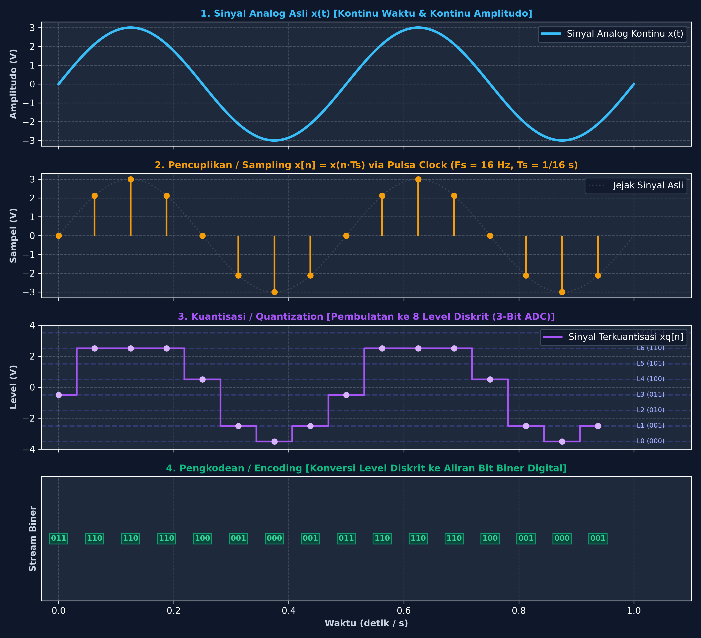

---

## 2.2 Rantai 4 Tahap Lengkap Konversi ADC

```mermaid
flowchart LR
    Analog["Sinyal Analog x(t)<br><i>Kontinu Waktu & Nilai</i>"] --> LPF["0. Anti-Aliasing Filter<br>(Low-Pass Analog)"]
    LPF --> Sampler["1. Sampling (Clock Ts)<br>x[n] = x(nTs)<br><i>Diskrit Waktu</i>"]
    Sampler --> Quantizer["2. Kuantisasi (2^B Step)<br>xq[n]<br><i>Diskrit Nilai</i>"]
    Quantizer --> Encoder["3. Encoding (Biner)<br>Stream Bit 0 & 1"]
    Encoder --> DSPCore["Digital Signal Processor<br>(CPU / FPGA / DSP)"]

    style Analog fill:#1e293b,stroke:#64748b,color:#fff
    style LPF fill:#78350f,stroke:#f59e0b,color:#fff
    style Sampler fill:#312e81,stroke:#6366f1,color:#fff
    style Quantizer fill:#581c87,stroke:#a855f7,color:#fff
    style Encoder fill:#064e3b,stroke:#10b981,color:#fff
    style DSPCore fill:#0f172a,stroke:#38bdf8,color:#fff
```

Konversi ADC bekerja melalui 4 tahapan berurutan:
1. **Filter Anti-Aliasing:** Membuang frekuensi liar yang terlalu tinggi sebelum sinyal dicuplik.
2. **Pencuplikan (*Sampling*):** Mengambil sampel nilai sinyal secara berkala pada setiap detak clock $T_s$.
3. **Kuantisasi (*Quantization*):** Membulatkan nilai tegangan sampel ke level anak tangga terdekat.
4. **Pengkodean (*Encoding*):** Mengubah level anak tangga menjadi susunan angka biner $0$ dan $1$.

---

## 2.3 Tahap 1: Pencuplikan (Sampling) & Peran Detak Clock

### Analogi Awam: Rekaman Kamera Video
Bayangkan Anda sedang menonton film di bioskop. Mata Anda melihat gerakan aktor yang mulus, padahal proyektor sebenarnya hanya memutar **24 foto diam (*frame*) per detik**. 

Proses memotret gerakan kontinu menjadi 24 foto terpisah per detik itulah yang disebut **Sampling**.

### Cara Kerja Elektronika:
* Generator clock osilator membangkitkan pulsa trigger secara berulang tiap periode waktu $T_s = \frac{1}{F_s}$.
* Rangkaian saklar elektronik *Sample-and-Hold (S/H)* menangkap nilai tegangan sesaat dan menahannya:
  $$x[n] = x(n \cdot T_s)$$
* **Status Sinyal:**  
  Sinyal sudah **diskrit dalam domain waktu** ($n = 0, 1, 2, \dots$), namun nilai tegangannya **masih berupa bilangan riil kontinu** (misal $3.14159\dots\text{ Volt}$).

---

## 2.4 Teorema Nyquist-Shannon & Bahaya Fenomena Aliasing

Berapa kali kita harus memotret/mencuplik sinyal dalam satu detik agar bentuk aslinya tidak rusak? Jawabannya dirumuskan oleh **Harry Nyquist dan Claude Shannon**:

> **🛡️ Teorema Sampling Nyquist:**  
> Frekuensi pencuplikan clock ($F_s$) **wajib minimal dua kali lebih besar** daripada frekuensi tertinggi ($f_{\text{maks}}$) yang ada di dalam sinyal:
> $$F_s \geq 2 \cdot f_{\text{maks}}$$

* Batas $f_N = \frac{F_s}{2}$ disebut sebagai **Frekuensi Nyquist**.

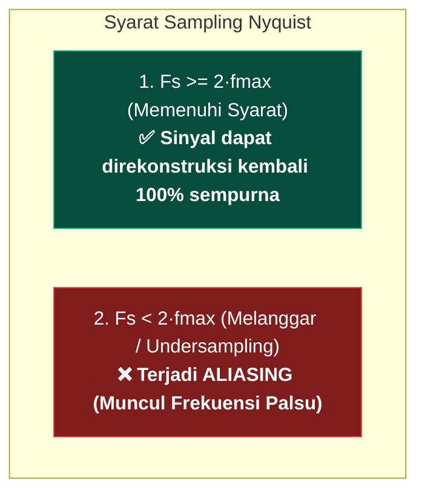

### Apa Itu Fenomena Aliasing? (Analogi Roda Mobil Berputar Mundur)
Pernahkah Anda melihat video mobil yang melaju sangat kencang di jalan tol, tetapi di video pelek roda mobilnya **terlihat berputar lambat atau bahkan berputar mundur**? 

Itu terjadi karena kamera merekam terlalu lambat dibanding kecepatan putaran roda. 

Dalam sinyal digital, jika frekuensi clock $F_s$ terlalu lambat, nada musik tinggi ($10\text{ kHz}$) akan menyamar menjadi bunyi dengung rendah palsu ($1\text{ kHz}$) yang merusak keseluruhan audio.

---

## 2.5 Mengapa Wajib Ada Filter Anti-Aliasing Sebelum Sampling?

Untuk mencegah terjadinya aliasing, sebelum masuk ke saklar sampling, sinyal analog **wajib disaring oleh filter analog Low-Pass Filter (LPF)** bernama **Anti-Aliasing Filter**. 

Filter ini bertindak seperti satpam yang memotong dan membuang semua frekuensi liar $f > F_s/2$ agar tidak sempat masuk merusak data.

---

## 2.6 Tahap 2: Kuantisasi (Quantization) — Seni Membulatkan Nilai

### Analogi Awam: Pembulatan Uang Pecahan
Jika Anda berbelanja di kasir supermarket dan total belanja Anda adalah Rp 12.347,- kasir akan membulatkannya menjadi Rp 12.350,- atau Rp 12.300,- karena tidak ada koin pecahan Rp 7,-.

Dalam ADC, proses membulatkan nilai tegangan kontinu ke salah satu anak tangga diskrit terdekat disebut **Kuantisasi**.

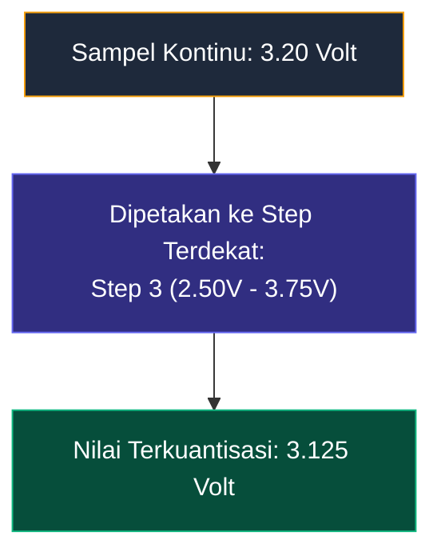

### Rumus Matematis Parameter Kuantisasi:
1. **Jumlah Step Level ($L$):** Ditentukan oleh jumlah bit resolusi ADC ($B$-bit):
   $$L = 2^B$$
   *Contoh:* ADC 3-bit memiliki $2^3 = 8\text{ buah step}$. ADC 8-bit memiliki $2^8 = 256\text{ step}$.
2. **Lebar Rentang Per Step (*Step Size* $\Delta$):**
   $$\Delta = \frac{V_{\text{maks}} - V_{\text{min}}}{2^B}$$
3. **Derau Kuantisasi (*Quantization Error* $e$):**  
   Selisih antara nilai riil asli dengan nilai anak tangga pembulatan:
   $$e = x_q[n] - x[n]$$
   Nilai error terbesar tidak akan melebihi setengah lebar step ($|e| \leq \frac{\Delta}{2}$).

---

## 2.7 Tahap 3: Pengkodean (Encoding) ke Deretan Bit Biner Digital

Setelah sampel berada di salah satu anak tangga step kuantisasi, setiap anak tangga diberi label **kode biner unik** ($0$ dan $1$):

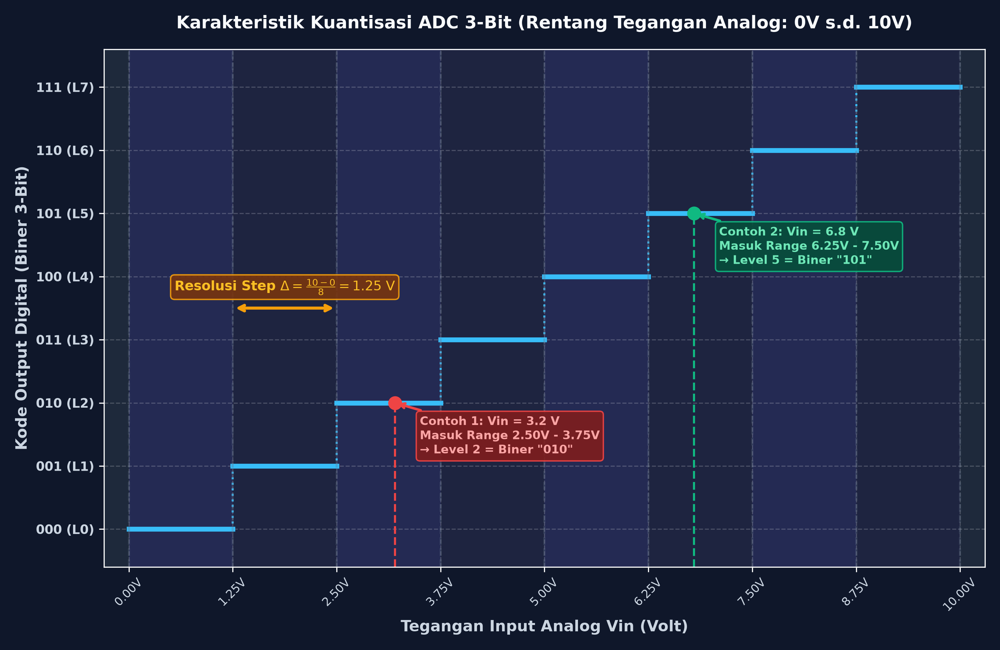

### Tabel Pemetaan Step Kuantisasi vs Biner 3-Bit ($0\text{V} - 10\text{V}$):
$$\Delta = \frac{10\text{ V} - 0\text{ V}}{8} = 1.25\text{ Volt / step}$$

| Step Kuantisasi | Rentang Tegangan Analog Input ($V_{\text{in}}$) | Kode Biner Encoding ($3$-bit) | Nilai Tengah Representasi ($V_q$) |
| :---: | :---: | :---: | :---: |
| **Step 1** | $0.00\text{ V} \leq V_{\text{in}} < 1.25\text{ V}$ | **`000`** | $0.625\text{ V}$ |
| **Step 2** | $1.25\text{ V} \leq V_{\text{in}} < 2.50\text{ V}$ | **`001`** | $1.875\text{ V}$ |
| **Step 3** | $2.50\text{ V} \leq V_{\text{in}} < 3.75\text{ V}$ | **`010`** | $3.125\text{ V}$ |
| **Step 4** | $3.75\text{ V} \leq V_{\text{in}} < 5.00\text{ V}$ | **`011`** | $4.375\text{ V}$ |
| **Step 5** | $5.00\text{ V} \leq V_{\text{in}} < 6.25\text{ V}$ | **`100`** | $5.625\text{ V}$ |
| **Step 6** | $6.25\text{ V} \leq V_{\text{in}} < 7.50\text{ V}$ | **`101`** | $6.875\text{ V}$ |
| **Step 7** | $7.50\text{ V} \leq V_{\text{in}} < 8.75\text{ V}$ | **`110`** | $8.125\text{ V}$ |
| **Step 8** | $8.75\text{ V} \leq V_{\text{in}} \leq 10.00\text{ V}$| **`111`** | $9.375\text{ V}$ |

---

## 2.8 Studi Kasus End-to-End: Konversi Sinyal Sinus Utuh x(t) ke Aliran Biner

Mari kita simulasikan proses digitalisasi secara utuh dari awal gelombang fisik hingga menjadi data biner yang masuk ke prosesor!

### 1. Deskripsi Kasus
* **Sinyal Masukan:** Gelombang sinusoida tegangan dengan offset DC:
  $$x(t) = 5 + 4 \cdot \sin(2\pi \cdot 1 \cdot t) \quad \text{Volt}$$
  * Tegangan Puncak (*Peak*): $5 + 4 = \mathbf{9.00\text{ V}}$
  * Tegangan Lembah (*Trough*): $5 - 4 = \mathbf{1.00\text{ V}}$
  * Frekuensi: $f = 1\text{ Hz}$ (1 gelombang penuh tiap $1\text{ detik}$)
* **Perangkat ADC:**
  * Rentang: $0\text{ V}$ sampai $10\text{ V}$
  * Resolusi: $3\text{ bit}$ ($L = 8\text{ step}$, $\Delta = 1.25\text{ V}$)
  * Kecepatan Clock Sampling: $F_s = 8\text{ Hz}$ $\implies$ dicuplik setiap interval $T_s = \frac{1}{8} = \mathbf{0.125\text{ detik}}$ ($8$ titik sampel: $n=0$ s.d. $n=7$).

---

### 2. Grafik Pelacakan Titik Sampel ($n = 0 \dots 7$):

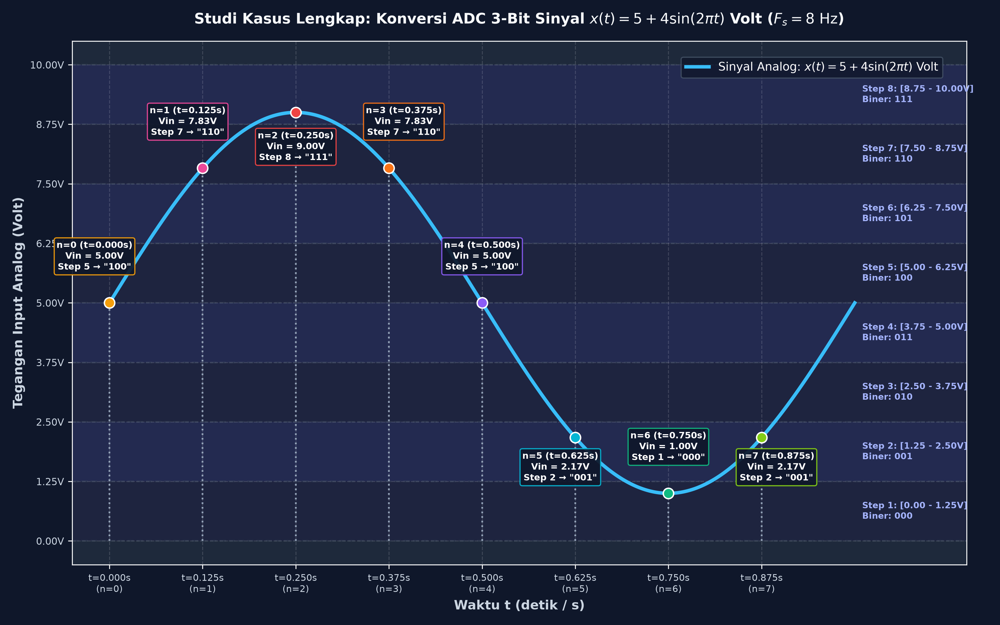

---

### 3. Perhitungan Rinci Titik demi Titik:

1. **Detak Clock $n=0$ ($t = 0.000\text{ s}$):**
   * $V_{\text{in}} = 5 + 4\sin(0) = \mathbf{5.00\text{ V}}$
   * Masuk Rentang: **Step 5** ($5.00\text{ V} - 6.25\text{ V}$) $\implies$ **Biner: `100`**
   * Nilai Representasi: $5.625\text{ V}$ $\implies$ Error $e = 5.625 - 5.00 = \mathbf{+0.625\text{ V}}$

2. **Detak Clock $n=1$ ($t = 0.125\text{ s}$):**
   * $V_{\text{in}} = 5 + 4\sin(\pi/4) = 5 + 4(0.7071) = \mathbf{7.83\text{ V}}$
   * Masuk Rentang: **Step 7** ($7.50\text{ V} - 8.75\text{ V}$) $\implies$ **Biner: `110`**
   * Nilai Representasi: $8.125\text{ V}$ $\implies$ Error $e = 8.125 - 7.83 = \mathbf{+0.295\text{ V}}$

3. **Detak Clock $n=2$ ($t = 0.250\text{ s}$ — Puncak Gelombang):**
   * $V_{\text{in}} = 5 + 4\sin(\pi/2) = 5 + 4(1) = \mathbf{9.00\text{ V}}$
   * Masuk Rentang: **Step 8** ($8.75\text{ V} - 10.00\text{ V}$) $\implies$ **Biner: `111`**
   * Nilai Representasi: $9.375\text{ V}$ $\implies$ Error $e = 9.375 - 9.00 = \mathbf{+0.375\text{ V}}$

4. **Detak Clock $n=3$ ($t = 0.375\text{ s}$):**
   * $V_{\text{in}} = 5 + 4\sin(3\pi/4) = 5 + 4(0.7071) = \mathbf{7.83\text{ V}}$
   * Masuk Rentang: **Step 7** ($7.50\text{ V} - 8.75\text{ V}$) $\implies$ **Biner: `110`**
   * Error $e = \mathbf{+0.295\text{ V}}$

5. **Detak Clock $n=4$ ($t = 0.500\text{ s}$):**
   * $V_{\text{in}} = 5 + 4\sin(\pi) = \mathbf{5.00\text{ V}}$
   * Masuk Rentang: **Step 5** ($5.00\text{ V} - 6.25\text{ V}$) $\implies$ **Biner: `100`**
   * Error $e = \mathbf{+0.625\text{ V}}$

6. **Detak Clock $n=5$ ($t = 0.625\text{ s}$):**
   * $V_{\text{in}} = 5 + 4\sin(5\pi/4) = 5 - 4(0.7071) = \mathbf{2.17\text{ V}}$
   * Masuk Rentang: **Step 2** ($1.25\text{ V} - 2.50\text{ V}$) $\implies$ **Biner: `001`**
   * Nilai Representasi: $1.875\text{ V}$ $\implies$ Error $e = 1.875 - 2.17 = \mathbf{-0.295\text{ V}}$

7. **Detak Clock $n=6$ ($t = 0.750\text{ s}$ — Lembah Gelombang):**
   * $V_{\text{in}} = 5 + 4\sin(3\pi/2) = 5 - 4(1) = \mathbf{1.00\text{ V}}$
   * Masuk Rentang: **Step 1** ($0.00\text{ V} - 1.25\text{ V}$) $\implies$ **Biner: `000`**
   * Nilai Representasi: $0.625\text{ V}$ $\implies$ Error $e = 0.625 - 1.00 = \mathbf{-0.375\text{ V}}$

8. **Detak Clock $n=7$ ($t = 0.875\text{ s}$):**
   * $V_{\text{in}} = 5 + 4\sin(7\pi/4) = 5 - 4(0.7071) = \mathbf{2.17\text{ V}}$
   * Masuk Rentang: **Step 2** ($1.25\text{ V} - 2.50\text{ V}$) $\implies$ **Biner: `001`**
   * Error $e = \mathbf{-0.295\text{ V}}$

---

### 4. Tabel Rekapitulasi Lengkap:

| Sampel ($n$) | Waktu ($t$) | Tegangan Analog $V_{\text{in}}$ | Step Kuantisasi | Nilai Level $V_q$ | Output Biner | Quantization Error ($e$) |
| :---: | :---: | :---: | :---: | :---: | :---: | :---: |
| **$n = 0$** | $0.000\text{ s}$ | $5.00\text{ V}$ | **Step 5** | $5.625\text{ V}$ | **`100`** | $+0.625\text{ V}$ |
| **$n = 1$** | $0.125\text{ s}$ | $7.83\text{ V}$ | **Step 7** | $8.125\text{ V}$ | **`110`** | $+0.295\text{ V}$ |
| **$n = 2$** | $0.250\text{ s}$ | $9.00\text{ V}$ (Peak) | **Step 8** | $9.375\text{ V}$ | **`111`** | $+0.375\text{ V}$ |
| **$n = 3$** | $0.375\text{ s}$ | $7.83\text{ V}$ | **Step 7** | $8.125\text{ V}$ | **`110`** | $+0.295\text{ V}$ |
| **$n = 4$** | $0.500\text{ s}$ | $5.00\text{ V}$ | **Step 5** | $5.625\text{ V}$ | **`100`** | $+0.625\text{ V}$ |
| **$n = 5$** | $0.625\text{ s}$ | $2.17\text{ V}$ | **Step 2** | $1.875\text{ V}$ | **`001`** | $-0.295\text{ V}$ |
| **$n = 6$** | $0.750\text{ s}$ | $1.00\text{ V}$ (Trough) | **Step 1** | $0.625\text{ V}$ | **`000`** | $-0.375\text{ V}$ |
| **$n = 7$** | $0.875\text{ s}$ | $2.17\text{ V}$ | **Step 2** | $1.875\text{ V}$ | **`001`** | $-0.295\text{ V}$ |

---

### 5. Hasil Akhir Aliran Bit Biner Digital (*Bitstream*):

$$\mathbf{\text{Aliran Bit (Bitstream)}} = \underbrace{\mathbf{100}}_{n=0} \ \underbrace{\mathbf{110}}_{n=1} \ \underbrace{\mathbf{111}}_{n=2} \ \underbrace{\mathbf{110}}_{n=3} \ \underbrace{\mathbf{100}}_{n=4} \ \underbrace{\mathbf{001}}_{n=5} \ \underbrace{\mathbf{000}}_{n=6} \ \underbrace{\mathbf{001}}_{n=7}$$

Inilah deretan $24\text{ bit}$ digital yang berhasil dikonversi dan siap masuk ke memori komputer untuk diproses oleh algoritma DSP! 🚀
