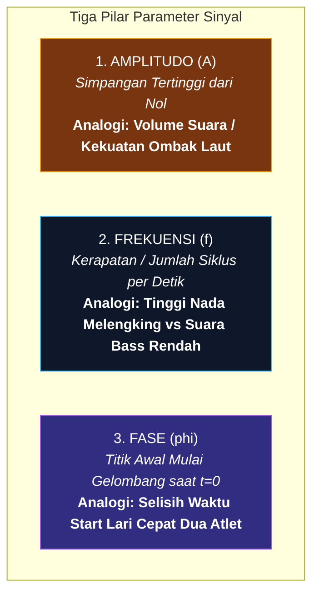
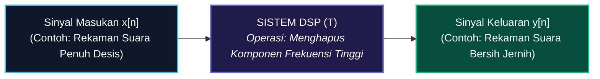
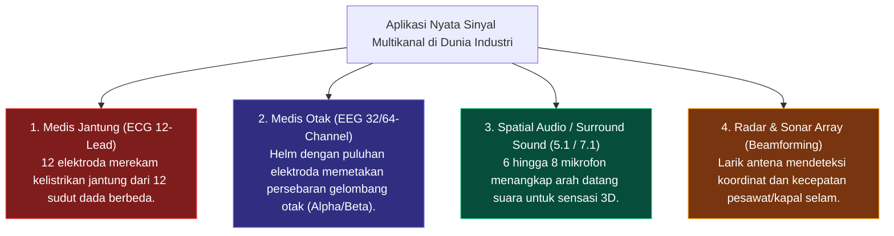
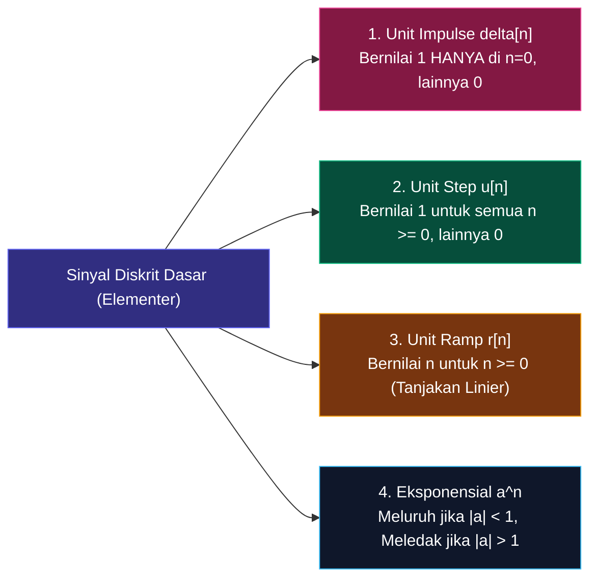

# 📘 BUKU AJAR LENGKAP PENGOLAHAN SINYAL DIGITAL (PSD)
*Panduan Komprehensif & Intuitif: Dari Paradigma ASP vs DSP, Konversi Digitalisasi ADC, Sinyal Multikanal, Sinyal Multi-Dimensi, hingga Sinyal Waktu Diskrit*

---

## 📑 DAFTAR ISI BUKU AJAR

1. [BAB 1: Paradigma Pemrosesan Sinyal — Dari Dunia Fisik Analog (ASP) ke Era Digital (DSP)](#bab-1-paradigma-pemrosesan-sinyal--dari-dunia-fisik-analog-asp-ke-era-digital-dsp)
   - [1.1 Fondasi Sinyal & Perjalanan Gelombang di Alam Semesta](#11-fondasi-sinyal--perjalanan-gelombang-di-alam-semesta)
   - [1.2 Paradigma Pemrosesan: ASP (Analog) vs DSP (Digital)](#12-paradigma-pemrosesan-asp-analog-vs-dsp-digital)
   - [1.3 Mengapa Dunia Berbondong-bondong Migrasi ke DSP?](#13-mengapa-dunia-berbondong-bondong-migrasi-ke-dsp)
   - [1.4 Tiga Pilar Anatomi Gelombang: Amplitudo, Frekuensi, dan Fase](#14-tiga-pilar-anatomi-gelombang-amplitudo-frekuensi-dan-fase)
   - [1.5 Anatomi Visual Grafik Sinyal](#15-anatomi-visual-grafik-sinyal)
   - [1.6 Komparasi Visual Perubahan Parameter Gelombang](#16-komparasi-visual-perubahan-parameter-gelombang)
   - [1.7 Apa Itu Sistem Pengolah Sinyal? (Analogi Pabrik Pemroses)](#17-apa-itu-sistem-pengolah-sinyal-analogi-pabrik-pemroses)
   - [1.8 Klasifikasi Sifat & Karakteristik Sistem Sinyal](#18-klasifikasi-sifat--karakteristik-sistem-sinyal)

2. [BAB 2: Proses Digitalisasi Sinyal (Analog-to-Digital Converter / ADC)](#bab-2-proses-digitalisasi-sinyal-analog-to-digital-converter--adc)
   - [2.1 Mengapa Sinyal Analog Harus Diubah Menjadi Bilangan Digital?](#21-mengapa-sinyal-analog-harus-diubah-menjadi-bilangan-digital)
   - [2.2 Rantai 4 Tahap Lengkap Digitalisasi ADC](#22-rantai-4-tahap-lengkap-digitalisasi-adc)
   - [2.3 Tahap 1: Pencuplikan (Sampling) & Peran Detak Clock](#23-tahap-1-pencuplikan-sampling--peran-detak-clock)
   - [2.4 Teorema Nyquist-Shannon & Bahaya Fenomena Aliasing](#24-teorema-nyquist-shannon--bahaya-fenomena-aliasing)
   - [2.5 Mengapa Wajib Ada Filter Anti-Aliasing Sebelum ADC?](#25-mengapa-wajib-ada-filter-anti-aliasing-sebelum-adc)
   - [2.6 Tahap 2: Kuantisasi (Quantization) — Seni Membulatkan Level Tegangan](#26-tahap-2-kuantisasi-quantization--seni-membulatkan-level-tegangan)
   - [2.7 Tahap 3: Pengkodean (Encoding) Biner 3-Bit pada Rentang 0 s.d. 10 Volt](#27-tahap-3-pengkodean-encoding-biner-3-bit-pada-rentang-0-sd-10-volt)
   - [2.8 Studi Kasus End-to-End: Konversi Sinyal Sinus Utuh x(t) ke Aliran Bit Digital](#28-studi-kasus-end-to-end-konversi-sinyal-sinus-utuh-xt-ke-aliran-bit-digital)

3. [BAB 3: Klasifikasi Lanjutan Sinyal Modern](#bab-3-klasifikasi-lanjutan-sinyal-modern)
   - [3.1 Sinyal Multikanal (Multi-Channel Signals) & Representasi Vektor-Matriks](#31-sinyal-multikanal-multi-channel-signals--representasi-vektor-matriks)
   - [3.2 Sinyal Multi-Dimensi (Multi-Dimensional Signals / M-D): 1D, 2D, 3D, hingga 4D](#32-sinyal-multi-dimensi-multi-dimensional-signals--m-d-1d-2d-3d-hingga-4d)
   - [3.3 Sinyal Waktu Diskrit (Discrete-Time Signals / DTS) & Sinyal Elementer](#33-sinyal-waktu-diskrit-discrete-time-signals--dts--sinyal-elementer)

---

# BAB 1: Paradigma Pemrosesan Sinyal — Dari Dunia Fisik Analog (ASP) ke Era Digital (DSP)

## 1.1 Fondasi Sinyal & Perjalanan Gelombang di Alam Semesta

Pernahkah Anda merenungkan bagaimana suara penyanyi di panggung konser bisa sampai ke telinga Anda, atau bagaimana foto pemandangan di kamera ponsel bisa dikirimkan sejauh ribuan kilometer ke teman Anda di belahan bumi lain? Semua keajaiban teknologi modern ini berakar pada satu konsep tunggal yang luar biasa bernama **Sinyal**.

Di alam semesta, hampir semua peristiwa fisik yang terjadi di sekitar kita menghasilkan variasi energi. Ketika pita suara seseorang bergetar, ia mendorong dan menarik molekul-molekul udara di sekitarnya, menciptakan riak gelombang tekanan udara yang merambat maju. Ketika sensor suhu dipanaskan, hambatan listrik di dalamnya berubah secara bertahap. Variasi getaran udara dan perubahan tegangan listrik inilah yang secara ilmiah kita definisikan sebagai sinyal.

Secara formal, **Sinyal** adalah besaran fisik terukur yang nilainya terus berubah (*bervariasi*) terhadap satu atau lebih variabel bebas, seperti waktu ($t$), ruang koordinat ($x, y$), atau suhu ($T$). Sinyal bukan sekadar getaran hampa; sinyal bertindak sebagai **kendaraan pembawa pesan (*carrier of information*)** yang menceritakan status, kondisi, dan perilaku dari suatu fenomena alam.

Jika suatu besaran bernilai konstan dan mati selamanya—seperti baterai $0\text{ Volt}$ yang tidak pernah berubah—maka besaran tersebut tidak memiliki dinamika informasi. Sinyal baru hidup dan bermakna saat ia mengalami dinamika fluktuasi naik dan turun. Tugas utama kita sebagai insinyur dan pemrogram sinyal adalah menangkap fluktuasi ini, membersihkannya dari gangguan kotor (*noise*), dan mengekstrak pesan tersembunyi di dalamnya menjadi informasi yang bermanfaat bagi manusia.

---

## 1.2 Paradigma Pemrosesan: ASP (Analog) vs DSP (Digital)

Dalam sejarah peradaban teknik elektro dan telekomunikasi, terdapat dua mazhab atau paradigma utama dalam mengolah sinyal: **Analog Signal Processing (ASP)** dan **Digital Signal Processing (DSP)**. Keduanya memiliki cara pandang yang sangat berbeda dalam memperlakukan informasi.

Pada era klasik, manusia mengandalkan **Pemrosesan Sinyal Analog (ASP)**. Pada paradigma ASP, sinyal masukan berupa gelombang listrik kontinu yang langsung dimasukkan ke dalam rangkaian sirkuit elektronik fisik yang tersusun dari resistor ($R$), kapasitor ($C$), induktor ($L$), dan transistor atau *operational amplifier* (Op-Amp). Sinyal analog mengalir secara murni sebagai arus dan tegangan nyata, disaring oleh komponen pasif/aktif, dan langsung menghasilkan sinyal keluaran analog. Rantai operasinya sangat ringkas:
$$\text{Analog Input Signal} \longrightarrow \mathbf{\text{Analog Signal Processor (ASP)}} \longrightarrow \text{Analog Output Signal}$$

Namun, seiring lahirnya revolusi mikroprosesor dan komputer mikro, lahirlah paradigma modern yang jauh lebih superior: **Pemrosesan Sinyal Digital (DSP)**. Pada paradigma DSP, gelombang analog dari dunia nyata tidak langsung diolah oleh komponen pasif. Sinyal analog terlebih dahulu dialirkan ke gerbang penerjemah bernama **Analog-to-Digital Converter (ADC / A-D)** untuk diubah menjadi deretan angka-angka biner ($0$ dan $1$). 

Setelah menjadi aliran data numerik digital, sinyal tersebut diproses di dalam "otak" komputasi cerdas bernama **Digital Signal Processor (DSP Core)**, mikroprosesor, atau komputer dengan menggunakan instruksi algoritma matematika murni. Setelah algoritma selesai memanipulasi angka-angka tersebut, hasilnya dikembalikan lagi ke bentuk gelombang tegangan fisik melalui chip **Digital-to-Analog Converter (DAC / D-A)**. Rantai pemrosesan DSP yang lengkap adalah:
$$\text{Analog Input} \longrightarrow \mathbf{A/D} \longrightarrow \mathbf{\text{Digital Signal Processor (DSP)}} \longrightarrow \mathbf{D/A} \longrightarrow \text{Analog Output}$$

---

## 1.3 Mengapa Dunia Berbondong-bondong Migrasi ke DSP?

Mengapa para ilmuwan dan industri global rela menambahkan tahap konversi A/D dan D/A yang rumit alih-alih bertahan dengan rangkaian ASP yang langsung menyambung kabel? Jawabannya terletak pada **kebebasan fleksibilitas perangkat lunak (*software programmable*)** dan **kekebalan mutlak terhadap derau (*noise immunity*)**.

Dalam sistem analog (ASP), jika Anda telah merakit sebuah filter audio untuk membuang nada desis dan suatu hari Anda ingin mengubah frekuensi batas filternya dari $1000\text{ Hz}$ menjadi $2500\text{ Hz}$, Anda terpaksa harus mencabut solder, membuang kapasitor lama, dan menggantinya dengan kapasitor berkapasitas baru. Di sisi lain, pada sistem DSP, Anda hanya perlu mengubah satu baris angka variabel di dalam kode program software Anda (*misalnya mengubah nilai variabel `cutoff_freq = 2500`*) tanpa perlu menyentuh solder atau membeli komponen baru sama sekali.

Selain itu, sinyal analog sangat rentan terhadap gangguan kotor di sepanjang kabel (*noise, suhu panas ruangan, toleransi pabrik, dan usia penuaan komponen*). Sedikit saja ada kabel yang longgar atau induksi medan magnet di dekatnya, suara analog akan langsung terdengar berdesis atau kresek-kresek. Sebaliknya, pada sistem DSP, sinyal telah diubah menjadi angka biner $0$ dan $1$. Komputer tidak peduli apakah voltase kabel naik turun sedikit; selama komputer dapat membedakan nilai logika RENDAH ($0$) dan TINGGI ($1$), data sinyal akan tetap **100% jernih, presisi, dan abadi tanpa penurunan kualitas (*lossless*)**.

Terakhir, sistem DSP memungkinkan manusia menerapkan algoritma super canggih yang secara fisik **mustahil diwujudkan oleh rangkaian kabel analog**, seperti *Active Noise Cancellation* (ANC pada headphone TWS modern), kompresi streaming video YouTube (H.264/H.265/AV1), pengenalan wajah biometrik, hingga model kecerdasan buatan (*Speech Recognition AI* seperti Google Assistant atau Siri).

| Parameter Perbandingan | Pemrosesan Analog (ASP) | Pemrosesan Digital (DSP) |
| :--- | :--- | :--- |
| **Bentuk Sinyal yang Diproses** | Gelombang tegangan listrik kontinu $x(t)$ | Deretan angka biner diskrit $x[n]$ |
| **Fleksibilitas Sistem** | ❌ Sangat Kaku (Harus merombak kabel & solder) | ✅ **Sangat Fleksibel** (Cukup perbarui kode software) |
| **Kekebalan Derau (*Noise*)** | ❌ Rentan rusak akibat suhu, interferensi & usia kabel | ✅ **Sangat Kebal** (Logika biner 0 & 1 tidak terdistorsi) |
| **Ketepatan & Pengulangan** | ❌ Bervariasi tergantung toleransi fisik komponen | ✅ **Eksak & 100% Konsisten** (Presisi 32-bit / 64-bit) |
| **Penyimpanan (*Storage*)** | ❌ Kaset pita magnetik aus dan rusak setiap diputar | ✅ **Penyimpanan Digital Abadi** (SSD/Cloud/Flashdisk) |
| **Kompleksitas Algoritma** | ❌ Terbatas pada operasi matematika dasar sederhana | ✅ **Tak Terbatas** (AI, FFT, Filter Adaptif, Enkripsi) |

---

## 1.4 Tiga Pilar Anatomi Gelombang: Amplitudo, Frekuensi, dan Fase

Untuk memahami bagaimana sebuah sinyal diolah, kita harus membedah struktur fundamental dari gelombang itu sendiri. Bentuk gelombang paling murni di alam semesta adalah **Gelombang Sinusoida**, yang secara matematis dirumuskan sebagai:

$$x(t) = A \cdot \sin(2\pi f t + \phi) = A \cdot \sin(\omega t + \phi)$$

Pilar pertama adalah **Amplitudo ($A$)**, yaitu jarak simpangan terjauh gelombang diukur dari garis kesetimbangan titik nol ($0\text{ Volt}$). Amplitudo mengukur **kekuatan atau energi** yang dibawa oleh sinyal. Dalam dunia audio, semakin besar amplitudo gelombang tegangan yang masuk ke speaker, semakin keras dan menggelegar volume suara yang kita dengar. Sebaliknya, sinyal beramplitudo kecil terdengar lirih dan berbisik.

Pilar kedua adalah **Frekuensi ($f$)**, yaitu banyaknya siklus gelombang bolak-balik lengkap yang terjadi dalam kurun waktu satu detik, dinyatakan dalam satuan **Hertz ($\text{Hz}$)**. Frekuensi berbanding terbalik dengan **Periode ($T$)**, yaitu durasi waktu yang dibutuhkan untuk menyelesaikan satu siklus penuh ($f = 1/T$). Dalam indera pendengaran kita, frekuensi merepresentasikan **tinggi-rendahnya nada (*pitch*)**. Frekuensi rendah ($50\text{ - }250\text{ Hz}$) menghasilkan suara bass yang berat seperti tabuhan drum, sedangkan frekuensi tinggi ($3000\text{ - }10.000\text{ Hz}$) menghasilkan suara melengking tajam seperti peluit wasit.

Pilar ketiga adalah **Fase ($\phi$)**, yaitu sudut posisi awal gelombang saat waktu tepat menunjukkan detik ke-nol ($t = 0$). Fase dinyatakan dalam satuan radian atau derajat sudut. Jika dua gelombang memiliki amplitudo dan frekuensi yang identik tetapi fasenya berbeda, salah satu gelombang akan terlihat "terlambat" atau "mendahului" gelombang lainnya. Konsep fase ini sangat krusial dalam teknologi pelacakan arah gelombang (*Radar/Sonar*) dan sistem audio peredam bising aktif (*ANC*), di mana gelombang suara bising dibatalkan dengan menembakkan gelombang kebalikan yang fasenya berbeda $180^\circ$.

---

## 1.5 Anatomi Visual Grafik Sinyal

Berikut adalah grafik visual asli beresolusi tinggi yang membedah anatomi gelombang sinusoida secara mendalam:

Pada grafik di atas, Anda dapat melihat dengan jelas:
1. **Amplitudo Puncak ($A = 3.0\text{ V}$):** Jarak vertikal dari sumbu horizontal $y=0$ menuju puncak tertinggi (*Peak*).
2. **Amplitudo Puncak-ke-Puncak ($V_{p-p} = 6.0\text{ V}$):** Rentang total dari dasar lembah terdalam (*Trough* di $-3.0\text{ V}$) hingga puncak teratas ($+3.0\text{ V}$).
3. **Periode Waktu ($T = 0.5\text{ detik}$):** Rentang waktu horizontal untuk menuntaskan 1 bukit dan 1 lembah gelombang penuh, yang menghasilkan frekuensi $f = \frac{1}{0.5} = 2\text{ Hz}$.

---

## 1.6 Komparasi Visual Perubahan Parameter Gelombang

Untuk melihat bagaimana perubahan parameter memengaruhi bentuk fisik gelombang, perhatikan perbandingan 3-panel berikut:

* **Panel 1 (Modulasi Frekuensi):** Gelombang biru ($1\text{ Hz}$) tampak renggang dan santai, sedangkan gelombang oranye ($3\text{ Hz}$) tampak sangat rapat bergetar 3 kali lipat lebih cepat.
* **Panel 2 (Modulasi Amplitudo):** Gelombang ungu ($A=3.0$) memiliki bukit yang tinggi menjulang, sedangkan gelombang hijau ($A=1.0$) memiliki bukit landai rendah.
* **Panel 3 (Pergeseran Fase):** Gelombang merah ($\phi = \pi/2 = 90^\circ$) memulai langkahnya lebih awal dari posisi puncak saat $t=0$, mendahului gelombang biru standar ($\phi = 0^\circ$).

---

## 1.7 Apa Itu Sistem Pengolah Sinyal? (Analogi Pabrik Pemroses)

Setelah kita mengenal apa itu sinyal sebagai bahan baku, kini saatnya kita memahami apa yang dimaksud dengan **Sistem**. Jika sinyal diibaratkan sebagai biji kopi mentah, maka sistem adalah **mesin penggiling dan penyeduh kopi** yang mengolah biji mentah tersebut menjadi secangkir kopi espreso yang nikmat.

Secara formal, **Sistem** adalah suatu entitas fisik (berupa rangkaian elektronika) atau entitas logika (berupa algoritma program komputer) yang menerima sebuah sinyal masukan $x[n]$, melakukan serangkaian transformasi atau operasi matematika terhadap nilai-nilainya, dan kemudian memuntahkan sinyal baru $y[n]$ sebagai keluarannya:
$$y[n] = \mathcal{T}\{x[n]\}$$

Sistem tidak bekerja secara acak; sistem bekerja mematuhi seperangkat aturan matematis tertentu. Contoh operasi sistem yang paling sederhana adalah penguat volume (*amplifier*), di mana sistem mengalikan setiap nilai sinyal masuk dengan sebuah angka konstanta: $y[n] = 2.5 \cdot x[n]$. Contoh sistem yang lebih canggih adalah **Filter Digital**, yang mampu membedah komponen frekuensi sinyal masukan, membiarkan frekuensi suara manusia lewat, namun memblokir habis frekuensi desis pendingin ruangan (*AC noise*).

Wujud realisasi sistem di dunia nyata dapat berupa:
1. **Perangkat Keras Murni (*Hardware*):** Rangkaian komponen transistor dan penguat op-amp analog.
2. **Perangkat Lunak Murni (*Software*):** Skrip program Python, C++, atau MATLAB yang dieksekusi di atas CPU komputer.
3. **Sistem Tertanam (*Embedded Firmware*):** Kode program yang ditanamkan ke dalam chip khusus seperti mikroprosesor DSP (*Texas Instruments TMS320*), FPGA (*Xilinx/Altera*), atau mikrokontroler (*STM32, ESP32*).

---

## 1.8 Klasifikasi Sifat & Karakteristik Sistem Sinyal

Dalam analisis matematika sinyal dan sistem, kita mengklasifikasikan sistem berdasarkan perilaku operasinya:

1. **Linearitas (*Linear System*):**  
   Sistem dikatakan linier jika memenuhi **Prinsip Superposisi (Kombinasi Linier)**. Artinya, jika input $x_1[n]$ menghasilkan output $y_1[n]$ dan input $x_2[n]$ menghasilkan output $y_2[n]$, maka input gabungan $a \cdot x_1[n] + b \cdot x_2[n]$ akan menghasilkan output gabungan $a \cdot y_1[n] + b \cdot y_2[n]$.

2. **Kekekalan Waktu (*Time-Invariance*):**  
   Sistem dikatakan *Time-Invariant* jika karakteristik perilakunya tidak berubah seiring berjalannya waktu kalender. Jika Anda memasukkan sinyal hari ini menghasilkan pola output $y[n]$, maka jika Anda menunda memasukkan sinyal yang sama besok (tertunda sejauh $n_0$ detik), sistem akan menghasilkan pola output yang persis sama namun hanya bergeser waktunya saja ($y[n - n_0]$). Sistem yang memenuhi kedua sifat ini disebut **Sistem LTI (Linear Time-Invariant)**.

3. **Kausalitas (*Causality*):**  
   Sistem kausal adalah sistem yang realistis di dunia nyata, di mana nilai output saat ini $y[n]$ **hanya bergantung pada nilai input saat ini $x[n]$ dan masa lalu $x[n-1], x[n-2]$**, serta tidak pernah bergantung pada input masa depan $x[n+1]$ (*sistem tidak bisa meramal masa depan*).

4. **Stabilitas (*BIBO Stability — Bounded-Input Bounded-Output*):**  
   Sistem dikatakan stabil jika setiap kali kita memberikan sinyal masukan yang nilainya terbatas (tidak meledak ke tak hingga, $|x[n]| \leq M_x < \infty$), sistem dijamin akan menghasilkan keluaran yang nilainya juga selalu terbatas ($|y[n]| \leq M_y < \infty$).

---

# BAB 2: Proses Digitalisasi Sinyal (Analog-to-Digital Converter / ADC)

## 2.1 Mengapa Sinyal Analog Harus Diubah Menjadi Bilangan Digital?

Dunia fisik di mana manusia hidup adalah alam yang murni analog. Udara yang kita hirup mengalirkan gelombang suara kontinu tanpa putus, sinar matahari memancarkan spektrum cahaya kontinu, dan otot jantung kita berkontraksi dalam kurva kelistrikan yang mengalir mulus tanpa henti.

Namun, komputer digital, smartphone, dan mikroprosesor adalah makhluk diskrit yang hidup di alam biner. Silikon prosesor komputer terdiri dari miliaran sakelar transistor mikro yang hanya memahami dua kondisi logika: **Tegangan Mati ($0$)** dan **Tegangan Hidup ($1$)**. Komputer tidak memiliki kemampuan alami untuk menampung gelombang riil yang memiliki titik desimal tak berhingga.

Oleh karena itu, diperlukan sebuah gerbang jembatan penerjemah yang bertugas memotret dunia analog kontinu, mencacahnya menjadi bagian-bagian kecil, membulatkan nilainya, dan mengubahnya menjadi deretan angka biner yang dapat dikomputasi oleh prosesor. Gerbang penerjemah ajaib inilah yang kita sebut sebagai **Analog-to-Digital Converter (ADC)**.

Tanpa adanya chip ADC, komputer tidak akan pernah bisa merekam suara dari mikrofon, kamera tidak akan pernah bisa menghasilkan foto dari lensa sensor, dan dokter di rumah sakit tidak akan pernah bisa melihat grafik detak jantung pasien di layar monitor ICU.

---

## 2.2 Rantai 4 Tahap Lengkap Digitalisasi ADC

Proses pengubahan gelombang analog kontinu menjadi aliran data bit biner digital bukanlah proses satu langkah instan, melainkan sebuah **rantai pipa konversi 4 tahap berurutan**:

```mermaid
flowchart LR
    Analog["Sinyal Analog x(t)<br><i>Kontinu Waktu & Nilai</i>"] --> LPF["0. Anti-Aliasing Filter<br>(Low-Pass Analog)"]
    LPF --> Sampler["1. Pencuplikan (Sampling)<br>x[n] = x(nTs)<br><i>Diskrit Waktu</i>"]
    Sampler --> Quantizer["2. Kuantisasi (2^B Level)<br>xq[n]<br><i>Diskrit Nilai</i>"]
    Quantizer --> Encoder["3. Pengkodean (Encoding)<br>Stream Bit Biner 0 & 1"]
    Encoder --> DSPCore["Digital Signal Processor<br>(CPU / FPGA / DSP Core)"]

    style Analog fill:#1e293b,stroke:#64748b,color:#fff
    style LPF fill:#78350f,stroke:#f59e0b,color:#fff
    style Sampler fill:#312e81,stroke:#6366f1,color:#fff
    style Quantizer fill:#581c87,stroke:#a855f7,color:#fff
    style Encoder fill:#064e3b,stroke:#10b981,color:#fff
    style DSPCore fill:#0f172a,stroke:#38bdf8,color:#fff
```

1. **Tahap 0 — Filter Anti-Aliasing (Penyaringan Awal):** Filter analog *Low-Pass* memangkas semua frekuensi liar yang terlampau tinggi sebelum sinyal menyentuh rangkaian sampler.
2. **Tahap 1 — Pencuplikan (*Sampling*):** Mengubah domain **waktu kontinu ($t$)** menjadi **waktu diskrit ($n$)** dengan memotret nilai sinyal pada detak jam (*clock*) teratur $T_s$.
3. **Tahap 2 — Kuantisasi (*Quantization*):** Mengubah rentang **amplitudo kontinu (tegangan riil)** menjadi **amplitudo diskrit bertingkat (*discrete levels*)** melalui proses pembulatan cerdas ke level terdekat.
4. **Tahap 3 — Pengkodean (*Encoding*):** Menerjemahkan nomor tangga level hasil kuantisasi menjadi deretan kombinasi bit biner ($0$ dan $1$) berukuran $B$-bit.

---

## 2.3 Tahap 1: Pencuplikan (Sampling) & Peran Detak Clock

Bayangkan Anda sedang menonton sebuah film di bioskop. Ketika Anda melihat aktor berlari di layar dengan mulus, mata Anda sebenarnya sedang dibohongi oleh proyektor film. Proyektor bioskop tidak menampilkan gerakan kontinu, melainkan menembakkan **24 lembar foto diam (*still frames*) terpisah setiap satu detik**. Karena otak manusia lambat dalam memproses visual terpisah, rangkaian 24 foto per detik tersebut menyatu menjadi ilusi gerakan yang mulus.

Inilah prinsip dasar dari **Pencuplikan (*Sampling*)**. Sebuah rangkaian elektronika osilator clock membangkitkan detak periodik dengan frekuensi stabil yang disebut **Frekuensi Sampling ($F_s$)**, di mana interval waktu antar detak jam adalah **Periode Sampling ($T_s = \frac{1}{F_s}$)**. 

Setiap kali detak clock berbunyi (*tik-tik-tik*), sebuah rangkaian sakelar elektronik super cepat bernama *Sample-and-Hold* (S/H) akan menutup sesaat untuk "menangkap" nilai tegangan sinyal analog $x(t)$ pada detik tersebut dan menahannya di dalam kapasitor kecil, menghasilkan deret cuplikan:
$$x[n] = x(t)\Big|_{t = n \cdot T_s} = x(n \cdot T_s)$$
di mana $n \in \{0, 1, 2, 3, \dots\}$ adalah indeks nomor urut sampel cuplikan.

Setelah tahap sampling selesai, sinyal kita telah berhasil menjadi **Diskrit dalam domain Waktu** (*hanya ada data pada saat detak clock berbunyi*), namun nilainya masih berupa bilangan riil desimal kontinu tak terbatas (*misalnya $7.834192\dots\text{ Volt}$*).

---

## 2.4 Teorema Nyquist-Shannon & Bahaya Fenomena Aliasing

Berapa kecepatan detak clock ($F_s$) yang harus kita pasang agar rekaman digital kita tidak kehilangan informasi aslinya? Apakah boleh kita mencuplik secara lambat dan santai? Jawabannya dirumuskan secara brilian oleh Harry Nyquist dan Claude Shannon dalam **Teorema Sampling Nyquist-Shannon**:

> **🛡️ Teorema Sampling Nyquist-Shannon:**  
> Agar suatu sinyal analog kontinu dapat direkonstruksi kembali ke bentuk aslinya secara sempurna tanpa cacat, frekuensi pencuplikan ($F_s$) harus dipilih **minimal dua kali lipat lebih tinggi daripada frekuensi komponen tertinggi ($f_{\text{maks}}$)** yang terkandung di dalam sinyal tersebut:
> $$F_s \geq 2 \cdot f_{\text{maks}}$$
> Nilai batas minimum $2 \cdot f_{\text{maks}}$ ini disebut sebagai **Laju Nyquist (*Nyquist Rate*)**.

Apa yang terjadi jika kita melanggar hukum alam ini dan mencuplik terlalu lambat ($F_s < 2 f_{\text{maks}}$)? Akan terjadi bencana distorsi sinyal terburuk dalam dunia DSP yang disebut **Aliasing**.

Pernahkah Anda melihat video mobil berkecepatan tinggi di mana pelek rodanya justru terlihat **berputar mundur pelan-pelan ke belakang**? Itu terjadi karena kamera video mencuplik frame gambar lebih lambat daripada putaran roda mobil. Dalam dunia sinyal, frekuensi tinggi yang dicuplik terlalu lambat akan **menyamar (*alias*)** menjadi frekuensi rendah palsu yang sama sekali tidak ada pada sinyal aslinya, merusak integritas data selamanya.

---

## 2.5 Mengapa Wajib Ada Filter Anti-Aliasing Sebelum ADC?

Untuk mencegah terjadinya petaka *aliasing* di atas, para insinyur memasang sebuah gerbang pelindung wajib sebelum rangkaian pencuplikan, yaitu **Filter Anti-Aliasing (Anti-Aliasing Filter / AAF)**.

Filter Anti-Aliasing adalah rangkaian analog *Low-Pass Filter* (LPF) berkualitas tinggi yang dipasang tepat di jalur masukan sebelum chip ADC. Filter ini bertindak seperti satpam yang tegas: ia membiarkan semua frekuensi informasi yang kita inginkan ($f \leq f_{\text{maks}}$) lewat dengan mulus, namun memotong dan membuang habis semua frekuensi liar, noise radiofrekuensi, dan dengung elektromagnetik yang berada di atas frekuensi batas Nyquist ($f > F_s/2$).

Dengan adanya filter anti-aliasing ini, sinyal analog yang masuk ke blok sampler dijamin 100% steril dan aman dari bahaya distorsi frekuensi bayangan palsu.

---

## 2.6 Tahap 2: Kuantisasi (Quantization) — Seni Membulatkan Level Tegangan

Setelah sinyal dicuplik menjadi titik-titik diskrit waktu $x[n]$, langkah berikutnya adalah **Kuantisasi (*Quantization*)**. Kuantisasi adalah proses memetakan nilai tegangan riil kontinu yang tak terhingga jumlah kemungkinannya menjadi salah satu dari sekumpulan nilai level diskrit yang terbatas jumlahnya.

Analogi kuantisasi sangat mirip dengan kasir supermarket yang kehabisan uang koin receh. Jika total belanja Anda adalah Rp 10.340 dan kasir hanya memiliki pecahan Rp 500 terdekat, kasir akan "membulatkan" tagihan Anda ke Rp 10.500. Selisih Rp 160 antara uang asli dan uang pembulatan itulah yang kita sebut sebagai **Kesalahan Kuantisasi (*Quantization Error*)**.

Jumlah tangga level yang tersedia pada sebuah ADC ditentukan oleh resolusi bit ($B$) yang dimilikinya:
$$\text{Jumlah Tangga Level } (L) = 2^B$$
Lebar rentang tegangan untuk satu anak tangga level disebut sebagai **Ukuran Langkah Kuantisasi (*Step Size* $\Delta$ / Resolusi Tegangan)**:
$$\Delta = \frac{V_{\text{maks}} - V_{\text{min}}}{2^B}$$

Tegangan hasil kuantisasi dilambangkan sebagai $x_q[n]$. Selisih antara tegangan kuantisasi dengan tegangan analog asli menghasilkan galat error:
$$e[n] = x_q[n] - x[n]$$
Di mana nilai galat error kuantisasi maksimal selalu berada di dalam batas toleransi setengah anak tangga: $|e[n]| \leq \frac{\Delta}{2}$. Semakin banyak jumlah bit resolusi ADC yang kita gunakan (misalnya ADC 16-bit atau 24-bit), nilai $\Delta$ akan semakin sangat kecil mendekati nol, sehingga suara rekaman menjadi luar biasa jernih mendekati sempurna.

---

## 2.7 Tahap 3: Pengkodean (Encoding) Biner 3-Bit pada Rentang 0 s.d. 10 Volt

Kini mari kita bedah spesifikasi konkret dari sebuah ADC 3-bit dengan rentang tegangan masukan analog dari **$0\text{ Volt}$ sampai $10\text{ Volt}$** ($V_{\text{min}} = 0\text{V}, V_{\text{maks}} = 10\text{V}$).

Dengan resolusi $B = 3\text{ bit}$, jumlah bilangan biner yang dapat kita representasikan adalah $2^3 = 8\text{ buah kombinasi biner}$, yaitu: `000`, `001`, `010`, `011`, `100`, `101`, `110`, dan `111`.

Lebar rentang tegangan untuk tiap step kuantisasi adalah:
$$\Delta = \frac{10.0\text{ V} - 0.0\text{ V}}{8} = 1.25\text{ Volt / step}$$

Berikut adalah tabel pemetaan lengkap untuk ke-8 step kuantisasi beserta kode biner encoding-nya:

| Step Kuantisasi | Rentang Tegangan Analog Masukan ($V_{\text{in}}$) | Kode Biner Encoding ($3$-bit) | Nilai Tengah Representasi ($V_q$) |
| :---: | :---: | :---: | :---: |
| **Step 1** | $0.00\text{ V} \leq V_{\text{in}} < 1.25\text{ V}$ | **`000`** | $0.625\text{ V}$ |
| **Step 2** | $1.25\text{ V} \leq V_{\text{in}} < 2.50\text{ V}$ | **`001`** | $1.875\text{ V}$ |
| **Step 3** | $2.50\text{ V} \leq V_{\text{in}} < 3.75\text{ V}$ | **`010`** | $3.125\text{ V}$ |
| **Step 4** | $3.75\text{ V} \leq V_{\text{in}} < 5.00\text{ V}$ | **`011`** | $4.375\text{ V}$ |
| **Step 5** | $5.00\text{ V} \leq V_{\text{in}} < 6.25\text{ V}$ | **`100`** | $5.625\text{ V}$ |
| **Step 6** | $6.25\text{ V} \leq V_{\text{in}} < 7.50\text{ V}$ | **`101`** | $6.875\text{ V}$ |
| **Step 7** | $7.50\text{ V} \leq V_{\text{in}} < 8.75\text{ V}$ | **`110`** | $8.125\text{ V}$ |
| **Step 8** | $8.75\text{ V} \leq V_{\text{in}} \leq 10.00\text{ V}$| **`111`** | $9.375\text{ V}$ |

---

## 2.8 Studi Kasus End-to-End: Konversi Sinyal Sinus Utuh x(t) ke Aliran Bit Digital

Untuk melihat gambaran nyata bagaimana seluruh teori di atas bekerja, mari kita jalankan simulasi komputasi lengkap dari awal hingga akhir.

Misalkan kita memiliki sinyal analog gelombang sinus murni dengan offset tegangan:
$$x(t) = 5 + 4 \cdot \sin(2\pi \cdot 1 \cdot t)\text{ Volt}$$
Sinyal ini berosilasi dengan frekuensi $f = 1\text{ Hz}$, berayun dari lembah terendah $1.0\text{ Volt}$ hingga puncak tertinggi $9.0\text{ Volt}$ (seluruhnya berada aman di dalam rentang kerja ADC $0-10\text{ V}$).

Kita menggunakan chip ADC 3-bit dengan frekuensi clock sampling $F_s = 8\text{ Hz}$ (interval $T_s = \frac{1}{8} = 0.125\text{ detik}$). Selama rentang 1 detik pertama, ADC akan mengambil tepat 8 titik cuplikan ($n = 0, 1, 2, 3, 4, 5, 6, 7$).

Berikut adalah tabel rekapitulasi perhitungan matematis untuk ke-8 titik sampel:

| Sampel ($n$) | Waktu ($t$) | Tegangan Analog Asli $V_{\text{in}}$ | Masuk ke Step | Level Kuantisasi $V_q$ | Kode Biner | Error Kuantisasi ($e$) |
| :---: | :---: | :---: | :---: | :---: | :---: | :---: |
| **$n = 0$** | $0.000\text{ s}$ | $5.00\text{ V}$ | **Step 5** | $5.625\text{ V}$ | **`100`** | $+0.625\text{ V}$ |
| **$n = 1$** | $0.125\text{ s}$ | $7.83\text{ V}$ | **Step 7** | $8.125\text{ V}$ | **`110`** | $+0.295\text{ V}$ |
| **$n = 2$** | $0.250\text{ s}$ | $9.00\text{ V}$ *(Peak)* | **Step 8** | $9.375\text{ V}$ | **`111`** | $+0.375\text{ V}$ |
| **$n = 3$** | $0.375\text{ s}$ | $7.83\text{ V}$ | **Step 7** | $8.125\text{ V}$ | **`110`** | $+0.295\text{ V}$ |
| **$n = 4$** | $0.500\text{ s}$ | $5.00\text{ V}$ | **Step 5** | $5.625\text{ V}$ | **`100`** | $+0.625\text{ V}$ |
| **$n = 5$** | $0.625\text{ s}$ | $2.17\text{ V}$ | **Step 2** | $1.875\text{ V}$ | **`001`** | $-0.295\text{ V}$ |
| **$n = 6$** | $0.750\text{ s}$ | $1.00\text{ V}$ *(Trough)* | **Step 1** | $0.625\text{ V}$ | **`000`** | $-0.375\text{ V}$ |
| **$n = 7$** | $0.875\text{ s}$ | $2.17\text{ V}$ | **Step 2** | $1.875\text{ V}$ | **`001`** | $-0.295\text{ V}$ |

Setelah seluruh proses selesai, rangkaian encoding mengeluarkan **Aliran Bit Digital (*Bitstream*)** yang siap dikirimkan melalui kabel jaringan atau disimpan ke dalam media memori digital:

$$\mathbf{\text{Aliran Bit Output (Bitstream)}} = \underbrace{\mathbf{100}}_{n=0} \ \underbrace{\mathbf{110}}_{n=1} \ \underbrace{\mathbf{111}}_{n=2} \ \underbrace{\mathbf{110}}_{n=3} \ \underbrace{\mathbf{100}}_{n=4} \ \underbrace{\mathbf{001}}_{n=5} \ \underbrace{\mathbf{000}}_{n=6} \ \underbrace{\mathbf{001}}_{n=7}$$

---

# BAB 3: Klasifikasi Lanjutan Sinyal Modern

## 3.1 Sinyal Multikanal (Multi-Channel Signals) & Representasi Vektor-Matriks

Dalam aplikasi teknik dan sains modern, kita sangat jarang hanya mengandalkan 1 buah sensor tunggal. Ketika seorang dokter ingin mendiagnosis kondisi serangan jantung pasien di ruang gawat darurat, dokter tidak hanya menempelkan satu kabel elektroda ke dada pasien. Dokter memasang **12 elektroda sekaligus** di berbagai posisi dada dan pergelangan tangan. Kumpulan sinyal yang direkam bersamaan inilah yang kita sebut sebagai **Sinyal Multikanal (*Multi-Channel Signals*)**.

> **📌 Definisi Sinyal Multikanal:**  
> **Sinyal Multikanal** adalah sekumpulan sinyal individual yang dihasilkan secara serentak (*simultan*) oleh beberapa sumber atau sensor (*sensor array*) yang ditempatkan pada titik-titik koordinat ruang yang berbeda.

Secara matematis, karena ada banyak sensor yang bekerja bersamaan (misalkan terdapat $M$ buah sensor), maka pada setiap saat detak waktu $t$, data yang masuk bukan lagi satu angka skalar tunggal, melainkan sebuah **Vektor Kolom Sinyal $\mathbf{x}(t)$** berukuran $M \times 1$:
$$\mathbf{x}(t) = \begin{bmatrix} x_1(t) \\ x_2(t) \\ x_3(t) \\ \vdots \\ x_M(t) \end{bmatrix} \in \mathbb{R}^{M \times 1}$$

Ketika sinyal multikanal tersebut dicuplik sepanjang $N$ titik sampel waktu ($n = 0, 1, \dots, N-1$), seluruh data rekaman membentuk sebuah **Matriks Data Spasio-Temporal $\mathbf{X}$** berukuran $M \times N$:
$$\mathbf{X} = \begin{bmatrix} 
x_1[0] & x_1[1] & x_1[2] & \dots & x_1[N-1] \\ 
x_2[0] & x_2[1] & x_2[2] & \dots & x_2[N-1] \\ 
x_3[0] & x_3[1] & x_3[2] & \dots & x_3[N-1] \\ 
\vdots & \vdots & \vdots & \ddots & \vdots \\ 
x_M[0] & x_M[1] & x_M[2] & \dots & x_M[N-1] 
\end{bmatrix}_{M \times N}$$
Di mana **Baris Matriks ($M$)** merepresentasikan **Dimensi Spasial (Posisi Sensor Fisik ke-1 s.d. ke-$M$)**, sedangkan **Kolom Matriks ($N$)** merepresentasikan **Dimensi Temporal (Waktu Cuplikan ke-$0$ s.d. ke-$N-1$)**.

Keberadaan representasi matriks dan vektor ini membuka kekuatan dahsyat di bidang **Aljabar Linier**:
1. **Spatial Filtering & Beamforming:** Memungkinkan smart speaker (seperti Google Nest atau Amazon Echo) yang memiliki 6 mikrofon melingkar untuk "mengarahkan telinga digitalnya" secara cerdas hanya ke arah pemilik rumah yang sedang berbicara sambil meredam suara TV di belakangnya.
2. **Blind Source Separation (Masalah Pesta Koktail / *Cocktail Party Problem*):** Memisahkan suara dua orang yang sedang berbicara saling menumpuk secara bersamaan dengan menggunakan algoritma **Independent Component Analysis (ICA)**.
3. **Principal Component Analysis (PCA):** Memampatkan ratusan saluran sensor yang rumit menjadi beberapa pola paling dominan untuk diagnosis penyakit otomatis.

---

## 3.2 Sinyal Multi-Dimensi (Multi-Dimensional Signals / M-D): 1D, 2D, 3D, hingga 4D

Selain jumlah sensor (*multikanal*), sinyal juga diklasifikasikan berdasarkan berapa banyak variabel bebas (*independent variables*) yang menentukan nilainya. Inilah konsep dari **Sinyal Multi-Dimensi ($M$-Dimensi)**.

> **📌 Definisi Sinyal $M$-Dimensi:**  
> Suatu sinyal disebut **$M$-Dimensi ($M$-D)** apabila nilai amplitudonya merupakan fungsi matematis dari **$M$ buah variabel bebas (*independent variables*)**:
> $$s = f(v_1, v_2, v_3, \dots, v_M)$$

Mari kita bedah klasifikasi hierarki dimensinya satu per satu:

1. **Sinyal Satu Dimensi (1D) — $s = f(t)$ *(Panel 1)*:**  
   Sinyal yang hanya bergantung pada **1 variabel bebas, yaitu Waktu ($t$)**. Nilai tegangan listrik atau tekanan suara hanya berubah seiring berjalannya detik waktu. Contoh nyata: rekaman suara manusia di mikrofon mono, sinyal detak jantung ECG, dan gelombang seismometer pencatat getaran gempa bumi.

2. **Sinyal Dua Dimensi (2D) — Citra Intensitas $I = f(x, y)$ *(Panel 2)*:**  
   Sinyal yang bergantung pada **2 variabel koordinat spasial bidang datar $(x, y)$** (sumbu kolom horizontal $x$ dan sumbu baris vertikal $y$). Pada sebuah foto digital diam atau citra rontgen X-ray, nilai fungsi $f(x, y)$ merepresentasikan **tingkat intensitas kecerahan (*brightness/luminance*)** atau derajat keabuan (*grayscale*) pada titik piksel koordinat $(x, y)$. Nilainya berkisar dari $0$ (hitam pekat) hingga $255$ (putih terang).

3. **Sinyal Tiga Dimensi (3D) — $V = f(x, y, t)$ atau $f(x, y, z)$ *(Panel 3)*:**  
   * **Bentuk Video / Citra TV Hitam-Putih $f(x, y, t)$:** Bergantung pada 2 variabel spasial $(x, y)$ dan 1 variabel waktu $(t)$. Citra televisi hitam-putih adalah rangkaian ribuan frame foto 2D $f(x, y)$ yang diputar dan diperbarui terus-menerus setiap detik waktu $t$ (misal 30 atau 60 frame per detik).
   * **Bentuk Citra Medis Volume 3D $f(x, y, z)$:** Bergantung pada 3 koordinat ruang fisik $(x, y, z)$ yaitu panjang, lebar, dan kedalaman. Contohnya adalah hasil pemindaian organ otak manusia menggunakan MRI (*Magnetic Resonance Imaging*) atau CT-Scan, di mana setiap titik volume dinamakan ***Voxel* (*Volumetric Pixel*)**.

4. **Sinyal Empat Dimensi (4D) & Multi-Spektral — $C = f(x, y, t, \lambda)$:**  
   Bergantung pada ruang $(x, y)$, waktu $(t)$, dan kanal spektral warna ($\lambda$ atau kanal warna Red, Green, Blue). Contohnya adalah video digital berwarna di layar bioskop atau animasi 3D organ jantung yang sedang berdenyut terhadap waktu $f(x, y, z, t)$.

#### Perbedaan Esensial: Sinyal Multi-Dimensi vs Sinyal Multi-Kanal
Banyak pemula yang sering tertukar antara kedua istilah ini. Kunci pembedanya sangat sederhana: **Multi-Dimensi ($M$-D)** berbicara tentang *banyaknya variabel bebas masukan* (waktu, ruang $x, y, z$), sedangkan **Multi-Kanal** berbicara tentang *banyaknya sensor/jalur keluaran fisik* yang merekam data secara bersamaan.

| Parameter Pembeda | Sinyal Multi-Dimensi ($M$-D) | Sinyal Multi-Kanal (*Multi-Channel*) |
| :--- | :--- | :--- |
| **Fokus Utama** | **Jumlah Variabel Bebas Masukan ($M$)**. Sinyal dipengaruhi oleh berapa banyak sumbu koordinat. | **Jumlah Sensor / Jalur Keluaran ($M$)**. Sinyal direkam oleh berapa banyak sensor fisik serentak. |
| **Bentuk Matematis** | Fungsi skalar dari banyak variabel: $s = f(x, y, t)$. | Vektor dari banyak fungsi: $\mathbf{x}(t) = [x_1(t), x_2(t), \dots, x_M(t)]^T$. |
| **Contoh Kasus** | Foto Citra 2D $f(x, y)$ atau Video 3D $f(x, y, t)$. | Rekaman ECG 12-Lead (12 sensor merekam waktu $t$) atau Audio Surround 7.1. |

---

## 3.3 Sinyal Waktu Diskrit (Discrete-Time Signals / DTS) & Sinyal Elementer

Setelah kita memahami dimensi dan kanal sinyal, kita tiba pada pondasi paling fundamental dalam seluruh arsitektur matematika DSP: **Sinyal Waktu Diskrit (*Discrete-Time Signals / DTS*)**.

> **📌 Definisi Formal Sinyal Waktu Diskrit:**  
> Sinyal Waktu Diskrit didefinisikan **hanya pada indeks waktu diskrit berupa bilangan bulat (*integer*)** $n \in \mathbb{Z} = \{\dots, -3, -2, -1, 0, 1, 2, 3, \dots\}$. Sinyal ini dinyatakan sebagai **deret bilangan (*sequence*)** riil atau kompleks $x[n]$ atau $x(n)$.
> 
> ⚠️ **Prinsip Utama:** Pada waktu di antara dua indeks bulat (misalnya pada $n = 1.5$ atau $n = 2.7$), sinyal waktu diskrit **tidak terdefinisi (*undefined*)**, bukan bernilai nol.

Di dunia nyata, sinyal waktu diskrit lahir melalui dua jalur:
1. **Hasil Pencuplikan (*Sampling*) dari Sinyal Analog Fisik:** Gelombang tegangan kontinu $x(t)$ dipotret pada selang waktu periodik $T_s$, menghasilkan deret $x[n] = x(n \cdot T_s)$. Contohnya: gelombang suara mikrofon yang dicuplik chip ADC.
2. **Sinyal Diskrit Alami / Murni (Non-Fisik):** Data yang memang secara alamiah lahir sebagai angka-angka terpisah dan tidak pernah memiliki bentuk gelombang kontinu. Contohnya: harga penutupan saham di Bursa Efek per hari ($n = \text{hari}$), jumlah pasien rumah sakit per minggu, atau total pengunjung website per jam.

Dalam matematika DSP, terdapat beberapa **Sinyal Diskrit Elementer** yang menjadi batu bata dasar untuk membangun dan menganalisis sistem yang rumit:

1. **Unit Impulse / Delta Dirac Diskrit ($\delta[n]$):**
   $$\delta[n] = \begin{cases} 1, & n = 0 \\ 0, & n \neq 0 \end{cases}$$
   Sinyal ini adalah **"raja" dalam DSP**. Jika kita memasukkan sinyal $\delta[n]$ ke dalam sebuah sistem LTI, keluaran yang dihasilkan disebut sebagai **Impulse Response $h[n]$**. Karakteristik $h[n]$ ini dapat mendeskripsikan 100% seluruh perilaku sistem tersebut melalui operasi **Konvolusi**.

2. **Unit Step ($u[n]$):**
   $$u[n] = \begin{cases} 1, & n \geq 0 \\ 0, & n < 0 \end{cases}$$
   Berfungsi sebagai sakelar virtual yang menyalakan sinyal tepat pada saat $n = 0$.

3. **Sinyal Eksponensial Diskrit ($x[n] = a^n \cdot u[n]$):**
   * Jika $|a| < 1$ (misal $a = 0.7$): Sinyal meluruh turun secara bertahap (*decaying*) menuju nol.
   * Jika $|a| > 1$ (misal $a = 1.5$): Sinyal meledak membesar (*growing*) tak terkendali.
   * Jika $a < 0$ (misal $a = -0.8$): Sinyal meluruh sambil berosilasi bolak-balik tanda positif dan negatif.

Empat cara utama untuk merepresentasikan sinyal diskrit dalam kalkulasi teknik adalah:
* **Notasi Deret Himpunan:** $x[n] = \{ \dots, 0.5, \underset{\uparrow}{2.0}, 3.5, 1.0, -1.5, \dots \}$ (panah menunjukkan posisi $n=0$).
* **Rumus Analitik Matematis:** $x[n] = 3 \cdot (0.7)^n \cdot u[n] + 2 \cdot \delta[n - 1]$.
* **Tabel Pasangan Nilai ($n$ vs $x[n]$)**.
* **Representasi Grafis (*Stem Plot / Lollipop Plot*)**.

---
*Dokumen ini disusun sebagai Modul Standar Pengolahan Sinyal Digital (PSD) berstandar industri dan akademis.*
