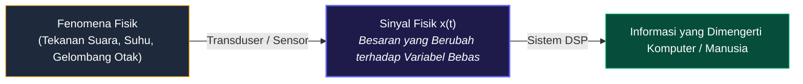
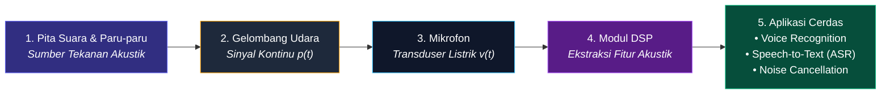
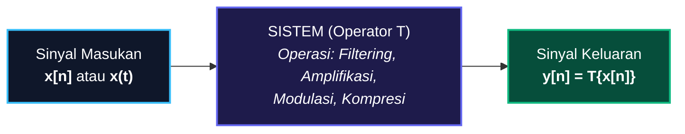

# 📘 MODUL PEMBELAJARAN PENGOLAHAN SINYAL DIGITAL (PSD)
**Materi Terkompilasi — Bab 1: Pengantar Sinyal, Sistem, dan Paradigma Pemrosesan**

---

## 📑 DAFTAR ISI MODUL
* [BAB 1: Pengantar Sinyal, Sistem, dan Paradigma Pemrosesan](#bab-1-pengantar-sinyal-sistem-dan-paradigma-pemrosesan)
  * [1.1 Definisi Fundamental Sinyal](#11-definisi-fundamental-sinyal)
  * [1.2 Representasi Matematis Sinyal](#12-representasi-matematis-sinyal)
  * [1.3 Tiga Parameter Utama Sinyal (Amplitudo, Frekuensi, Fase)](#13-tiga-parameter-utama-sinyal)
  * [1.4 Anatomi Visual Grafik Sinyal](#14-anatomi-visual-grafik-sinyal)
  * [1.5 Komparasi Visual Parameter Sinyal](#15-komparasi-visual-parameter-sinyal)
  * [1.6 Studi Kasus: Sinyal Ucapan (Speech Signal)](#16-studi-kasus-sinyal-ucapan)
  * [1.7 Konsep Dasar Sistem](#17-konsep-dasar-sistem)
  * [1.8 Tiga Bentuk Realisasi Sistem](#18-tiga-bentuk-realisasi-sistem)
  * [1.9 Klasifikasi & Karakteristik Operasi Sistem](#19-klasifikasi--karakteristik-operasi-sistem)
  * [1.10 Paradigma Pemrosesan Sinyal: ASP vs DSP](#110-paradigma-pemrosesan-sinyal-asp-vs-dsp)
  * [1.11 Keunggulan Paradigma DSP](#111-keunggulan-paradigma-dsp)

---

# BAB 1: Pengantar Sinyal, Sistem, dan Paradigma Pemrosesan

## 1.1 Definisi Fundamental Sinyal

> **📌 Definisi Sinyal:**  
> **Sinyal** adalah suatu besaran fisik yang nilainya berubah terhadap waktu, ruang, atau satu maupun lebih variabel bebas lainnya. Sinyal berfungsi sebagai media pembawa informasi fisik dari suatu fenomena alam atau sensor ke sistem pengolah data.

---

## 1.2 Representasi Matematis Sinyal

Sinyal direpresentasikan secara formal sebagai **fungsi dari variabel-variabel bebas**:

* **Sinyal 1-Dimensi (1D) — Fungsi Waktu $t$:**
  $$x = f(t)$$
  *Contoh:* Sinyal suara ucapan $s(t)$, tegangan listrik sensor $v(t)$, sinyal detak jantung ECG $x(t)$.

* **Sinyal 2-Dimensi (2D) — Fungsi Spasial $(x, y)$:**
  $$I = f(x, y)$$
  *Contoh:* Citra digital/foto, di mana nilai fungsi merepresentasikan intensitas kecerahan (*brightness*) pada koordinat baris $x$ dan kolom $y$.

* **Sinyal Multi-Dimensi (3D/4D) — Spatio-Temporal:**
  $$V = f(x, y, t)$$
  *Contoh:* Video digital (rangkaian frame citra 2D yang berubah seiring waktu $t$) atau citra medis CT-Scan/MRI 3D.

---

## 1.3 Tiga Parameter Utama Sinyal

Sebagian besar sinyal periodik atau harmonik dapat dinyatakan secara eksplisit melalui persamaan gelombang sinusoida:

$$x(t) = A \cdot \sin(2\pi f t + \phi) = A \cdot \sin(\omega t + \phi)$$

Seluruh sinyal pada dasarnya dapat dianalisis dan dibedah melalui **3 pilar parameter utama**:

| Parameter | Simbol & Satuan | Makna Matematis | Makna Fisik (Contoh Audio) |
| :--- | :--- | :--- | :--- |
| **Amplitudo** | $A$ (Volt, Pascal, dsb.) | Simpangan puncak maksimum gelombang dari titik nol. | **Kekuatan / Volume Suara (*Loudness*)**. Gelombang tinggi = suara keras. |
| **Frekuensi** | $f = \frac{1}{T}$ (Hz) atau $\omega = 2\pi f$ (rad/s) | Jumlah siklus gelombang penuh per 1 detik. | **Tinggi-Rendah Nada (*Pitch*)**. Gelombang rapat = nada tinggi melengking. |
| **Fase** | $\phi$ (Radian / Derajat) | Posisi awal gelombang pada saat $t = 0$. | **Pergeseran Waktu / Arah Kedatangan Gelombang**. |

---

## 1.4 Anatomi Visual Grafik Sinyal

Berikut adalah grafik visual yang menunjukkan letak **Amplitudo ($A$)**, **Periode ($T$)**, **Frekuensi ($f$)**, **Puncak (*Peak*)**, dan **Lembah (*Trough*)**:

---

## 1.5 Komparasi Visual Parameter Sinyal

Berikut adalah perbandingan visual langsung bagaimana perubahan nilai Frekuensi, Amplitudo, dan Fase mengubah bentuk fisik gelombang:

---

## 1.6 Studi Kasus: Sinyal Ucapan (*Speech Signal*)

Sinyal suara ucapan manusia merupakan contoh nyata **sinyal pembawa informasi**:

### Informasi dalam Sinyal Ucapan:
1. **Informasi Fonem/Tekstual:** Dibentuk oleh frekuensi resonansi rongga vokal (*Formant* $F_1, F_2, F_3$). Contoh: membedakan vokal "A", "I", "U", "E", "O".
2. **Informasi Pembicara:** Frekuensi dasar pita suara (*Fundamental pitch $F_0$*) dan warna suara unik (*Timbre*).
3. **Informasi Emosi & Intonasi:** Modulasi amplitudo dan kontur naik-turunnya frekuensi.

---

## 1.7 Konsep Dasar Sistem

> **📌 Definisi Sistem:**  
> **Sistem** adalah perangkat fisik atau realisasi perangkat lunak yang melakukan suatu operasi matematis atau transformasi pada sinyal masukan $x[n]$ untuk menghasilkan sinyal keluaran $y[n]$ yang diinginkan:
> $$y[n] = \mathcal{T}\{x[n]\}$$

---

## 1.8 Tiga Bentuk Realisasi Sistem

---

## 1.9 Klasifikasi & Karakteristik Operasi Sistem

Operasi yang dilakukan oleh sistem akan menentukan sifat dan perilakunya:

1. **Linear vs Non-Linear:**
   * **Linear:** Memenuhi prinsip superposisi:
     $$\mathcal{T}\{a \cdot x_1[n] + b \cdot x_2[n]\} = a \cdot \mathcal{T}\{x_1[n]\} + b \cdot \mathcal{T}\{x_2[n]\}$$
   * **Non-Linear:** Tidak memenuhi superposisi *(Contoh: $y[n] = x^2[n]$, distorsi audio).*

2. **Time-Invariant (TI) vs Time-Variant:**
   * Pergeseran waktu pada masukan menghasilkan pergeseran waktu yang sama pada keluaran tanpa mengubah bentuk respon:
     $$x[n - n_0] \implies y[n - n_0]$$

3. **Kausal (Causal) vs Non-Kausal:**
   * **Kausal:** Output saat ini hanya bergantung pada input saat ini dan masa lalu ($x[n], x[n-1], \dots$). Wajib untuk sistem *real-time*.
   * **Non-Kausal:** Bergantung pada nilai masa depan ($x[n+1]$), hanya bisa dilakukan pada data rekaman/offline.

4. **Stabilitas BIBO (Bounded-Input Bounded-Output):**
   * Input terbatas menjamin output selalu terbatas (sistem stabil, tidak meledak/berosilasi liar).

---

## 1.10 Paradigma Pemrosesan Sinyal: ASP vs DSP

### A. Pengolahan Sinyal Analog (ASP - Analog Signal Processing)
$$\text{Analog Input Signal } x(t) \longrightarrow \mathbf{\text{Analog Signal Processor}} \longrightarrow \text{Analog Output Signal } y(t)$$
* **Cara Kerja:** Sinyal analog kontinu diproses langsung oleh komponen elektronik analog pasif/aktif (R, L, C, Op-Amp).
* **Kelemahan:** Rentan suhu (*thermal drift*), penuaan komponen (*aging*), derau lingkungan, dan kaku (sulit dimodifikasi).

### B. Pengolahan Sinyal Digital (DSP - Digital Signal Processing)
$$\text{Input } x(t) \xrightarrow{\text{A/D}} \text{Digital Stream } x[n] \xrightarrow{\mathbf{\text{DSP Processor}}} \text{Digital Stream } y[n] \xrightarrow{\text{D/A}} \text{Output } y(t)$$

* **A/D Converter (ADC):** Mengubah sinyal analog kontinu $x(t)$ menjadi deretan biner $x[n]$ melalui *Sampling*, *Quantization*, dan *Encoding*.
* **Digital Signal Processor:** Otak komputasi algoritma software (Filter digital, FFT, Noise Suppression, Kompresi).
* **D/A Converter (DAC):** Mengubah kembali biner $y[n]$ menjadi tegangan tangga analog dan dihaluskan oleh *Reconstruction Smoothing Filter* menjadi sinyal fisik $y(t)$.

---

## 1.11 Keunggulan Paradigma DSP

| Parameter | Sistem Analog (ASP) | Sistem Digital (DSP) |
| :--- | :--- | :--- |
| **Fleksibilitas Desain** | ❌ Kaku. Ubah fungsi harus ganti rangkaian fisik/solder baru. | ✅ **Ultra Fleksibel**. Cukup update baris kode program (*software/firmware*). |
| **Kekebalan Derau (*Noise Immunity*)** | ❌ Sangat rentan terhadap gangguan kabel dan derau lingkungan. | ✅ **Kebal**. Data berupa biner (0 & 1), tidak terpengaruh fluktuasi tegangan kecil. |
| **Akurasi & Konsistensi** | ❌ Berubah-ubah tergantung suhu dan toleransi komponen. | ✅ **Eksak & 100% Reprodusibel**. Ditentukan oleh presisi bit komputasi (32-bit / 64-bit). |
| **Penyimpanan (*Storage*)** | ❌ Pita kaset magnetik (kualitas turun setiap diputar). | ✅ **Lossless**. Disimpan di SSD/Flashdisk selamanya tanpa penurunan kualitas. |
| **Algoritma Canggih** | ❌ Hanya operasi matematika dasar (tambah, diferensial). | ✅ **Bisa Algoritma Sangat Rumit** (Active Noise Cancellation, AI Speech-to-Text). |
