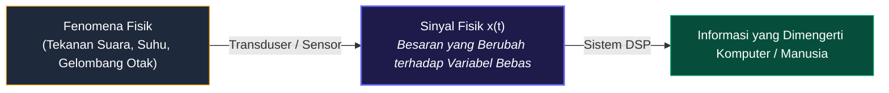

# 📘 MODUL PEMBELAJARAN PENGOLAHAN SINYAL DIGITAL (PSD)
**Materi Terkompilasi — Konsep Dasar Sinyal, Sistem, dan Paradigma Pemrosesan**

---

## 📑 DAFTAR ISI
1. [BAB 1: Fondasi & Parameter Sinyal](#bab-1-fondasi--parameter-sinyal)
   - [1.1 Definisi Fundamental Sinyal](#11-definisi-fundamental-sinyal)
   - [1.2 Representasi Matematis](#12-representasi-matematis)
   - [1.3 Tiga Parameter Utama (Amplitudo, Frekuensi, Fase)](#13-tiga-parameter-utama)
   - [1.4 Anatomi Visual Grafik Sinyal](#14-anatomi-visual-grafik-sinyal)
   - [1.5 Komparasi Visual Parameter Sinyal](#15-komparasi-visual-parameter-sinyal)
   - [1.6 Studi Kasus: Sinyal Ucapan (Speech Signal)](#16-studi-kasus-sinyal-ucapan)
2. [BAB 2: Konsep Dasar & Klasifikasi Sistem](#bab-2-konsep-dasar--klasifikasi-sistem)
   - [2.1 Definisi Sistem](#21-definisi-sistem)
   - [2.2 Tiga Bentuk Realisasi Sistem](#22-tiga-bentuk-realisasi-sistem)
   - [2.3 Klasifikasi & Karakteristik Operasi Sistem](#23-klasifikasi--karakteristik-operasi-sistem)
3. [BAB 3: Paradigma Pemrosesan Sinyal (ASP vs DSP)](#bab-3-paradigma-pemrosesan-sinyal-asp-vs-dsp)
   - [3.1 Pengolahan Sinyal Analog (ASP)](#31-pengolahan-sinyal-analog-asp)
   - [3.2 Pengolahan Sinyal Digital (DSP) & Rantai Blok](#32-pengolahan-sinyal-digital-dsp--rantai-blok)
   - [3.3 Mengapa DSP Lebih Unggul dibanding ASP?](#33-mengapa-dsp-lebih-unggul-dibanding-asp)

---

# BAB 1: Fondasi & Parameter Sinyal

### 1.1 Definisi Fundamental Sinyal
> **📌 Definisi:**  
> **Sinyal** adalah suatu besaran fisik yang nilainya berubah terhadap waktu, ruang, atau satu maupun lebih variabel bebas lainnya. Sinyal bertindak sebagai media pembawa informasi fisik dari suatu fenomena alam ke sistem pengolah data.

### 1.2 Representasi Matematis
Sinyal direpresentasikan secara formal sebagai fungsi dari variabel-variabel bebas:
* **Sinyal 1-Dimensi (1D) — $x = f(t)$:** Contoh: sinyal suara $s(t)$, tegangan listrik $v(t)$, sinyal detak jantung ECG $x(t)$.
* **Sinyal 2-Dimensi (2D) — $I = f(x, y)$:** Contoh: citra digital/foto (intensitas kecerahan pada koordinat baris $x$ dan kolom $y$).
* **Sinyal Multi-Dimensi (3D/4D) — $V = f(x, y, t)$:** Contoh: video digital (rangkaian frame 2D terhadap waktu) atau citra medis MRI 3D.

### 1.3 Tiga Parameter Utama
Setiap gelombang sinusoida dapat dinyatakan secara eksplisit:
$$x(t) = A \cdot \sin(2\pi f t + \phi) = A \cdot \sin(\omega t + \phi)$$

| Parameter | Simbol & Satuan | Makna Matematis | Makna Fisik (Contoh Audio) |
| :--- | :--- | :--- | :--- |
| **Amplitudo** | $A$ (Volt, Pascal, dsb.) | Simpangan puncak maksimum gelombang dari titik nol. | **Kekuatan / Volume Suara (*Loudness*)**. Gelombang tinggi = suara keras. |
| **Frekuensi** | $f = \frac{1}{T}$ (Hz) atau $\omega = 2\pi f$ (rad/s) | Jumlah siklus gelombang penuh per 1 detik. | **Tinggi-Rendah Nada (*Pitch*)**. Gelombang rapat = nada tinggi melengking. |
| **Fase** | $\phi$ (Radian / Derajat) | Posisi awal gelombang pada saat $t = 0$. | **Pergeseran Waktu / Arah Kedatangan Gelombang**. |

---

### 1.4 Anatomi Visual Grafik Sinyal

Berikut adalah grafik visual asli yang menunjukkan letak **Amplitudo ($A$)**, **Periode ($T$)**, **Frekuensi ($f$)**, **Puncak (*Peak*)**, dan **Lembah (*Trough*)**:

---

### 1.5 Komparasi Visual Parameter Sinyal

Berikut adalah perbandingan visual langsung bagaimana perubahan nilai Frekuensi, Amplitudo, dan Fase mengubah bentuk fisik gelombang:

---

### 1.6 Studi Kasus: Sinyal Ucapan (*Speech Signal*)
* **Informasi Fonem/Tekstual:** Resonansi rongga vokal (*Formant* $F_1, F_2, F_3$).
* **Informasi Pembicara:** Frekuensi dasar pita suara ($F_0$) dan timbre suara.
* **Informasi Emosi:** Dinamika modulasi amplitudo dan kontur intonasi frekuensi.

---

# BAB 2: Konsep Dasar & Klasifikasi Sistem

### 2.1 Definisi Sistem
> **📌 Definisi:**  
> **Sistem** adalah perangkat fisik atau realisasi perangkat lunak yang melakukan suatu operasi matematis atau transformasi pada sinyal masukan $x[n]$ untuk menghasilkan sinyal keluaran $y[n]$ yang diinginkan:
> $$y[n] = \mathcal{T}\{x[n]\}$$

### 2.2 Tiga Bentuk Realisasi Sistem
1. **Perangkat Keras Murni (Hardware / Analog):** Rangkaian RLC, Op-Amp, Transistor.
2. **Perangkat Lunak Murni (Software / Digital):** Algoritma Python, C++, MATLAB pada CPU/Server.
3. **Hybrid / Embedded Firmware (Hardware + Software):** Chip DSP (TMS320), FPGA, Mikrokontroler (STM32, ESP32).

### 2.3 Klasifikasi & Karakteristik Operasi Sistem
* **Linear vs Non-Linear:** Memenuhi prinsip superposisi $\mathcal{T}\{a x_1 + b x_2\} = a \mathcal{T}\{x_1\} + b \mathcal{T}\{x_2\}$.
* **Time-Invariant (TI) vs Time-Variant:** $x[n - n_0] \implies y[n - n_0]$.
* **Kausal vs Non-Kausal:** Output saat ini hanya bergantung pada input saat ini dan masa lalu.
* **Stabilitas BIBO:** Input terbatas selalu menghasilkan output terbatas.

---

# BAB 3: Paradigma Pemrosesan Sinyal (ASP vs DSP)

Dalam dunia rekayasa sinyal, terdapat dua pendekatan utama dalam memproses sinyal:

---

### 3.1 Pengolahan Sinyal Analog (ASP - Analog Signal Processing)

Alur dasar ASP:
$$\text{Analog Input Signal } x(t) \longrightarrow \mathbf{\text{Analog Signal Processor}} \longrightarrow \text{Analog Output Signal } y(t)$$

* **Cara Kerja:** Sinyal analog kontinu dimasukkan langsung ke komponen elektronik analog pasif/aktif (Resistor, Kapasitor, Induktor, Op-Amp).
* **Contoh:** Pengatur nada (Tone Control) analog pada amplifier jadul, filter pasif speaker crossover.
* **Kelemahan Utama:**
  * Komponen rentan terhadap perubahan suhu (*thermal drift*) dan penuaan komponen (*aging*).
  * Karakteristik sistem kaku; jika ingin mengubah frekuensi cutoff filter, sirkuit harus disolder ulang.
  * Rentan terhadap derau/noise lingkungan dan toleransi nilai fisik komponen (misal resistor $\pm 5\%$).

---

### 3.2 Pengolahan Sinyal Digital (DSP - Digital Signal Processing)

Alur lengkap DSP:
$$\text{Analog Input } x(t) \xrightarrow{\text{A/D}} \text{Digital Stream } x[n] \xrightarrow{\mathbf{\text{DSP Processor}}} \text{Digital Output } y[n] \xrightarrow{\text{D/A}} \text{Analog Output } y(t)$$

Tahapan rantai kerja DSP:
1. **A/D Converter (Analog-to-Digital Converter):**
   * Mengubah sinyal kontinu $x(t)$ menjadi deretan angka biner diskrit $x[n]$ melalui tahapan *Sampling* (Pencuplikan waktu) dan *Quantization* (Pembulatan nilai level amplitudo).
2. **Digital Signal Processor (DSP Core / CPU / FPGA):**
   * Mengeksekusi algoritma matematis (Filter digital FIR/IIR, FFT spektrum, kompresi, enkripsi, *noise reduction*) melalui manipulasi aritmatika data biner.
3. **D/A Converter (Digital-to-Analog Converter):**
   * Mengonversi kembali hasil komputasi digital $y[n]$ menjadi tegangan tangga analog dan dihaluskan (*smoothing reconstruction*) kembali menjadi sinyal fisik kontinu $y(t)$ (misalnya suara yang dikeluarkan ke speaker).

---

### 3.3 Mengapa DSP Lebih Unggul dibanding ASP?

| Faktor Perbandingan | Analog Signal Processing (ASP) | Digital Signal Processing (DSP) |
| :--- | :--- | :--- |
| **Fleksibilitas Desain** | ❌ Kaku. Mengubah fungsi sistem menuntut pergantian komponen fisik / PCB baru. | ✅ **Sangat Fleksibel**. Cukup modifikasi kode program (software update/firmware) tanpa ubah hardware. |
| **Kekebalan Derau (*Noise Immunity*)** | ❌ Rentan. Derau termal dan fluktuasi tegangan langsung merusak sinyal. | ✅ **Sangat Tinggi**. Representasi biner (0 dan 1) memiliki *noise margin* yang sangat kuat. |
| **Presisi & Akurasi** | ❌ Dibatasi toleransi komponen fisik ($\pm 1\% - 10\%$) dan efek suhu. | ✅ **Eksak & Konsisten**. Ditentukan oleh jumlah bit representasi floating point (32-bit / 64-bit). |
| **Penyimpanan Data** | ❌ Sulit (Pita kaset magnetik, degradasi kualitas tiap diputar). | ✅ **Sempurna Tanpa Rugi**. Data digital disimpan di Flash/SSD/Cloud tanpa penurunan kualitas (*lossless*). |
| **Kemampuan Algoritma Canggih** | ❌ Terbatas pada operasi matematika dasar (penjumlahan, integrasi, diferensiasi). | ✅ **Tanpa Batas** (FFT resolusi tinggi, Adaptive Filtering, AI Voice Recognition, Active Noise Cancelling). |
